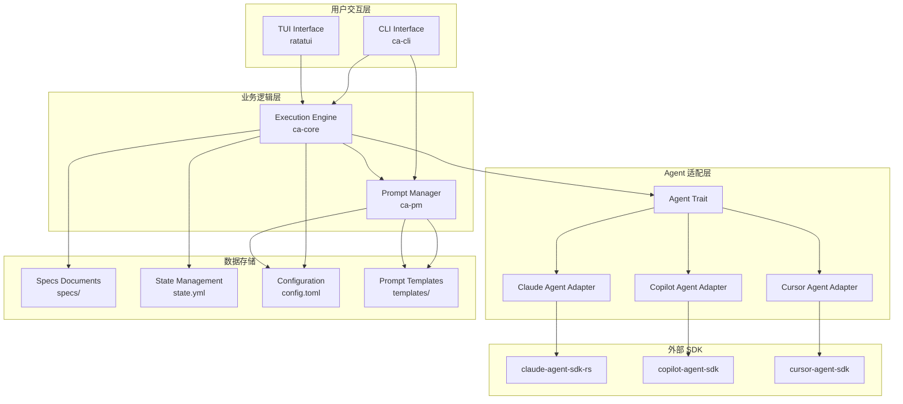
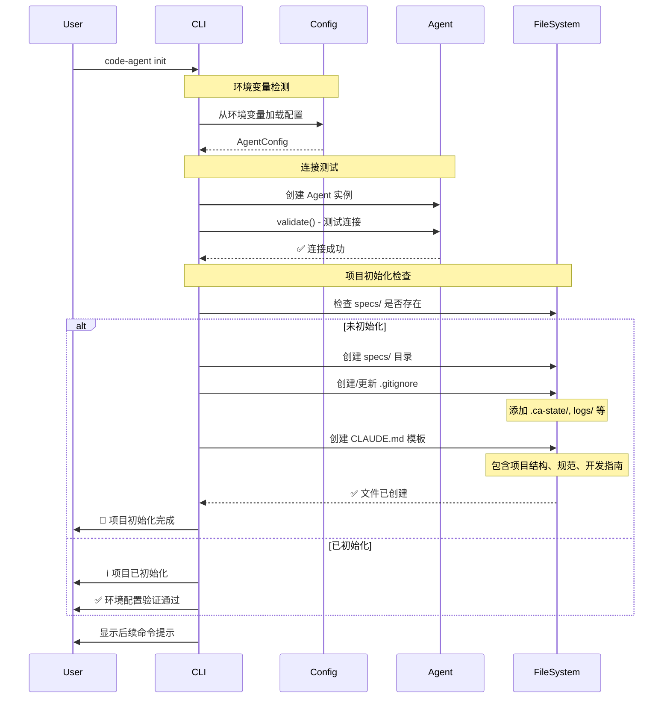
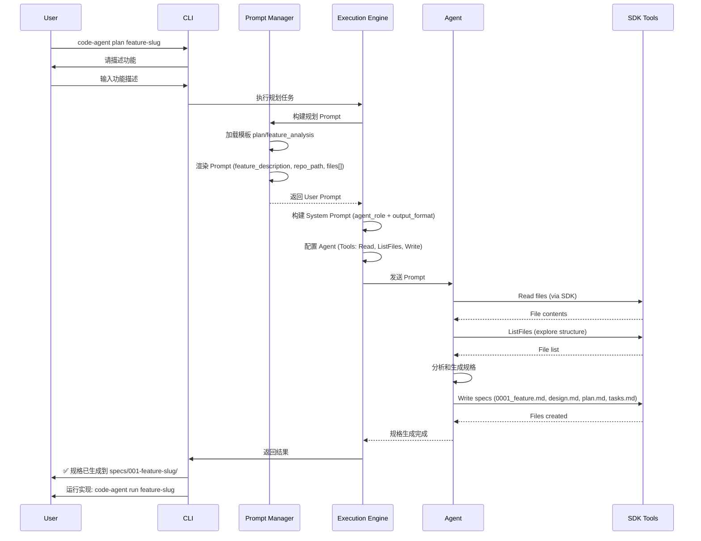
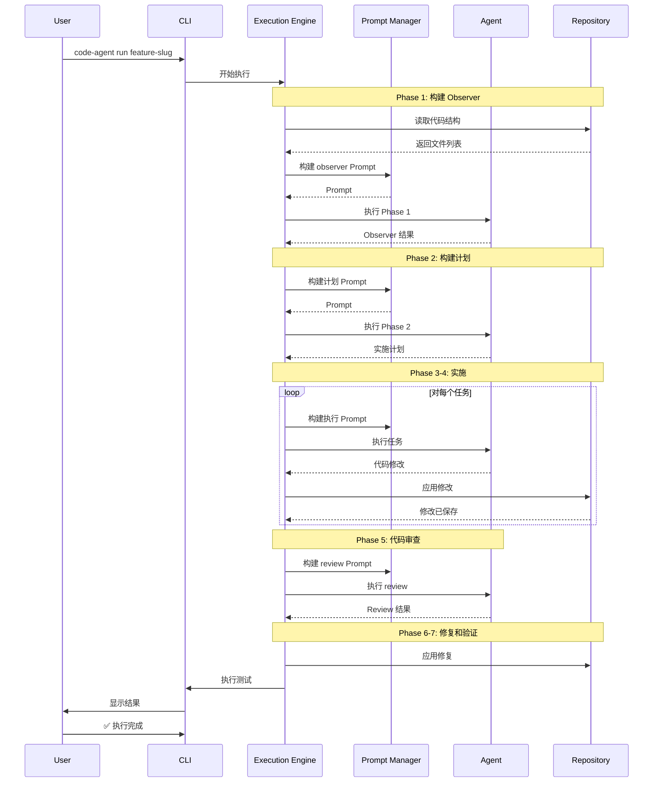
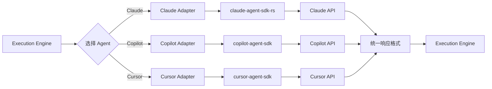

# Code Agent 设计文档

**版本**: v1.5  
**日期**: 2026-02-10  
**项目**: Code Agent - 多 Agent SDK 统一封装工具  
**状态**: Design Complete, Ready for Implementation

---

## 更新记录

**v1.5** (2026-02-10 24:00):
- ✅ 重新定义 `init` 命令职责 (环境验证 + 最小化项目初始化)
- ✅ 整合 GBA 优良设计参考
  - TUI 交互设计
  - Task 模板结构
  - Review/Verification 关键词匹配
  - Git Worktree 管理策略
  - 状态持久化与恢复
  - EventHandler 流式处理
  - 并发模型 (TUI + Worker)
- ✅ 项目初始化包含:
  - 创建 `specs/` 目录
  - 更新 `.gitignore` (添加 Code Agent 规则)
  - 创建 `CLAUDE.md` 项目文档模板
- ✅ 幂等性保证 (已初始化时不重复创建)
- ✅ 明确 Code Agent 与 GBA 的设计差异和权衡

**v1.4** (2026-02-10 23:00):
- ✅ 添加配置管理设计 (零配置文件方案)
- ✅ 环境变量优先策略 (直接使用 SDK 官方变量)
- ✅ 配置优先级: CLI args → 环境变量 → 错误提示
- ✅ 不创建配置文件和目录 (更简洁、更安全)
- ✅ 创建 CONFIG_SECURITY_DESIGN_V2.md

**v1.3** (2026-02-10 22:00):
- ✅ 完成三个 Agent SDK 深度调研
  - Claude Agent SDK (claude-agent-sdk-rs 0.6.4)
  - GitHub Copilot SDK (官方多语言 SDK)
  - Cursor Cloud API (RESTful API)
- ✅ 添加 Multi-SDK 支持架构
- ✅ Agent trait 扩展 (capabilities 方法)
- ✅ AgentCapabilities 定义 (6 个能力维度)
- ✅ AgentType 更新 (Tier 1/2/3 分级)
- ✅ 3 个 AgentAdapter 设计 (Claude, Cursor, Copilot)
- ✅ 降级策略和 Phase 适配机制
- ✅ 创建 SDK_COMPARISON.md (27 KB)
- ✅ 创建 MULTI_SDK_SUMMARY.md (15 KB)

**v1.2** (2026-02-10):
- ✅ 补全 Plan 阶段完整设计
- ✅ 添加 Agent Preset 配置 (基于 claude-agent-sdk-rs 0.6.4)
- ✅ 完整的 Phase Configuration (Tools, Permission, Budget)
- ✅ Plan 流程图更新
- ✅ phase_config.rs 接口设计
- ✅ 所有 13 个 Prompt 模板就绪

**v1.1** (2026-02-10):
- ✅ 添加 State Management (state.yml)
- ✅ 添加 TaskKind::Verification
- ✅ 中断恢复机制设计
- ✅ 完整 Prompt 模板 (13 个)
- ✅ 变量简化 (Convention over Configuration)
- ✅ System/User Prompts 分离

**v1.0** (2026-02-09):
- 初始设计文档
- 核心架构和 Crate 设计
- 基本流程和接口定义

---

## 目录

1. [项目概述](#项目概述)
2. [核心架构](#核心架构)
3. [Crate 设计](#crate-设计)
4. [核心流程](#核心流程)
5. [接口设计](#接口设计)
6. [开发计划](#开发计划)

---

## 项目概述

### 项目目标

Code Agent 是一个统一的代码助手 CLI 工具,旨在封装多种 AI Agent SDK (Claude Agent, GitHub Copilot Agent, Cursor Agent),提供一致的使用体验,让开发者能够轻松地在代码仓库中添加新功能、重构代码、修复 Bug 等。

### 核心价值

- **统一接口**: 为不同的 Agent SDK 提供统一的抽象层
- **灵活配置**: 支持多种 Agent 类型和配置方式
- **模板化**: 基于场景的 Prompt 模板管理
- **可扩展**: 易于添加新的 Agent 支持
- **开发友好**: 清晰的流程,从规划到执行

### 使用场景

1. **初始化项目** (`code-agent init`)
   - 验证环境变量配置 (API Key, 模型等)
   - 测试 Agent 连接
   - 初始化项目管理结构:
     - 创建 `specs/` 目录
     - 创建 `.gitignore` (如不存在)
     - 创建/更新 `CLAUDE.md` 项目文档
   - 检测是否已初始化,避免重复操作

2. **规划功能** (`code-agent plan`)
   - 与用户交互,明确功能需求
   - 分析代码库结构和现有模式
   - 生成功能规格文档 (specs/001-feature-slug/)
     - design.md - 设计文档
     - plan.md - 实施计划  
     - tasks.md - 任务分解
     - status.md - 项目进度状态
     - state.yml - 执行状态
   - 使用 Agent tools: Read, ListFiles, Write
   - 为后续 `code-agent run` 做准备

3. **执行任务** (`code-agent run`)
   - 读取功能规格
   - 调用 Agent SDK 执行任务
   - 多阶段执行,代码审查,测试验证
   - 自动更新 status.md 和 state.yml

---

## 核心架构

### 系统架构图



### 模块职责

| 模块 | 职责 | 依赖 |
|------|------|------|
| **ca-cli** | 命令行接口,用户交互,命令解析 | ca-core, ca-pm |
| **ca-core** | 核心执行引擎,任务编排,Agent 调度 | ca-pm, agent SDKs |
| **ca-pm** | Prompt 模板管理,渲染,上下文构建 | minijinja |

### 设计原则

1. **单一职责原则 (SRP)**: 每个模块只负责一个明确的功能域
2. **开闭原则 (OCP)**: 对扩展开放(新 Agent),对修改封闭
3. **里氏替换原则 (LSP)**: Agent trait 的所有实现可互相替换
4. **接口隔离原则 (ISP)**: 提供精简的 public interface
5. **依赖倒置原则 (DIP)**: 依赖抽象(Agent trait)而非具体实现

---

## Crate 设计

### 1. ca-core (核心执行引擎)

#### 职责

- Agent SDK 的统一抽象和调度
- 任务执行流程编排
- 代码仓库管理(读写文件,遵循 .gitignore)
- 执行结果收集和报告

#### Public Interface

```rust
// Agent 抽象
pub trait Agent: Send + Sync {
    fn agent_type(&self) -> AgentType;
    async fn execute(&self, request: AgentRequest) -> Result<AgentResponse>;
    async fn validate(&self) -> Result<bool>;
}

// Agent 工厂
pub struct AgentFactory;
impl AgentFactory {
    pub fn create(config: &AgentConfig) -> Result<Box<dyn Agent>>;
}

// 执行引擎
pub struct ExecutionEngine {
    pub fn new(agent: Box<dyn Agent>, repo: Repository) -> Self;
    pub async fn execute_task(&self, task: Task) -> Result<ExecutionResult>;
    pub async fn execute_plan(&self, plan: Plan) -> Result<Vec<ExecutionResult>>;
}

// 仓库管理
pub struct Repository {
    pub fn new(path: impl AsRef<Path>) -> Result<Self>;
    pub fn read_file(&self, path: impl AsRef<Path>) -> Result<String>;
    pub fn write_file(&self, path: impl AsRef<Path>, content: &str) -> Result<()>;
    pub fn list_files(&self, pattern: &str) -> Result<Vec<PathBuf>>;
}

// 核心类型
pub enum AgentType {
    Claude,
    Copilot,
    Cursor,
}

pub struct AgentRequest {
    pub prompt: String,
    pub context: Context,
    pub config: RequestConfig,
}

pub struct AgentResponse {
    pub content: String,
    pub artifacts: Vec<Artifact>,
    pub metadata: Metadata,
}

pub struct Task {
    pub id: String,
    pub description: String,
    pub context_files: Vec<PathBuf>,
    pub config: TaskConfig,
}

pub struct ExecutionResult {
    pub success: bool,
    pub message: String,
    pub changes: Vec<FileChange>,
    pub metrics: Metrics,
}
```

#### 内部模块

```
ca-core/src/
├── lib.rs              # Public API
├── agent/
│   ├── mod.rs         # Agent trait + factory
│   ├── claude.rs      # Claude Agent 实现
│   ├── copilot.rs     # Copilot Agent 实现
│   └── cursor.rs      # Cursor Agent 实现
├── engine/
│   ├── mod.rs         # Execution engine
│   ├── orchestrator.rs # 任务编排
│   ├── phase_config.rs # Phase 配置 (NEW)
│   └── validator.rs   # 结果验证
├── state/             # NEW: State management
│   ├── mod.rs         # StateManager
│   └── types.rs       # State types
├── repository/
│   ├── mod.rs         # Repository 管理
│   ├── file_ops.rs    # 文件操作
│   └── ignore.rs      # .gitignore 处理
├── types/
│   ├── mod.rs         # 核心类型定义
│   ├── request.rs
│   ├── response.rs
│   └── task.rs
└── error.rs           # 错误类型
```

### 2. ca-pm (Prompt Manager)

#### 职责

- Prompt 模板加载和管理
- 模板渲染(基于 MiniJinja)
- 上下文构建(代码片段,文件列表等)
- 场景化 Prompt 生成

#### Public Interface

```rust
// Prompt 管理器
pub struct PromptManager {
    pub fn new(config: PromptConfig) -> Result<Self>;
    pub fn load_templates(&mut self, dir: impl AsRef<Path>) -> Result<()>;
    pub fn render(&self, template_name: &str, context: &Context) -> Result<String>;
    pub fn list_templates(&self) -> Vec<&str>;
}

// 上下文构建器
pub struct ContextBuilder {
    pub fn new() -> Self;
    pub fn add_file(&mut self, path: impl AsRef<Path>, content: &str) -> &mut Self;
    pub fn add_variable(&mut self, key: &str, value: impl Serialize) -> &mut Self;
    pub fn add_instruction(&mut self, instruction: &str) -> &mut Self;
    pub fn build(self) -> Context;
}

// 场景化 Prompt 生成器
pub struct ScenarioPromptBuilder {
    pub fn for_feature_planning() -> PromptBuilder;
    pub fn for_code_generation() -> PromptBuilder;
    pub fn for_code_review() -> PromptBuilder;
    pub fn for_bug_fix() -> PromptBuilder;
    pub fn for_refactoring() -> PromptBuilder;
}

pub struct PromptBuilder {
    pub fn with_task(&mut self, task: &str) -> &mut Self;
    pub fn with_context(&mut self, context: &Context) -> &mut Self;
    pub fn with_constraints(&mut self, constraints: &[&str]) -> &mut Self;
    pub fn build(&self, manager: &PromptManager) -> Result<String>;
}

// 核心类型
pub struct Context {
    // 内部实现,外部不可见
}

pub struct PromptConfig {
    pub template_dir: PathBuf,
    pub default_template: String,
    pub variables: HashMap<String, Value>,
}
```

#### 内部模块

```
ca-pm/src/
├── lib.rs              # Public API
├── manager.rs          # PromptManager 实现
├── context.rs          # Context 和 ContextBuilder
├── builder.rs          # PromptBuilder 实现
├── scenarios.rs        # 场景化 Prompt
├── template/
│   ├── mod.rs         # 模板管理
│   ├── loader.rs      # 模板加载
│   └── renderer.rs    # 模板渲染
└── error.rs           # 错误类型
```

#### 默认模板

```
templates/
├── init/
│   └── project_setup.jinja
├── plan/
│   ├── feature_analysis.jinja
│   ├── task_breakdown.jinja
│   └── milestone_planning.jinja
├── run/
│   ├── phase1_observer.jinja
│   ├── phase2_plan.jinja
│   ├── codex_review.jinja
│   └── test_validation.jinja
└── common/
    ├── code_context.jinja
    └── file_structure.jinja
```

### 3. ca-cli (命令行界面)

#### 职责

- 命令行参数解析(Clap)
- 用户交互(输入提示,确认等)
- TUI 界面(Ratatui)
- 命令执行协调
- 结果展示和格式化

#### Public Interface (Binary)

```bash
# 命令行接口
code-agent init [--agent <type>] [--api-key <key>] [--force]
code-agent plan <feature-slug> [--interactive] [--description <text>]
code-agent run <feature-slug> [--phase <n>] [--dry-run] [--resume]
code-agent list [--all] [--status <filter>]
code-agent status <feature-slug>
code-agent clean [--dry-run] [--force]
code-agent templates [list|show <name>|validate]
code-agent tui [<feature-slug>]
```

#### 命令详解

##### 1. `code-agent init`

初始化项目配置和管理结构

```bash
# 环境变量方式 (推荐)
export ANTHROPIC_API_KEY='sk-ant-xxx'
code-agent init

# CLI 参数覆盖
code-agent init --api-key sk-xxx --agent claude

# 选项
--agent <type>      # Agent 类型: claude, copilot, cursor (可选,自动检测)
--api-key <key>     # API 密钥 (可选,优先使用环境变量)
--model <name>      # 模型名称 (可选)
--api-url <url>     # 自定义 API endpoint (如 OpenRouter)
```

**执行内容**:

1. **环境检查**
   - 检测 Agent 类型 (根据环境变量或参数)
   - 验证 API Key 可用性
   - 测试 Agent 连接

2. **项目初始化** (仅首次)
   - 创建 `specs/` 目录
   - 创建/更新 `.gitignore` (添加必要忽略规则)
   - 创建/更新 `CLAUDE.md` (项目 AI 文档模板)

3. **幂等性保证**
   - 检测是否已初始化 (存在 `specs/` 目录)
   - 已初始化时仅验证连接,不重复创建文件
   - 支持 `--force` 强制重新初始化

**输出示例**:
```bash
$ code-agent init
🚀 欢迎使用 Code Agent!

🔧 Code Agent 使用零配置文件方案 - 所有配置通过环境变量提供

📋 检测到的配置:
  Agent 类型: Claude
  模型: claude-3-5-sonnet-20241022
  API Key: sk-o***
  API URL: https://openrouter.ai/api

🔌 测试 Agent 连接...
✅ 连接成功!

📁 初始化项目结构...
✓ 已创建 specs/ 目录
✓ 已更新 .gitignore
✓ 已创建 CLAUDE.md

🎉 初始化完成! 现在可以运行:
   code-agent plan <feature-name>
   code-agent run <feature-name>

💡 状态追踪:
   • status.md - 人类可读的进度报告 (中文)
   • state.yml - 机器可读的状态文件 (用于恢复执行)
```

##### 2. `code-agent plan`

规划功能并生成 specs

```bash
# 交互式规划
code-agent plan new-feature

# 使用已有描述
code-agent plan new-feature --description "Add user authentication"

# 选项
--interactive       # 交互式模式
--description <d>   # 功能描述
--template <name>   # 使用指定模板
--output <dir>      # 输出目录 (默认 specs/)
```

**输出结构**:
```
specs/001-feature-slug/
├── 0001_feature1.md
├── 0002_feature2.md
├── design.md
├── plan.md
├── tasks.md
├── status.md          # NEW: 项目进度状态文档（中文）
└── state.yml          # 机器可读的状态文件
```

##### 3. `code-agent run`

执行功能开发

```bash
# 执行完整流程
code-agent run feature-slug

# 执行特定阶段
code-agent run feature-slug --phase 1

# 选项
--phase <n>         # 执行特定阶段 (1-7)
--dry-run           # 模拟执行,不修改文件
--resume            # 从中断处继续
--skip-review       # 跳过代码审查
--skip-test         # 跳过测试验证
```

**执行阶段**:
1. Phase 1: 构建 observer (分析当前代码)
2. Phase 2: 构建计划
3. Phase 3: 执行 Phase 1
4. Phase 4: 执行 Phase 2
5. Phase 5: Codex review
6. Phase 6: 处理 review 结果
7. Phase 7: 验证和测试

##### 4. `code-agent list`

列出所有功能

```bash
# 列出所有功能
code-agent list

# 筛选特定状态
code-agent list --status inProgress
code-agent list --status completed

# 显示所有 (包括历史)
code-agent list --all

# 选项
--all               # 显示所有功能 (包括已删除的)
--status <filter>   # 按状态筛选: planned | inProgress | completed | failed
```

**输出示例**:
```bash
$ code-agent list
┌──────┬───────────────┬────────────┬──────────┬─────────┐
│  ID  │     SLUG      │   STATUS   │ PROGRESS │  COST   │
├──────┼───────────────┼────────────┼──────────┼─────────┤
│ 001  │ add-user-auth │ completed  │   7/7    │  $1.25  │
│ 002  │ fix-login-bug │ inProgress │   3/7    │  $0.45  │
│ 003  │ new-dashboard │ planned    │   0/7    │  $0.00  │
└──────┴───────────────┴────────────┴──────────┴─────────┘

Total: 3 features | In Progress: 1 | Completed: 1
```

##### 5. `code-agent status`

查看功能详细状态

```bash
code-agent status <feature-slug>
```

**输出示例**:
```bash
$ code-agent status add-user-auth

Feature: add-user-auth (001)
Status: completed
Created: 2024-01-15 10:30:00
Updated: 2024-01-15 14:20:00

Phases:
┌─────┬────────────────┬───────────┬──────────┬─────────┐
│  #  │     Name       │  Status   │  Commit  │  Cost   │
├─────┼────────────────┼───────────┼──────────┼─────────┤
│  1  │ setup          │ completed │ abc1234  │  $0.15  │
│  2  │ implementation │ completed │ def5678  │  $0.58  │
│  3  │ testing        │ completed │ ghi9012  │  $0.12  │
│  4  │ review         │ completed │ jkl3456  │  $0.08  │
│  5  │ fix            │ completed │ mno7890  │  $0.15  │
│  6  │ verification   │ completed │ pqr1234  │  $0.10  │
│  7  │ pr-creation    │ completed │ stu5678  │  $0.07  │
└─────┴────────────────┴───────────┴──────────┴─────────┘

Total Stats:
• Turns: 45
• Input tokens: 125,000
• Output tokens: 85,000
• Total cost: $1.25

Result:
• PR: https://github.com/owner/repo/pull/123
• Status: Merged ✓
```

##### 6. `code-agent clean`

清理已完成的功能

```bash
# 试运行 (显示将删除的内容)
code-agent clean --dry-run

# 实际清理
code-agent clean

# 强制清理所有 (包括进行中的)
code-agent clean --force

# 选项
--dry-run           # 试运行,不实际删除
--force             # 强制清理所有功能 (危险操作)
```

**清理规则**:
- ✅ 已完成且已合并的 PR
- ✅ 已关闭的 PR
- ❌ 进行中的功能 (需要 --force)
- ❌ 无 PR 的功能 (需要 --force 并确认)

**输出示例**:
```bash
$ code-agent clean --dry-run

将清理以下功能:

✓ 001-add-user-auth (PR #123 已合并)
  - specs/001-add-user-auth/
  
✓ 002-fix-login-bug (PR #124 已关闭)
  - specs/002-fix-login-bug/

跳过以下功能:

⚠ 003-new-dashboard (进行中)

总计: 2 个功能将被清理
运行 'code-agent clean' 执行清理
```

##### 7. `code-agent templates`

模板管理

```bash
# 列出所有模板
code-agent templates list

# 显示模板内容
code-agent templates show plan/feature_analysis

# 验证模板语法
code-agent templates validate
```

##### 8. `code-agent tui`

启动交互式 TUI

```bash
# 启动 TUI
code-agent tui

# 从特定功能开始
code-agent tui <feature-slug>
```

#### 内部模块

```
ca-cli/src/
├── main.rs             # 入口点
├── cli.rs              # Clap 命令定义
├── commands/
│   ├── mod.rs
│   ├── init.rs        # init 命令
│   ├── plan.rs        # plan 命令
│   ├── run.rs         # run 命令
│   ├── list.rs        # list 命令
│   ├── status.rs      # status 命令
│   ├── clean.rs       # clean 命令
│   ├── templates.rs   # templates 命令
│   └── tui.rs         # tui 命令
├── tui/
│   ├── mod.rs
│   ├── app.rs         # TUI 应用状态
│   ├── ui.rs          # UI 渲染
│   └── events.rs      # 事件处理
├── display/
│   ├── mod.rs
│   ├── formatter.rs   # 结果格式化
│   ├── table.rs       # 表格显示
│   └── progress.rs    # 进度显示
├── utils/
│   ├── mod.rs
│   ├── git.rs         # Git 操作辅助
│   └── pr.rs          # PR 状态查询 (gh cli)
└── error.rs           # 错误处理
```

---

## 核心流程

### 1. 初始化流程 (init)



**关键步骤**:

1. **环境配置加载**
   - 优先级: CLI 参数 > 环境变量 > 错误提示
   - 自动检测 Agent 类型
   - 验证必需的环境变量

2. **Agent 连接测试**
   - 创建临时 Agent 实例
   - 调用 `validate()` 方法
   - 友好的错误提示和设置指导

3. **项目结构初始化** (幂等)
   - 检查 `specs/` 是否存在
   - 仅首次创建项目管理文件
   - 已初始化时跳过文件创建

4. **文件创建清单**
   ```
   .
   ├── specs/              # Feature 规格目录 (初始为空)
   ├── .gitignore          # 添加 Code Agent 忽略规则
   └── CLAUDE.md           # 项目 AI 文档模板
   ```

**CLAUDE.md 模板结构**:
```markdown
# {Project Name} - AI 开发文档

> **由 Code Agent 管理** | 最后更新: {date}

## 项目概述

[待完善] 项目简介、技术栈、架构说明

## 项目结构

[待完善] 关键目录和文件说明

## 开发规范

[待完善] 编码规范、命名约定、最佳实践

## 当前功能开发

### 进行中的 Features

- [待添加] 使用 `code-agent plan` 规划新功能

### 已完成的 Features

- [待添加] 功能完成后自动记录

## 技术债务与待办

[待完善] 技术改进项、性能优化点

---

**Code Agent 使用提示**:
- 规划新功能: `code-agent plan <feature-name>`
- 执行功能开发: `code-agent run <feature-name>`
- 查看功能状态: `code-agent status <feature-name>`
```

**.gitignore 添加规则**:
```gitignore
# Code Agent
.ca-state/          # 执行状态目录
specs/*/state.yml   # 功能执行状态 (包含敏感信息)
logs/               # 执行日志
*.ca.tmp            # 临时文件
```

### 2. 规划流程 (plan)



### 3. 执行流程 (run)



### 4. Agent 调用流程



---

## Agent 配置设计

### Phase Configuration

每个执行阶段有不同的 Agent 配置需求:

```rust
// ca-core/src/engine/phase_config.rs

use claude_agent_sdk_rs::{ClaudeAgentOptions, PermissionMode, SystemPrompt};

pub enum Phase {
    Init,
    Plan,
    Observer,      // Run Phase 1
    Planning,      // Run Phase 2  
    ExecutePhase3, // Run Phase 3
    ExecutePhase4, // Run Phase 4
    Review,        // Run Phase 5
    Fix,           // Run Phase 6
    Verification,  // Run Phase 7
}

impl Phase {
    /// Build system prompt for this phase
    pub fn build_system_prompt(&self) -> Result<String> {
        let components = self.system_prompt_components();
        let mut prompt = String::new();
        
        for component in components {
            prompt.push_str(&component.load()?);
            prompt.push_str("\n\n");
        }
        
        Ok(prompt)
    }
    
    /// Get system prompt components
    fn system_prompt_components(&self) -> Vec<SystemPromptComponent> {
        match self {
            Phase::Init | Phase::Plan => vec![
                SystemPromptComponent::AgentRole,
                SystemPromptComponent::OutputFormat,
            ],
            
            Phase::Observer | Phase::Planning | Phase::Review => vec![
                SystemPromptComponent::AgentRole,
                SystemPromptComponent::OutputFormat,
            ],
            
            Phase::ExecutePhase3 | Phase::ExecutePhase4 | Phase::Fix => vec![
                SystemPromptComponent::AgentRole,
                SystemPromptComponent::OutputFormat,
                SystemPromptComponent::QualityStandards,
            ],
            
            Phase::Verification => vec![
                SystemPromptComponent::AgentRole,
                SystemPromptComponent::OutputFormat,
            ],
        }
    }
    
    /// Get Claude Agent configuration
    pub fn claude_agent_options(&self, system_prompt: String) -> ClaudeAgentOptions {
        ClaudeAgentOptions::builder()
            .system_prompt(SystemPrompt::Text(system_prompt))
            .allowed_tools(self.allowed_tools())
            .permission_mode(self.permission_mode())
            .max_turns(self.max_turns())
            .max_budget_usd(self.max_budget())
            .build()
    }
    
    /// Allowed tools for this phase
    fn allowed_tools(&self) -> Vec<String> {
        match self {
            Phase::Init => vec![
                "Read".into(),
                "Write".into(),
                "ListFiles".into(),
            ],
            
            Phase::Plan => vec![
                "Read".into(),
                "ListFiles".into(),
                "Write".into(),
            ],
            
            Phase::Observer => vec![
                "Read".into(),  // Can read files if needed
            ],
            
            Phase::Planning => vec![],  // No tools, pure planning
            
            Phase::ExecutePhase3 | Phase::ExecutePhase4 => vec![
                "Read".into(),
                "Write".into(),
                "Bash".into(),  // Run tests
            ],
            
            Phase::Review => vec![
                "Read".into(),  // Read-only review
            ],
            
            Phase::Fix => vec![
                "Read".into(),
                "Write".into(),
            ],
            
            Phase::Verification => vec![
                "Read".into(),
                "Bash".into(),  // Run tests/linter
            ],
        }
    }
    
    /// Permission mode for this phase
    fn permission_mode(&self) -> PermissionMode {
        match self {
            // Auto-approve file operations
            Phase::Init | Phase::Plan | 
            Phase::ExecutePhase3 | Phase::ExecutePhase4 | 
            Phase::Fix => PermissionMode::AcceptEdits,
            
            // Prompt for operations (read-only phases)
            Phase::Observer | Phase::Planning | 
            Phase::Review | Phase::Verification => PermissionMode::Default,
        }
    }
    
    /// Maximum turns for this phase
    fn max_turns(&self) -> usize {
        match self {
            Phase::Init => 10,
            Phase::Plan => 20,
            Phase::Observer | Phase::Planning => 5,
            Phase::ExecutePhase3 | Phase::ExecutePhase4 => 30,
            Phase::Review | Phase::Verification => 10,
            Phase::Fix => 15,
        }
    }
    
    /// Maximum budget (USD) for this phase
    fn max_budget(&self) -> Option<f64> {
        match self {
            Phase::ExecutePhase3 | Phase::ExecutePhase4 => Some(5.0),
            _ => None,
        }
    }
    
    /// User prompt template path
    pub fn template_path(&self) -> &'static str {
        match self {
            Phase::Init => "init/project_setup.jinja",
            Phase::Plan => "plan/feature_analysis.jinja",
            Phase::Observer => "run/phase1_observer.jinja",
            Phase::Planning => "run/phase2_planning.jinja",
            Phase::ExecutePhase3 => "run/phase3_execute.jinja",
            Phase::ExecutePhase4 => "run/phase4_execute.jinja",
            Phase::Review => "run/phase5_review.jinja",
            Phase::Fix => "run/phase6_fix.jinja",
            Phase::Verification => "run/phase7_verification.jinja",
        }
    }
}

pub enum SystemPromptComponent {
    AgentRole,
    OutputFormat,
    QualityStandards,
}

impl SystemPromptComponent {
    pub fn load(&self) -> Result<String> {
        let path = match self {
            Self::AgentRole => "templates/system/agent_role.txt",
            Self::OutputFormat => "templates/system/output_format.txt",
            Self::QualityStandards => "templates/system/quality_standards.txt",
        };
        std::fs::read_to_string(path).map_err(Into::into)
    }
}
```

### Phase Configuration Summary

| Phase | System Prompt | Tools | Permission | Max Turns | Budget |
|-------|--------------|-------|------------|-----------|--------|
| init | Role + Format | Read, Write, ListFiles | AcceptEdits | 10 | None |
| plan | Role + Format | Read, ListFiles, Write | AcceptEdits | 20 | None |
| observer | Role + Format | Read | Default | 5 | None |
| planning | Role + Format | None | Default | 5 | None |
| execute (3/4) | Role + Format + Quality | Read, Write, Bash | AcceptEdits | 30 | $5.00 |
| review | Role + Format | Read | Default | 10 | None |
| fix | Role + Format + Quality | Read, Write | AcceptEdits | 15 | None |
| verification | Role + Format | Read, Bash | Default | 10 | None |

**设计原则**:
1. **Convention over Configuration**: 硬编码在 Engine,不使用配置文件
2. **Tool Control**: 按需提供最小工具集
3. **Permission**: 写阶段用 AcceptEdits,读阶段用 Default
4. **Cost Control**: Execute 阶段设置预算上限
5. **SDK Native**: 使用 claude-agent-sdk-rs 原生 tools 和 API

---

## 接口设计

### Agent Trait 设计

```rust
/// Agent 抽象 trait - 所有 Agent 实现必须遵守的接口
#[async_trait]
pub trait Agent: Send + Sync {
    /// 获取 Agent 类型
    fn agent_type(&self) -> AgentType;
    
    /// 获取 Agent 能力 (NEW)
    fn capabilities(&self) -> AgentCapabilities;
    
    /// 获取 Agent 元数据
    fn metadata(&self) -> AgentMetadata;
    
    /// 执行请求
    async fn execute(&self, request: AgentRequest) -> Result<AgentResponse>;
    
    /// 流式执行(可选)
    async fn execute_stream(
        &self,
        request: AgentRequest,
    ) -> Result<Pin<Box<dyn Stream<Item = Result<AgentChunk>>>>>;
    
    /// 验证连接和配置
    async fn validate(&self) -> Result<ValidationResult>;
    
    /// 取消正在执行的请求(可选)
    async fn cancel(&self, request_id: &str) -> Result<()>;
}

/// Agent 能力定义
pub struct AgentCapabilities {
    pub supports_system_prompt: bool,
    pub supports_tool_control: bool,
    pub supports_permission_mode: bool,
    pub supports_cost_control: bool,
    pub supports_streaming: bool,
    pub supports_multimodal: bool,
}

pub enum AgentType {
    Claude,    // claude-agent-sdk-rs (Tier 1: 完全支持)
    Cursor,    // Cursor Cloud API (Tier 2: 基础支持)
    Copilot,   // GitHub Copilot SDK (Tier 3: 实验性)
}

/// Agent 元数据
pub struct AgentMetadata {
    pub name: String,
    pub version: String,
    pub capabilities: Vec<Capability>,
    pub limits: Limits,
}

pub enum Capability {
    CodeGeneration,
    CodeAnalysis,
    CodeReview,
    Documentation,
    Testing,
}

pub struct Limits {
    pub max_context_length: usize,
    pub max_response_length: usize,
    pub rate_limit: Option<RateLimit>,
}
```

### 统一的请求/响应格式

```rust
/// Agent 请求
pub struct AgentRequest {
    /// 请求 ID (用于追踪和取消)
    pub id: String,
    
    /// Prompt 内容
    pub prompt: String,
    
    /// 上下文信息
    pub context: Context,
    
    /// 配置选项
    pub config: RequestConfig,
    
    /// 元数据
    pub metadata: HashMap<String, Value>,
}

/// 上下文
pub struct Context {
    /// 代码文件
    pub files: Vec<CodeFile>,
    
    /// 项目信息
    pub project: ProjectInfo,
    
    /// 环境变量
    pub env: HashMap<String, String>,
    
    /// 自定义数据
    pub custom: HashMap<String, Value>,
}

/// Agent 响应
pub struct AgentResponse {
    /// 请求 ID
    pub request_id: String,
    
    /// 响应内容
    pub content: String,
    
    /// 生成的代码修改
    pub artifacts: Vec<Artifact>,
    
    /// 元数据
    pub metadata: ResponseMetadata,
}

/// Artifact (代码修改)
pub enum Artifact {
    FileCreate {
        path: PathBuf,
        content: String,
    },
    FileUpdate {
        path: PathBuf,
        content: String,
        diff: Option<String>,
    },
    FileDelete {
        path: PathBuf,
    },
}

/// 响应元数据
pub struct ResponseMetadata {
    pub tokens_used: Option<u32>,
    pub duration_ms: u64,
    pub model: String,
    pub finish_reason: String,
}
```

---

## 开发计划

### Phase 0: 项目设置 (已完成 ✅)

**目标**: 搭建项目基础架构

- [x] 创建 Cargo Workspace
- [x] 设置 ca-core crate
- [x] 设置 ca-pm crate
- [x] 设置 ca-cli crate
- [x] 配置依赖和构建系统
- [x] 基础文档和 README

**时间**: 1 天 (已完成)

---

### Phase 1: 核心基础设施 (2-3 天)

**目标**: 实现核心的 Agent 抽象和基础功能

#### 任务列表

**ca-core**:
- [ ] 完善 Agent trait 定义
- [ ] 实现 AgentFactory
- [ ] 实现 Repository 完整功能
  - [ ] 文件读写
  - [ ] .gitignore 支持
  - [ ] 文件搜索和过滤
- [ ] 实现基础的 ExecutionEngine
- [ ] 添加全面的错误处理
- [ ] 单元测试 (覆盖率 >80%)

**ca-pm**:
- [ ] 完善 PromptManager
- [ ] 实现 ContextBuilder
- [ ] 添加默认模板
  - [ ] init 模板
  - [ ] plan 模板
  - [ ] run 模板
- [ ] 模板验证功能
- [ ] 单元测试 (覆盖率 >80%)

**ca-cli**:
- [ ] 完善 CLI 命令结构
- [ ] 实现配置管理
- [ ] 基础的用户交互
- [ ] 结果格式化和显示

**交付物**:
- 可运行的基础架构
- 完整的单元测试
- API 文档

---

### Phase 2: Claude Agent 集成 (2-3 天)

**目标**: 完整集成 Claude Agent SDK

#### 任务列表

- [ ] 实现 ClaudeAgent adapter
- [ ] 与 claude-agent-sdk-rs 集成
- [ ] 请求/响应格式转换
- [ ] 流式响应支持
- [ ] 错误处理和重试逻辑
- [ ] 连接验证
- [ ] 集成测试
- [ ] 性能测试和优化

**测试场景**:
- [ ] 简单代码生成
- [ ] 多文件修改
- [ ] 代码审查
- [ ] 错误处理
- [ ] 超时和取消

**交付物**:
- 完全可用的 Claude Agent 集成
- 集成测试套件
- 性能基准

---

### Phase 3: Init 命令实现 (1-2 天)

**目标**: 实现项目初始化和环境验证

#### 任务列表

- [ ] 环境变量检测和加载
- [ ] Agent 连接测试
- [ ] 项目结构初始化 (幂等)
  - [ ] 创建 `specs/` 目录
  - [ ] 创建/更新 `.gitignore`
  - [ ] 创建 `CLAUDE.md` 模板
- [ ] 已初始化检测逻辑
- [ ] 友好的错误提示和设置指导
- [ ] `--force` 选项支持

**关键实现**:

```rust
// apps/ca-cli/src/commands/init.rs

pub async fn execute_init(
    api_key: Option<String>,
    agent_type_str: Option<String>,
    force: bool,
    config: &AppConfig,
) -> Result<()> {
    // 1. 环境变量检测
    let config = if let Some(key) = api_key {
        Config::from_cli_args(agent_type_str, key)
    } else {
        Config::from_env()?
    };
    
    // 2. 连接测试
    println!("🔌 测试 Agent 连接...");
    let agent = AgentFactory::create(config.agent)?;
    agent.validate().await?;
    println!("✅ 连接成功!");
    
    // 3. 项目初始化检查
    let specs_dir = Path::new("specs");
    let is_initialized = specs_dir.exists();
    
    if is_initialized && !force {
        println!("ℹ️  项目已初始化");
        return Ok(());
    }
    
    // 4. 创建项目结构
    println!("📁 初始化项目结构...");
    
    fs::create_dir_all(specs_dir)?;
    println!("✓ 已创建 specs/ 目录");
    
    update_gitignore()?;
    println!("✓ 已更新 .gitignore");
    
    create_claude_md()?;
    println!("✓ 已创建 CLAUDE.md");
    
    println!("🎉 初始化完成!");
    print_next_steps();
    
    Ok(())
}

fn update_gitignore() -> Result<()> {
    let gitignore_path = Path::new(".gitignore");
    let rules = "\n# Code Agent\n.ca-state/\nspecs/*/state.yml\nlogs/\n*.ca.tmp\n";
    
    if gitignore_path.exists() {
        let content = fs::read_to_string(gitignore_path)?;
        if !content.contains("# Code Agent") {
            fs::write(gitignore_path, format!("{}{}", content, rules))?;
        }
    } else {
        fs::write(gitignore_path, rules)?;
    }
    
    Ok(())
}

fn create_claude_md() -> Result<()> {
    let path = Path::new("CLAUDE.md");
    if path.exists() {
        // 已存在,不覆盖
        return Ok(());
    }
    
    let template = include_str!("../templates/CLAUDE.md.template");
    let content = template
        .replace("{PROJECT_NAME}", &detect_project_name()?)
        .replace("{DATE}", &chrono::Utc::now().format("%Y-%m-%d").to_string());
    
    fs::write(path, content)?;
    Ok(())
}
```

**CLAUDE.md 模板** (`apps/ca-cli/src/templates/CLAUDE.md.template`):

```markdown
# {PROJECT_NAME} - AI 开发文档

> **由 Code Agent 管理** | 最后更新: {DATE}

## 项目概述

[待完善] 简要描述项目的目标、技术栈和核心功能

## 项目结构

[待完善] 关键目录和文件的说明

\`\`\`
project-root/
├── src/           # 源代码
├── specs/         # Code Agent 功能规格 (自动生成)
├── tests/         # 测试代码
└── CLAUDE.md      # 本文档
\`\`\`

## 开发规范

### 编码规范

[待完善] 编码风格、命名约定、注释规范

### Git 工作流

[待完善] 分支策略、提交信息规范

### 测试要求

[待完善] 测试覆盖率、测试类型要求

## 当前功能开发

### 进行中的 Features

_使用 `code-agent plan <feature-name>` 规划新功能后，此处会自动更新_

### 已完成的 Features

_功能完成后会自动记录到此处_

## 技术债务与待办

[待完善] 需要改进的技术点、性能优化项

## 常见问题

### 如何添加新功能？

\`\`\`bash
# 1. 规划功能
code-agent plan <feature-name>

# 2. 执行开发
code-agent run <feature-name>

# 3. 查看状态
code-agent status <feature-name>
\`\`\`

---

**Code Agent 版本**: v0.1.0
**最后更新**: {DATE}
```

**用户体验**:
```bash
$ code-agent init
🚀 欢迎使用 Code Agent!

🔧 Code Agent 使用零配置文件方案 - 所有配置通过环境变量提供

📋 检测到的配置:
  Agent 类型: Claude
  模型: claude-3-5-sonnet-20241022
  API Key: sk-o***

🔌 测试 Agent 连接...
✅ 连接成功!

📁 初始化项目结构...
✓ 已创建 specs/ 目录
✓ 已更新 .gitignore
✓ 已创建 CLAUDE.md

🎉 初始化完成! 现在可以运行:
   code-agent plan <feature-name>
   code-agent run <feature-name>

💡 状态追踪:
   • status.md - 人类可读的进度报告 (中文)
   • state.yml - 机器可读的状态文件 (用于恢复执行)
```

**再次运行** (幂等性):
```bash
$ code-agent init
🚀 欢迎使用 Code Agent!

📋 检测到的配置:
  Agent 类型: Claude
  模型: claude-3-5-sonnet-20241022
  API Key: sk-o***

🔌 测试 Agent 连接...
✅ 连接成功!

ℹ️  项目已初始化
✅ 环境配置验证通过
```

**交付物**:
- 可用的 `init` 命令
- 项目结构初始化
- 幂等性保证
- 友好的用户体验
```

**交付物**:
- 完整的 init 命令
- 用户文档
- 演示视频

---

### Phase 4: Plan 命令实现 (3-4 天)

**目标**: 实现功能规划和 specs 生成

#### 任务列表

**核心功能**:
- [ ] 交互式功能分析
- [ ] specs 文档生成
  - [ ] feature1.md
  - [ ] design.md
  - [ ] plan.md
  - [ ] tasks.md
- [ ] 任务分解算法
- [ ] 里程碑规划
- [ ] 依赖分析

**Prompt 工程**:
- [ ] 功能分析 Prompt
- [ ] 任务分解 Prompt
- [ ] 设计文档 Prompt
- [ ] 实施计划 Prompt

**用户交互**:
- [ ] 功能描述输入
- [ ] 迭代式细化
- [ ] specs 预览和编辑
- [ ] 确认和保存

**交付物**:
- 完整的 plan 命令
- 高质量的 Prompt 模板
- 示例 specs 文档
- 用户指南

---

### Phase 5: Run 命令核心实现 (4-5 天)

**目标**: 实现任务执行核心流程

#### 任务列表

**执行编排**:
- [ ] 多阶段执行流程
- [ ] Phase 1: Observer 构建
- [ ] Phase 2: 计划制定
- [ ] Phase 3-4: 代码实施
- [ ] Phase 5: 代码审查
- [ ] Phase 6-7: 修复和验证
- [ ] 阶段间状态管理
- [ ] 断点续传功能

**代码管理**:
- [ ] 文件修改应用
- [ ] 冲突检测
- [ ] 备份和回滚
- [ ] Git 集成(可选)

**Prompt 工程**:
- [ ] Observer Prompt
- [ ] 计划 Prompt
- [ ] 实施 Prompt
- [ ] Review Prompt
- [ ] 修复 Prompt

**交付物**:
- 完整的 run 命令
- 执行流程文档
- 示例项目
- 最佳实践指南

---

### Phase 6: TUI 界面 (2-3 天)

**目标**: 实现交互式终端界面

#### 任务列表

- [ ] TUI 框架搭建 (Ratatui)
- [ ] 主界面设计
  - [ ] 项目信息面板
  - [ ] 任务列表
  - [ ] 执行进度
  - [ ] 日志输出
- [ ] 交互功能
  - [ ] 任务选择
  - [ ] 执行控制(开始/暂停/取消)
  - [ ] 配置编辑
- [ ] 实时更新
- [ ] 键盘快捷键

**交付物**:
- 完整的 TUI 界面
- 用户指南
- 演示视频

---

### Phase 7: Copilot Agent 集成 (3-4 天)

**目标**: 添加 GitHub Copilot Agent 支持

#### 任务列表

- [ ] 研究 Copilot Agent API
- [ ] 实现 CopilotAgent adapter
- [ ] 请求/响应格式适配
- [ ] 认证和授权
- [ ] 集成测试
- [ ] 文档更新

**注意事项**:
- Copilot API 可能与 Claude 有不同的特性
- 需要适配不同的响应格式
- 考虑 rate limiting

**交付物**:
- 可用的 Copilot Agent 集成
- 对比测试报告
- 使用文档

---

### Phase 8: Cursor Agent 集成 (3-4 天)

**目标**: 添加 Cursor Agent 支持

#### 任务列表

- [ ] 研究 Cursor Agent API
- [ ] 实现 CursorAgent adapter
- [ ] 请求/响应格式适配
- [ ] 认证和授权
- [ ] 集成测试
- [ ] 文档更新

**交付物**:
- 可用的 Cursor Agent 集成
- 对比测试报告
- 使用文档

---

### Phase 9: 高级特性 (3-4 天)

**目标**: 实现高级功能和优化

#### 任务列表

**高级功能**:
- [ ] 任务历史记录
- [ ] 执行回放
- [ ] 性能分析
- [ ] 成本估算
- [ ] 多项目支持
- [ ] 插件系统(可选)

**优化**:
- [ ] 并发执行优化
- [ ] 缓存机制
- [ ] 增量更新
- [ ] 智能上下文裁剪

**工具**:
- [ ] 代码统计
- [ ] 质量报告
- [ ] 依赖分析

**交付物**:
- 高级特性实现
- 性能报告
- 功能文档

---

### Phase 10: 文档和发布 (2-3 天)

**目标**: 完善文档,准备发布

#### 任务列表

**文档**:
- [ ] 完整的用户手册
- [ ] API 文档
- [ ] 开发者指南
- [ ] 贡献指南
- [ ] 架构文档
- [ ] 常见问题 FAQ
- [ ] 最佳实践

**示例和教程**:
- [ ] 入门教程
- [ ] 进阶教程
- [ ] 实际案例
- [ ] 视频教程

**测试**:
- [ ] 端到端测试
- [ ] 性能测试
- [ ] 用户验收测试
- [ ] 文档测试

**发布准备**:
- [ ] 版本号确定
- [ ] CHANGELOG 编写
- [ ] Release notes
- [ ] 打包和分发
- [ ] CI/CD 设置

**交付物**:
- 完整文档站点
- 发布包
- 宣传材料

---

## 时间线总览

| Phase | 任务 | 预计时间 | 依赖 |
|-------|------|---------|------|
| 0 | 项目设置 | 1 天 | - |
| 1 | 核心基础设施 | 2-3 天 | Phase 0 |
| 2 | Claude Agent 集成 | 2-3 天 | Phase 1 |
| 3 | Init 命令 | 1-2 天 | Phase 2 |
| 4 | Plan 命令 | 3-4 天 | Phase 2, 3 |
| 5 | Run 命令 | 4-5 天 | Phase 2, 4 |
| 6 | TUI 界面 | 2-3 天 | Phase 5 |
| 7 | Copilot Agent | 3-4 天 | Phase 1 |
| 8 | Cursor Agent | 3-4 天 | Phase 1 |
| 9 | 高级特性 | 3-4 天 | Phase 5, 6 |
| 10 | 文档和发布 | 2-3 天 | All |

**总计**: 25-35 天 (5-7 周)

---

## 技术债务和风险

### 技术债务

1. **测试覆盖率**: 优先级高的模块需要 >80% 覆盖率
2. **错误处理**: 需要统一的错误处理策略
3. **日志系统**: 需要结构化日志和日志级别管理
4. **文档**: 代码注释和 API 文档需要保持同步

### 风险

| 风险 | 影响 | 缓解措施 |
|------|------|---------|
| Agent SDK API 变更 | 高 | 使用适配器模式,隔离外部依赖 |
| 性能问题 | 中 | 提前进行性能测试,实现缓存 |
| 用户体验不佳 | 中 | 早期用户测试,迭代优化 |
| 多 Agent 行为不一致 | 高 | 统一的测试套件,行为规范 |
| 模板质量 | 中 | Prompt 工程最佳实践,持续优化 |

---

## 成功指标

### 技术指标

- [ ] 单元测试覆盖率 >80%
- [ ] 集成测试覆盖率 >60%
- [ ] 核心 API 响应时间 <100ms
- [ ] Agent 调用成功率 >95%
- [ ] 零严重 bug 发布

### 用户指标

- [ ] 初始化成功率 >95%
- [ ] 功能规划满意度 >4.0/5.0
- [ ] 代码生成质量满意度 >4.0/5.0
- [ ] 用户留存率 >60%
- [ ] NPS 分数 >40

### 业务指标

- [ ] 支持 3 种主流 Agent
- [ ] 文档完整度 >90%
- [ ] 社区贡献者 >10
- [ ] GitHub Stars >100

---

## GBA 优良设计参考

Code Agent 在设计中参考了 [GBA (Geektime Bootcamp Agent)](https://github.com/tyrchen/gba) 的优秀实践，并结合自身的多 Agent SDK 支持和零配置文件策略进行了适配。

### 核心架构相似性 (95% 一致)

```
┌────────────────────────────────────────────────────────────────┐
│                    3层架构设计                                  │
├────────────────────────────────────────────────────────────────┤
│                                                                │
│  CLI层 (用户交互)                                               │
│    ↓                                                           │
│  Core层 (执行引擎 + Prompt管理)                                 │
│    ↓                                                           │
│  SDK层 (Agent SDK 抽象)                                         │
│                                                                │
└────────────────────────────────────────────────────────────────┘
```

### 借鉴的 GBA 优秀实践

#### 1. **TUI 交互设计**

**参考**: GBA 的 ratatui 聊天界面实现
- ✅ 实时流式输出
- ✅ 多轮对话历史
- ✅ 工具使用可视化
- ✅ 进度显示和统计

**应用**: Code Agent 的 `plan` 和 `run` TUI 界面

```
┌─────────────────────────────────────────────────────────────┐
│  Code Agent Plan: add-user-auth                    [Ctrl+C] │
├─────────────────────────────────────────────────────────────┤
│                                                             │
│  ┌───────────────────────────────────────────────────────┐  │
│  │ Assistant: 能告诉我更多关于你想实现的功能吗？           │  │
│  │                                                        │  │
│  │ User: 我想要支持 OAuth2 认证                           │  │
│  │                                                        │  │
│  │ Assistant: 明白了。这是我建议的方案：                   │  │
│  │ 1. 添加 oauth2 crate 依赖                             │  │
│  │ 2. 创建 auth 模块...                                  │  │
│  │                                                        │  │
│  │ [streaming...] █                                       │  │
│  └───────────────────────────────────────────────────────┘  │
│                                                             │
│  Stats: Turns: 5 | Tokens: 12.5K | Cost: $0.15            │
│                                                             │
│  [Enter] 发送  [Ctrl+C] 退出  [↑↓] 历史                     │
└─────────────────────────────────────────────────────────────┘
```

#### 2. **Task 模板结构**

**参考**: GBA 的 `tasks/<kind>/` 组织方式

```
GBA 模板结构:                    Code Agent 适配:
tasks/                           templates/
├── init/                        ├── init/
│   ├── config.yml              │   ├── config.yml
│   ├── system.j2               │   ├── system.jinja
│   └── user.j2                 │   └── user.jinja
├── plan/                        ├── plan/
├── execute/                     ├── execute/
├── review/                      ├── review/
└── verification/                └── verification/
```

**关键设计**:
- `config.yml`: 任务配置 (preset, tools, disallowedTools)
- `system.jinja`: 系统提示词模板
- `user.jinja`: 用户提示词模板

**应用**: Code Agent 的 13 个 Prompt 模板

#### 3. **Review/Verification 关键词匹配**

**参考**: GBA 的 keyword matching 机制

```rust
// Code Review 关键词
"APPROVED"        → 审查通过,继续下一阶段
"NEEDS_CHANGES"   → 需要修复,进入 Fix 循环

// Verification 关键词  
"VERIFIED"        → 验证通过,可以创建 PR
"FAILED"          → 验证失败,进入 Fix 循环
```

**匹配模式** (4种方式):
1. 单独一行: `"APPROVED"`
2. 带前缀: `"Verdict: APPROVED"`
3. 特殊格式: `"[APPROVED]"`, `"**VERIFIED**"`
4. 末尾匹配: 最后 100 字符内的单词边界

**应用**: Code Agent 的 Review Phase (Phase 5) 和 Verification Phase (Phase 7)

#### 4. **Git Worktree 管理**

**参考**: GBA 的 worktree 隔离策略

```bash
# GBA 方式
.trees/0001_add-user-auth/       # Worktree 目录
branch: feature/0001-add-user-auth

# Code Agent 适配
specs/001-add-user-auth/         # 规格和状态
# Worktree 可选 (由用户管理或集成到 run 命令)
```

**GBA 优势**:
- ✅ 功能隔离开发
- ✅ 并行多个功能
- ✅ 避免主分支污染

**Code Agent 策略**: 
- 初期版本: 由用户手动管理分支
- 后续增强: 可选的自动 worktree 管理

#### 5. **状态持久化与恢复**

**参考**: GBA 的 `state.yml` 设计

```yaml
# 两者结构几乎完全一致
feature:
  id: "001"
  slug: add-user-auth
  
status: inProgress          # planned | inProgress | completed | failed
current_phase: 2            # 0-indexed

phases:
  - name: setup
    status: completed
    commit_sha: abc1234
    stats:
      turns: 5
      cost_usd: 0.15
```

**应用**: Code Agent 的断点恢复机制 (100% 采纳)

#### 6. **EventHandler 流式处理**

**参考**: GBA 的 `EventHandler` trait 设计

```rust
pub trait EventHandler: Send + Sync {
    fn on_text(&mut self, text: &str);
    fn on_tool_use(&mut self, tool: &str, input: &serde_json::Value);
    fn on_tool_result(&mut self, result: &str);
    fn on_error(&mut self, error: &str);
    fn on_complete(&mut self);
}
```

**应用**: Code Agent 的实时进度显示和 TUI 更新

#### 7. **并发模型**

**参考**: GBA 的 TUI + Worker 双 Task 模式

```
Main Task
  │
  ├─▶ TUI Task (tokio::spawn)
  │   • 事件循环
  │   • UI 渲染
  │   • 用户输入
  │
  └─▶ Worker Task (tokio::spawn)
      • Phase 执行
      • Review 循环
      • Verification
      
      通过 mpsc channel 通信
```

**应用**: Code Agent 的 `run` 命令 TUI 界面

### Code Agent 的独特增强

虽然参考了 GBA，但 Code Agent 在以下方面有独特优势：

| 特性 | GBA | Code Agent |
|------|-----|------------|
| **配置策略** | 配置文件 (.gba/config.yml) | 零配置文件 (环境变量) |
| **Multi-Agent** | 单一 Claude | 支持 Claude + Copilot + Cursor |
| **Init 行为** | 创建项目结构 | 验证 + 最小化初始化 |
| **状态管理** | 集中在 `.gba/` | 分散在 `specs/` |
| **目标定位** | Bootcamp 专用 | 通用开源工具 |
| **安全性** | 配置文件可能泄露 | 不存储密钥到磁盘 |

### 设计权衡说明

**为什么采用零配置而非 GBA 的配置文件？**

1. **安全性**: 避免 API Key 意外提交到 git
2. **标准化**: 符合 12-Factor App 最佳实践
3. **CI/CD**: 直接使用 GitHub Secrets
4. **简洁性**: 不增加项目文件和目录
5. **灵活性**: 支持 direnv, dotenv 等工具

**GBA 配置文件的优势场景**:
- ✅ 企业内部工具 (配置统一管理)
- ✅ 复杂项目级设置 (git hooks, 自动提交规则)
- ✅ 团队协作 (共享配置约定)

**Code Agent 零配置的优势场景**:
- ✅ 开源项目 (避免敏感信息)
- ✅ 个人开发 (快速启动)
- ✅ 多项目切换 (环境变量隔离)
- ✅ 云环境部署 (Secrets 管理)

### 致谢

特别感谢 [GBA 项目](https://github.com/tyrchen/gba) 提供的优秀设计参考，其清晰的架构和完善的流程为 Code Agent 的开发提供了宝贵的经验。

---

## 配置管理

### 设计理念

Code Agent 采用**零配置文件**策略，直接使用各 SDK 官方的环境变量，提供最简洁、最安全的配置体验。

### 配置优先级

```
1. 命令行参数 (--api-key, --agent-type)    [最高优先级]
   ↓
2. 环境变量 (SDK 官方环境变量)             [推荐方式]
   ↓
3. 友好的错误提示和设置指导                [首次使用]
```

### 支持的环境变量

#### Claude Agent SDK
```bash
# 官方环境变量 (优先级从高到低)
export ANTHROPIC_API_KEY='sk-ant-xxx'  # Anthropic/Claude 官方
export CLAUDE_API_KEY='sk-ant-xxx'     # 常用别名

# 可选
export CLAUDE_MODEL='claude-4-sonnet'        # 默认模型
export ANTHROPIC_MODEL='claude-4-sonnet'     # 官方模型变量
```

#### GitHub Copilot SDK
```bash
# 官方环境变量 (优先级从高到低)
export COPILOT_GITHUB_TOKEN='ghp_xxx'  # Copilot 专用
export GH_TOKEN='ghp_xxx'              # GitHub CLI token
export GITHUB_TOKEN='ghp_xxx'          # GitHub Actions token

# 可选
export COPILOT_MODEL='gpt-4'           # 默认模型
```

#### Cursor Cloud API
```bash
# 官方环境变量
export CURSOR_API_KEY='cursor_xxx'     # Cursor API key

# 可选
export CURSOR_MODEL='claude-4.5-sonnet' # 默认模型
```

### Config 结构设计

```rust
// ca-core/src/config.rs

/// 运行时配置 (仅存于内存,不保存到文件)
#[derive(Debug, Clone)]
pub struct Config {
    pub agent: AgentConfig,
    pub project: ProjectConfig,
    pub execution: ExecutionConfig,
}

#[derive(Debug, Clone)]
pub struct AgentConfig {
    pub agent_type: AgentType,
    pub api_key: String,
    pub model: Option<String>,
    pub api_url: Option<String>,
}

impl Config {
    /// 从环境变量加载 (零配置文件)
    pub fn from_env() -> Result<Self> {
        let agent_type = Self::detect_agent_type();
        let api_key = Self::load_api_key(&agent_type)?;
        
        Ok(Self {
            agent: AgentConfig {
                agent_type,
                api_key,
                model: Self::load_model(&agent_type),
                api_url: None,
            },
            project: ProjectConfig::default(),
            execution: ExecutionConfig::default(),
        })
    }
    
    /// 自动检测 Agent 类型 (根据环境变量)
    fn detect_agent_type() -> AgentType {
        if std::env::var("ANTHROPIC_API_KEY").is_ok() 
            || std::env::var("CLAUDE_API_KEY").is_ok() {
            return AgentType::Claude;
        }
        
        if std::env::var("COPILOT_GITHUB_TOKEN").is_ok()
            || std::env::var("GH_TOKEN").is_ok()
            || std::env::var("GITHUB_TOKEN").is_ok() {
            return AgentType::Copilot;
        }
        
        if std::env::var("CURSOR_API_KEY").is_ok() {
            return AgentType::Cursor;
        }
        
        AgentType::Claude  // 默认
    }
    
    /// 加载 API Key (按官方环境变量)
    fn load_api_key(agent_type: &AgentType) -> Result<String> {
        match agent_type {
            AgentType::Claude => {
                std::env::var("ANTHROPIC_API_KEY")
                    .or_else(|_| std::env::var("CLAUDE_API_KEY"))
                    .map_err(|_| anyhow::anyhow!(
                        "API key not found. Set ANTHROPIC_API_KEY:\n  \
                         export ANTHROPIC_API_KEY='sk-ant-xxx'"
                    ))
            }
            
            AgentType::Copilot => {
                std::env::var("COPILOT_GITHUB_TOKEN")
                    .or_else(|_| std::env::var("GH_TOKEN"))
                    .or_else(|_| std::env::var("GITHUB_TOKEN"))
                    .map_err(|_| anyhow::anyhow!(
                        "GitHub token not found. Set COPILOT_GITHUB_TOKEN:\n  \
                         export COPILOT_GITHUB_TOKEN='ghp_xxx'"
                    ))
            }
            
            AgentType::Cursor => {
                std::env::var("CURSOR_API_KEY")
                    .map_err(|_| anyhow::anyhow!(
                        "API key not found. Set CURSOR_API_KEY:\n  \
                         export CURSOR_API_KEY='cursor_xxx'"
                    ))
            }
        }
    }
    
    /// 与命令行参数合并
    pub fn merge_with_args(&mut self, args: &CliArgs) {
        if let Some(ref api_key) = args.api_key {
            self.agent.api_key = api_key.clone();
        }
        if let Some(agent_type) = args.agent_type {
            self.agent.agent_type = agent_type;
            if args.api_key.is_none() {
                if let Ok(api_key) = Self::load_api_key(&agent_type) {
                    self.agent.api_key = api_key;
                }
            }
        }
        if let Some(ref model) = args.model {
            self.agent.model = Some(model.clone());
        }
    }
}

impl AgentType {
    /// 获取官方环境变量名列表
    pub fn env_var_names(&self) -> Vec<&'static str> {
        match self {
            Self::Claude => vec!["ANTHROPIC_API_KEY", "CLAUDE_API_KEY"],
            Self::Copilot => vec!["COPILOT_GITHUB_TOKEN", "GH_TOKEN", "GITHUB_TOKEN"],
            Self::Cursor => vec!["CURSOR_API_KEY"],
        }
    }
    
    /// 获取主要环境变量名
    pub fn primary_env_var(&self) -> &'static str {
        match self {
            Self::Claude => "ANTHROPIC_API_KEY",
            Self::Copilot => "COPILOT_GITHUB_TOKEN",
            Self::Cursor => "CURSOR_API_KEY",
        }
    }
}
```

### CLI 集成

```rust
// ca-cli/src/main.rs

use clap::Parser;

#[derive(Parser)]
#[command(name = "code-agent")]
struct Cli {
    /// Agent type (auto-detected if not specified)
    #[arg(long, global = true)]
    agent_type: Option<AgentType>,
    
    /// API key (overrides env vars)
    #[arg(long, global = true)]
    api_key: Option<String>,
    
    /// Model name
    #[arg(long, global = true)]
    model: Option<String>,
    
    #[command(subcommand)]
    command: Commands,
}

#[tokio::main]
async fn main() -> anyhow::Result<()> {
    let cli = Cli::parse();
    
    // 从环境变量加载配置
    let mut config = match Config::from_env() {
        Ok(config) => config,
        Err(e) => {
            eprintln!("❌ {}", e);
            eprintln!();
            eprintln!("💡 Quick setup:");
            eprintln!("   export ANTHROPIC_API_KEY='sk-ant-xxx'  # for Claude");
            eprintln!("   export COPILOT_GITHUB_TOKEN='ghp_xxx'  # for Copilot");
            eprintln!("   export CURSOR_API_KEY='cursor_xxx'     # for Cursor");
            std::process::exit(1);
        }
    };
    
    // 命令行参数覆盖
    config.merge_with_args(&cli);
    config.validate()?;
    
    // 执行命令
    execute_command(cli.command, &config).await
}
```

### 使用示例

#### 快速开始 (Claude)
```bash
# 1. 设置环境变量 (一次性)
export ANTHROPIC_API_KEY='sk-ant-xxx'

# 2. 直接使用 (零配置!)
code-agent plan user-auth
code-agent run user-auth
```

#### 临时覆盖
```bash
# 使用不同的 API key
code-agent --api-key 'sk-ant-temp' plan feature

# 使用不同的 Agent
code-agent --agent-type cursor --api-key 'cursor_xxx' run feature
```

#### 查看配置
```bash
code-agent config

# 输出:
# 🔧 Current Configuration
# 
# Agent Type: Claude
# API Key: sk-ant-x***xxx4
# Model: (using default)
# 
# 📝 Environment Variables:
#   ✅ ANTHROPIC_API_KEY = sk-ant-x***
#   ❌ CLAUDE_API_KEY = (not set)
```

#### Shell Profile 配置
```bash
# ~/.bashrc 或 ~/.zshrc
export ANTHROPIC_API_KEY='sk-ant-xxx'
export CLAUDE_MODEL='claude-4-sonnet'
```

### 与第三方工具集成

#### direnv (推荐)
```bash
# .envrc (项目根目录)
export ANTHROPIC_API_KEY='sk-ant-xxx'
export CLAUDE_MODEL='claude-4-sonnet'

# 激活
direnv allow
```

#### dotenv
```bash
# .env (不提交到 git)
ANTHROPIC_API_KEY=sk-ant-xxx
CLAUDE_MODEL=claude-4-sonnet

# .gitignore
.env
```

#### Docker
```yaml
# docker-compose.yml
services:
  code-agent:
    environment:
      - ANTHROPIC_API_KEY=${ANTHROPIC_API_KEY}
```

#### CI/CD
```yaml
# GitHub Actions
env:
  ANTHROPIC_API_KEY: ${{ secrets.ANTHROPIC_API_KEY }}

# GitLab CI
variables:
  ANTHROPIC_API_KEY: $ANTHROPIC_API_KEY
```

### 项目文件结构

```
project/
├── specs/            # 功能规格文档
├── .trees/           # 项目树快照
├── .ca-state/        # 执行状态和日志
└── .gitignore        # 忽略状态文件

# ✅ 没有配置文件!
# ✅ 没有 .code-agent/ 目录!
```

### .gitignore 最小配置

```gitignore
# Code Agent
.ca-state/     # 执行状态和日志
.trees/        # 项目树快照
*.log          # 日志文件

# 可选: 如果使用 dotenv
.env
```

### 安全性优势

| 特性 | 说明 |
|------|------|
| ✅ 不存储密钥到文件 | 避免意外提交到 git |
| ✅ 使用官方环境变量 | 符合各 SDK 标准实践 |
| ✅ 符合 12-Factor App | 配置与代码分离 |
| ✅ CI/CD 友好 | 直接使用 Secrets |
| ✅ 支持第三方工具 | direnv, dotenv 等 |

### 设计优势

vs 配置文件方案:
- 🚀 **更简单** - 零配置文件,零目录
- 🔒 **更安全** - 不在文件系统存储密钥
- 🎯 **更标准** - 直接使用 SDK 官方环境变量
- 🧹 **更清爽** - 不增加项目文件和目录
- ⚡ **更快速** - 无需读取和解析配置文件

---

## 附录

### A. Status Management (status.md)

#### Status 文档设计

**目的**: 为开发人员提供人类可读的项目进度报告，使用中文描述，便于快速了解项目状态和待解决问题。

**位置**: `specs/feature-slug/status.md`

**与 state.yml 的区别**:
- `state.yml`: 机器可读的状态文件，用于程序执行和恢复
- `status.md`: 人类可读的进度报告，用于团队沟通和项目管理

#### Status 文档结构

```markdown
# 功能开发状态 - {功能名称}

**功能编号**: {feature-slug}  
**创建时间**: {YYYY-MM-DD HH:mm:ss}  
**最后更新**: {YYYY-MM-DD HH:mm:ss}  
**当前阶段**: Phase {N} - {阶段名称}  
**整体进度**: {N}%  
**状态**: 🟢 进行中 | 🟡 暂停 | 🔴 阻塞 | ✅ 完成

---

## 📋 功能概述

{功能的简短描述，从 spec 中提取}

---

## 📊 执行进度

### 阶段完成情况

| 阶段 | 名称 | 状态 | 开始时间 | 完成时间 | 耗时 | 成本 |
|------|------|------|----------|----------|------|------|
| Phase 1 | 构建 Observer | ✅ 完成 | 2026-02-10 14:00 | 2026-02-10 14:15 | 15分钟 | $0.05 |
| Phase 2 | 制定计划 | ✅ 完成 | 2026-02-10 14:20 | 2026-02-10 14:35 | 15分钟 | $0.08 |
| Phase 3 | 执行实施 1 | 🟢 进行中 | 2026-02-10 14:40 | - | - | $0.03 |
| Phase 4 | 执行实施 2 | ⏳ 待开始 | - | - | - | - |
| Phase 5 | 代码审查 | ⏳ 待开始 | - | - | - | - |
| Phase 6 | 应用修复 | ⏳ 待开始 | - | - | - | - |
| Phase 7 | 验证测试 | ⏳ 待开始 | - | - | - | - |

**进度统计**:
- 已完成: 2/7 阶段
- 进行中: 1/7 阶段
- 待开始: 4/7 阶段
- 总体进度: 35%

### 任务完成情况

**Phase 3 任务进度** (当前阶段):
- ✅ task-1: 添加新模块 (已完成)
- ✅ task-2: 更新现有逻辑 (已完成)
- 🟢 task-3: 添加单元测试 (进行中 - 60%)
- ⏳ task-4: 集成测试 (待开始)
- ⏳ task-5: 文档更新 (待开始)

**总任务统计**:
- 已完成: 8 个任务
- 进行中: 1 个任务
- 待开始: 16 个任务
- 完成率: 32%

---

## 🔧 技术实施摘要

### 已完成的主要工作

**Phase 1: Observer 构建** (✅ 完成)
- 分析了 45 个源文件
- 识别出 12 个需要修改的文件
- 识别出 3 个新文件需要创建
- 评估了技术风险和复杂度

**Phase 2: 计划制定** (✅ 完成)
- 生成了 25 个具体任务
- 分配到 Phase 3 (12 个任务) 和 Phase 4 (13 个任务)
- 预估总工作量: 约 200 tokens
- 制定了测试策略和验证标准

**Phase 3: 执行实施 1** (🟢 进行中 - 60%)
- 已完成任务: 8/12
- 已修改文件: `src/modules/new.rs`, `src/main.rs`
- 当前任务: 添加单元测试 (60% 完成)
- 下一步: 完成剩余 4 个任务

### 代码修改统计

| 文件 | 状态 | 行数变化 | 说明 |
|------|------|----------|------|
| `src/modules/new.rs` | ✅ 已添加 | +150 | 新增用户认证模块 |
| `src/main.rs` | ✅ 已修改 | +25/-10 | 集成认证模块 |
| `tests/test_new.rs` | 🟢 进行中 | +80 | 单元测试 (60% 完成) |
| `src/config.rs` | ⏳ 待修改 | - | 配置更新 |
| `README.md` | ⏳ 待修改 | - | 文档更新 |

**总计**: 2 个文件已完成, 1 个进行中, 12 个待处理

---

## 💰 成本追踪

| 项目 | 数值 |
|------|------|
| **总 Token 使用** | 7,500 input + 4,100 output |
| **累计成本** | $0.16 |
| **预估剩余成本** | $0.24 |
| **预算状态** | 🟢 正常 (40% 已使用) |

**阶段成本明细**:
- Phase 1: $0.05
- Phase 2: $0.08
- Phase 3: $0.03 (进行中)

---

## ⚠️ 当前问题和风险

### 阻塞问题 (0)

无

### 高优先级问题 (1)

1. **单元测试编译失败** (Phase 3, task-3)
   - **问题**: 测试代码中的导入路径错误
   - **影响**: 阻塞测试任务完成
   - **计划**: 修复导入路径，预计 10 分钟解决
   - **负责人**: Agent
   - **状态**: 🟡 处理中

### 中优先级问题 (2)

1. **代码审查反馈待处理** (预期 Phase 5)
   - **问题**: 预期会有代码风格改进建议
   - **影响**: 可能需要重构部分代码
   - **计划**: Phase 6 统一处理
   - **状态**: ⏳ 待评估

2. **性能测试未计划** (Phase 7)
   - **问题**: 任务列表中未包含性能测试
   - **影响**: 可能遗漏性能问题
   - **计划**: 在 Phase 7 增加性能测试任务
   - **状态**: ⏳ 待确认

### 低优先级问题 (0)

无

---

## 📝 变更记录

### 最近更新 (最新 5 条)

1. **2026-02-10 15:20** - Phase 3 进度更新
   - task-3 (添加单元测试) 进度更新至 60%
   - 发现并记录单元测试编译失败问题
   - 更新成本统计

2. **2026-02-10 14:40** - 开始 Phase 3
   - Phase 2 成功完成，生成 25 个任务
   - 开始执行 Phase 3 的第一批任务
   - 创建 phase3-plan.md 文档

3. **2026-02-10 14:35** - Phase 2 完成
   - 完成任务分解和计划制定
   - 生成 tasks.md 和 plan.md
   - 总耗时 15 分钟，成本 $0.08

4. **2026-02-10 14:15** - Phase 1 完成
   - 完成项目观察和分析
   - 生成 observer-report.md
   - 识别 15 个需要修改的文件

5. **2026-02-10 14:00** - 项目启动
   - 初始化 feature 目录结构
   - 创建 spec.md 和 design.md
   - 初始化 state.yml

---

## 🎯 下一步计划

### 立即行动 (今天)

1. **修复单元测试编译错误** (优先级: 高)
   - 预计耗时: 10 分钟
   - 负责人: Agent

2. **完成 Phase 3 剩余任务** (优先级: 高)
   - 剩余 4 个任务
   - 预计耗时: 1 小时
   - 目标: 今天完成 Phase 3

### 短期目标 (本周)

1. 完成 Phase 4 实施 (12 个任务)
2. 进行代码审查 (Phase 5)
3. 应用审查修复 (Phase 6)
4. 执行验证测试 (Phase 7)

### 长期目标

1. 完成所有 7 个阶段
2. 生成 Pull Request
3. 合并到主分支

---

## 📞 联系信息

- **项目负责人**: {负责人名称}
- **开发团队**: Code Agent
- **问题报告**: 更新此文档的"当前问题和风险"部分
- **状态查询**: 查看 `state.yml` 获取实时状态

---

**文档版本**: 1.0  
**自动生成**: 由 Code Agent 自动维护  
**最后更新**: 2026-02-10 15:20:35
```

#### Status 文档字段说明

**头部信息**:
- `功能编号`: Feature slug，如 "001-user-auth"
- `当前阶段`: Phase 编号和名称
- `整体进度`: 百分比，基于已完成任务数
- `状态`: 使用 emoji 标识 (🟢 进行中, 🟡 暂停, 🔴 阻塞, ✅ 完成)

**执行进度**:
- 阶段完成情况表格：展示所有 7 个阶段的状态
- 任务完成情况：当前阶段的详细任务进度
- 状态图标：✅ 完成, 🟢 进行中, ⏳ 待开始, 🔴 失败

**技术实施摘要**:
- 已完成的主要工作：每个阶段的关键成果
- 代码修改统计：文件级别的变更追踪

**成本追踪**:
- Token 使用统计
- 按阶段的成本明细
- 预算使用情况

**当前问题和风险**:
- 按严重程度分类：阻塞/高/中/低
- 每个问题包含：描述、影响、计划、负责人、状态

**变更记录**:
- 时间倒序
- 记录关键事件和决策

**下一步计划**:
- 立即行动项（今天）
- 短期目标（本周）
- 长期目标

#### Status 更新时机

Status 文档在以下时机自动更新：

1. **Init 命令完成后** - 创建初始 status.md
2. **Plan 命令完成后** - 更新功能概述和任务列表
3. **每个 Phase 开始时** - 更新当前阶段信息
4. **每个 Phase 完成后** - 更新进度、成本、变更记录
5. **任务完成后** - 更新任务完成情况
6. **发现问题时** - 添加到问题列表
7. **问题解决后** - 更新问题状态
8. **Run 命令完成后** - 标记项目完成，添加 PR 信息

#### Status 更新机制

采用 **Hook 机制** 实现自动更新：

```rust
// crates/ca-core/src/state/mod.rs

pub trait StateHook: Send + Sync {
    /// Phase 开始时调用
    fn on_phase_start(&self, state: &FeatureState, phase: u8) -> Result<()>;
    
    /// Phase 完成时调用
    fn on_phase_complete(&self, state: &FeatureState, phase: u8) -> Result<()>;
    
    /// 任务完成时调用
    fn on_task_complete(&self, state: &FeatureState, task_id: &str) -> Result<()>;
    
    /// 错误记录时调用
    fn on_error_recorded(&self, state: &FeatureState, error: &ExecutionError) -> Result<()>;
}

/// Status 文档更新 Hook
pub struct StatusDocumentHook {
    specs_dir: PathBuf,
}

impl StateHook for StatusDocumentHook {
    fn on_phase_start(&self, state: &FeatureState, phase: u8) -> Result<()> {
        let status_path = self.specs_dir.join(&state.feature.slug).join("status.md");
        let mut doc = StatusDocument::load_or_create(&status_path)?;
        
        doc.update_current_phase(phase, &state.phases[phase as usize - 1].name);
        doc.add_change_log_entry(&format!("开始 Phase {}", phase));
        
        doc.save(&status_path)?;
        Ok(())
    }
    
    fn on_phase_complete(&self, state: &FeatureState, phase: u8) -> Result<()> {
        let status_path = self.specs_dir.join(&state.feature.slug).join("status.md");
        let mut doc = StatusDocument::load_or_create(&status_path)?;
        
        // 更新阶段表格
        doc.update_phase_status(phase, &state.phases[phase as usize - 1]);
        
        // 更新成本统计
        doc.update_cost_summary(&state.cost_summary);
        
        // 更新进度百分比
        let progress = calculate_progress(state);
        doc.update_overall_progress(progress);
        
        // 添加变更记录
        doc.add_change_log_entry(&format!("完成 Phase {} - {}", phase, state.phases[phase as usize - 1].name));
        
        doc.save(&status_path)?;
        Ok(())
    }
    
    // ... 其他 hook 实现
}

/// StateManager 支持 Hook
impl StateManager {
    pub fn add_hook(&mut self, hook: Arc<dyn StateHook>) {
        self.hooks.push(hook);
    }
    
    pub fn start_phase_with_hooks(&mut self, state: &mut FeatureState, phase: u8) -> Result<()> {
        // 先更新状态
        self.start_phase(state, phase)?;
        
        // 触发 hooks
        for hook in &self.hooks {
            hook.on_phase_start(state, phase)?;
        }
        
        Ok(())
    }
}
```

#### Status 文档生成器

```rust
// crates/ca-core/src/status/mod.rs

use chrono::{DateTime, Utc};
use serde::{Deserialize, Serialize};

/// Status 文档结构
#[derive(Debug, Serialize, Deserialize)]
pub struct StatusDocument {
    pub feature_name: String,
    pub feature_slug: String,
    pub created_at: DateTime<Utc>,
    pub updated_at: DateTime<Utc>,
    pub current_phase: u8,
    pub overall_progress: u8,
    pub status: ProjectStatus,
    pub phases: Vec<PhaseProgress>,
    pub tasks: Vec<TaskProgress>,
    pub cost: CostSummary,
    pub issues: Vec<Issue>,
    pub change_log: Vec<ChangeLogEntry>,
    pub next_steps: NextSteps,
}

#[derive(Debug, Serialize, Deserialize)]
pub enum ProjectStatus {
    InProgress,  // 🟢
    Paused,      // 🟡
    Blocked,     // 🔴
    Completed,   // ✅
}

impl StatusDocument {
    /// 从 FeatureState 生成 Status 文档
    pub fn from_feature_state(state: &FeatureState) -> Self {
        // 实现转换逻辑
        // ...
    }
    
    /// 渲染为 Markdown
    pub fn render_to_markdown(&self) -> String {
        // 使用模板生成 markdown
        // ...
    }
    
    /// 保存到文件
    pub fn save(&self, path: &Path) -> Result<()> {
        let markdown = self.render_to_markdown();
        std::fs::write(path, markdown)?;
        Ok(())
    }
    
    /// 从文件加载
    pub fn load(path: &Path) -> Result<Self> {
        // 解析 markdown frontmatter (YAML) 恢复结构
        // ...
    }
}
```

---

### B. State Management (state.yml)

#### State 文件结构

每个 feature 的执行状态保存在 `specs/feature-slug/state.yml`:

```yaml
# State file for tracking feature execution progress
version: "1.0"
feature:
  slug: "feature-slug"
  name: "Feature Name"
  created_at: "2026-02-10T10:00:00Z"
  updated_at: "2026-02-10T15:30:00Z"

# Overall execution status
status:
  current_phase: 3
  overall_status: "in_progress"  # pending, in_progress, completed, failed, paused
  completion_percentage: 45
  can_resume: true
  
# Agent information
agent:
  type: "claude"
  model: "claude-3-5-sonnet-20241022"
  session_id: "session-abc123"

# Phase execution tracking
phases:
  - phase: 1
    name: "Build Observer"
    status: "completed"
    started_at: "2026-02-10T10:05:00Z"
    completed_at: "2026-02-10T10:15:00Z"
    duration_seconds: 600
    cost:
      tokens_input: 2500
      tokens_output: 1200
      cost_usd: 0.05
    result:
      success: true
      output_file: "specs/feature-slug/.ca-state/phase1-observer.md"
      files_analyzed: 45
    
  - phase: 2
    name: "Build Plan"
    status: "completed"
    started_at: "2026-02-10T10:20:00Z"
    completed_at: "2026-02-10T10:35:00Z"
    duration_seconds: 900
    cost:
      tokens_input: 3500
      tokens_output: 2100
      cost_usd: 0.08
    result:
      success: true
      output_file: "specs/feature-slug/.ca-state/phase2-plan.md"
      tasks_generated: 12
    
  - phase: 3
    name: "Execute Phase 1"
    status: "in_progress"
    started_at: "2026-02-10T14:00:00Z"
    completed_at: null
    duration_seconds: null
    cost:
      tokens_input: 1500
      tokens_output: 800
      cost_usd: 0.03
    result:
      success: null
      current_task: 3
      total_tasks: 5
      files_modified: ["src/main.rs", "src/lib.rs"]
    
  - phase: 4
    name: "Execute Phase 2"
    status: "pending"
    started_at: null
    completed_at: null
    
  - phase: 5
    name: "Code Review"
    status: "pending"
    started_at: null
    completed_at: null
    
  - phase: 6
    name: "Apply Fixes"
    status: "pending"
    started_at: null
    completed_at: null
    
  - phase: 7
    name: "Verification"
    status: "pending"
    started_at: null
    completed_at: null

# Task tracking
tasks:
  - id: "task-1"
    kind: "implementation"  # implementation, refactoring, bugfix, testing, verification
    description: "Add new module"
    status: "completed"
    assigned_phase: 3
    files: ["src/modules/new.rs"]
    
  - id: "task-2"
    kind: "implementation"
    description: "Update existing logic"
    status: "completed"
    assigned_phase: 3
    files: ["src/main.rs"]
    
  - id: "task-3"
    kind: "testing"
    description: "Add unit tests"
    status: "in_progress"
    assigned_phase: 3
    files: ["tests/test_new.rs"]
    
  - id: "task-4"
    kind: "verification"
    description: "Verify integration"
    status: "pending"
    assigned_phase: 7
    files: []

# Interruption and resume support
resume:
  last_checkpoint: "phase-3-task-3"
  resume_prompt_context: |
    Previously working on Phase 3, Task 3: Adding unit tests for the new module.
    Completed tasks: task-1 (Add new module), task-2 (Update existing logic).
    Current progress: 3 out of 5 tasks completed in Phase 3.
    Files modified so far: src/modules/new.rs, src/main.rs.
    Next action: Complete unit tests in tests/test_new.rs.
  can_resume_from_phase: 3
  
# Cost tracking
cost_summary:
  total_tokens_input: 7500
  total_tokens_output: 4100
  total_cost_usd: 0.16
  estimated_remaining_cost_usd: 0.12
  
# Files modified
files_modified:
  - path: "src/modules/new.rs"
    status: "added"
    phase: 3
    size_bytes: 1250
    
  - path: "src/main.rs"
    status: "modified"
    phase: 3
    size_bytes: 3500
    backup: "specs/feature-slug/.ca-state/backups/main.rs.backup"
    
  - path: "tests/test_new.rs"
    status: "in_progress"
    phase: 3
    size_bytes: 800

# Final delivery (populated when completed)
delivery:
  pr_url: null
  pr_number: null
  merged: false
  merged_at: null
  branch_name: "feature/feature-slug"
  
# Metadata
metadata:
  repository: "/path/to/repo"
  base_branch: "main"
  target_branch: "feature/feature-slug"
  code_agent_version: "0.1.0"
  
# Error tracking
errors:
  - phase: 3
    task: "task-3"
    timestamp: "2026-02-10T15:20:00Z"
    error_type: "TestFailure"
    message: "Unit test compilation failed"
    resolved: false
    resolution: null
```

#### State 管理接口

```rust
// ca-core/src/state/mod.rs

use chrono::{DateTime, Utc};
use serde::{Deserialize, Serialize};

/// Feature execution state
#[derive(Debug, Clone, Serialize, Deserialize)]
pub struct FeatureState {
    pub version: String,
    pub feature: FeatureInfo,
    pub status: ExecutionStatus,
    pub agent: AgentInfo,
    pub phases: Vec<PhaseState>,
    pub tasks: Vec<TaskState>,
    pub resume: ResumeInfo,
    pub cost_summary: CostSummary,
    pub files_modified: Vec<FileModification>,
    pub delivery: DeliveryInfo,
    pub metadata: StateMetadata,
    pub errors: Vec<ExecutionError>,
}

#[derive(Debug, Clone, Serialize, Deserialize)]
pub struct FeatureInfo {
    pub slug: String,
    pub name: String,
    pub created_at: DateTime<Utc>,
    pub updated_at: DateTime<Utc>,
}

#[derive(Debug, Clone, Serialize, Deserialize)]
pub struct ExecutionStatus {
    pub current_phase: u8,
    pub overall_status: Status,
    pub completion_percentage: u8,
    pub can_resume: bool,
}

#[derive(Debug, Clone, Copy, Serialize, Deserialize)]
pub enum Status {
    Pending,
    InProgress,
    Completed,
    Failed,
    Paused,
}

#[derive(Debug, Clone, Serialize, Deserialize)]
pub struct PhaseState {
    pub phase: u8,
    pub name: String,
    pub status: Status,
    pub started_at: Option<DateTime<Utc>>,
    pub completed_at: Option<DateTime<Utc>>,
    pub duration_seconds: Option<u64>,
    pub cost: Option<PhaseCost>,
    pub result: Option<PhaseResult>,
}

#[derive(Debug, Clone, Serialize, Deserialize)]
pub struct TaskState {
    pub id: String,
    pub kind: TaskKind,
    pub description: String,
    pub status: Status,
    pub assigned_phase: u8,
    pub files: Vec<String>,
}

#[derive(Debug, Clone, Copy, Serialize, Deserialize)]
pub enum TaskKind {
    Implementation,
    Refactoring,
    Bugfix,
    Testing,
    Verification,  // NEW: Added verification task kind
}

#[derive(Debug, Clone, Serialize, Deserialize)]
pub struct ResumeInfo {
    pub last_checkpoint: String,
    pub resume_prompt_context: String,
    pub can_resume_from_phase: u8,
}

/// State manager - handles loading, saving, updating state
pub struct StateManager {
    state_file: PathBuf,
}

impl StateManager {
    pub fn new(feature_slug: &str, repo_path: &Path) -> Result<Self>;
    
    /// Load existing state or create new
    pub fn load_or_create(&self) -> Result<FeatureState>;
    
    /// Save state to disk
    pub fn save(&self, state: &FeatureState) -> Result<()>;
    
    /// Update phase status
    pub fn update_phase(&mut self, state: &mut FeatureState, phase: u8, status: Status) -> Result<()>;
    
    /// Add task completion
    pub fn complete_task(&mut self, state: &mut FeatureState, task_id: &str, result: TaskResult) -> Result<()>;
    
    /// Create checkpoint for resume
    pub fn checkpoint(&mut self, state: &mut FeatureState, context: &str) -> Result<()>;
    
    /// Check if execution can resume
    pub fn can_resume(&self, state: &FeatureState) -> bool;
    
    /// Generate resume prompt context
    pub fn generate_resume_context(&self, state: &FeatureState) -> String;
    
    /// Add cost tracking
    pub fn add_cost(&mut self, state: &mut FeatureState, phase: u8, cost: PhaseCost) -> Result<()>;
    
    /// Record file modification
    pub fn record_file_change(&mut self, state: &mut FeatureState, change: FileModification) -> Result<()>;
    
    /// Set PR information
    pub fn set_pr_info(&mut self, state: &mut FeatureState, pr_url: String, pr_number: u32) -> Result<()>;
    
    /// Record error
    pub fn record_error(&mut self, state: &mut FeatureState, error: ExecutionError) -> Result<()>;
}
```

#### Agent 兼容性保证

State 文件采用标准 YAML 格式,确保不同 Agent 可以读取:

1. **标准化结构**: 所有字段使用明确的语义名称
2. **版本控制**: `version` 字段支持未来格式演进
3. **完整元数据**: 包含 Agent 类型、模型、会话 ID
4. **详细追踪**: 每个阶段的输入输出、成本、文件变更
5. **恢复上下文**: `resume_prompt_context` 提供自然语言描述

不同 Agent 读取 state.yml 时:
- Claude Agent: 读取 `resume_prompt_context` 和完整历史
- Copilot Agent: 读取相同格式,理解相同语义
- Cursor Agent: 读取相同格式,理解相同语义

### B. 配置文件格式

```toml
# ~/.code-agent/config.toml

[agent]
type = "claude"  # claude, copilot, cursor
api_key = "sk-xxx"
api_url = "https://api.anthropic.com/v1"  # optional
model = "claude-3-5-sonnet-20241022"
timeout_seconds = 300

[project]
default_repo = "/path/to/default/repo"
specs_dir = "specs"
state_dir = ".ca-state"  # NEW: State files directory

[prompt]
template_dir = "~/.code-agent/templates"
default_template = "default"

[execution]
max_retries = 3
auto_backup = true
git_integration = false
enable_resume = true  # NEW: Enable resume from interruption
checkpoint_interval = 5  # NEW: Create checkpoint every N tasks

[ui]
theme = "dark"
show_progress = true
verbose = false
```

### B. Specs 文档结构

```markdown
# specs/001-feature-slug/0001_feature1.md

# Feature: 功能名称

## 概述
简短描述功能目标

## 需求
- 功能需求 1
- 功能需求 2

## 设计
技术设计说明

## 实施计划
分步骤的实施计划

## 测试计划
测试策略和用例

## 风险和依赖
潜在风险和外部依赖
```

### C. Specs 文档结构

```markdown
# specs/001-feature-slug/0001_feature1.md

# Feature: 功能名称

## 概述
简短描述功能目标

## 需求
- 功能需求 1
- 功能需求 2

## 设计
技术设计说明

## 实施计划
分步骤的实施计划

## 测试计划
测试策略和用例

## 风险和依赖
潜在风险和外部依赖
```

**目录结构**:
```
specs/feature-slug/
├── 0001_feature1.md     # 主功能规格
├── design.md            # 设计文档
├── plan.md              # 实施计划
├── tasks.md             # 任务列表
├── status.md            # NEW: 项目进度状态文档（中文，人类可读）
├── state.yml            # NEW: 执行状态跟踪（机器可读）
└── .ca-state/           # NEW: 状态文件目录
    ├── phase1-observer.md
    ├── phase2-plan.md
    └── backups/
        └── main.rs.backup
```

### D. Prompt 模板完整列表

所有模板位于 `crates/ca-pm/templates/`,使用英文编写:

```
templates/
├── init/
│   └── project_setup.jinja          # 项目初始化
├── plan/
│   ├── feature_analysis.jinja       # 功能分析
│   ├── task_breakdown.jinja         # 任务分解
│   └── milestone_planning.jinja     # 里程碑规划
├── run/
│   ├── phase1_observer.jinja        # Phase 1: 构建 Observer
│   ├── phase2_planning.jinja        # Phase 2: 制定计划
│   ├── phase3_execute.jinja         # Phase 3: 执行实施 1
│   ├── phase4_execute.jinja         # Phase 4: 执行实施 2
│   ├── phase5_review.jinja          # Phase 5: 代码审查
│   ├── phase6_fix.jinja             # Phase 6: 应用修复
│   ├── phase7_verification.jinja    # Phase 7: 验证测试
│   └── resume.jinja                 # NEW: 中断恢复
├── common/
│   ├── code_context.jinja           # 代码上下文
│   ├── file_structure.jinja         # 文件结构
│   └── task_context.jinja           # 任务上下文
└── README.md                         # 模板使用说明
```

详细的模板内容见下文。

### E. Prompt 模板详细内容

#### 1. Phase 1: Observer (phase1_observer.jinja)

```jinja
# Task: Build Observer for Project Analysis

## Context
You are analyzing the codebase to understand the current structure and identify areas that need modification for implementing the following feature.

## Project Information
- **Repository**: {{ project.repo_path }}
- **Language**: {{ project.primary_language }}
- **Framework**: {{ project.framework }}

## Feature Specification
{{ feature.spec }}

## Current Project Structure

- {{ file.path }} ({{ file.lines }} lines, {{ file.size_kb }} KB)
  
  Summary: {{ file.summary }}
  


## Your Task
Analyze the codebase and provide a comprehensive observer report that will guide the implementation.

### Analysis Requirements
1. **File Analysis**
   - Identify files that need modification
   - Identify new files to create
   - Identify files that may be affected indirectly

2. **Dependency Analysis**
   - Map dependencies between components
   - Identify external dependencies needed
   - Identify potential conflicts

3. **Risk Assessment**
   - Identify potential technical risks
   - Identify areas of high complexity
   - Identify backward compatibility concerns

4. **Architecture Impact**
   - Assess impact on existing architecture
   - Identify architectural patterns to follow
   - Identify refactoring opportunities

## Output Format
Provide your analysis in the following structured format:

### Files to Modify
For each file:
- Path: `path/to/file`
- Reason: Why this file needs modification
- Estimated complexity: Low/Medium/High
- Risk level: Low/Medium/High

### Files to Create
For each new file:
- Path: `path/to/new/file`
- Purpose: What this file will contain
- Dependencies: What it depends on
- Estimated size: Lines of code estimate

### Dependency Changes
- New dependencies to add
- Dependencies to update
- Dependencies to remove

### Risk Assessment
- Technical risks (with mitigation strategies)
- Complexity areas (with simplification suggestions)
- Compatibility concerns (with solutions)

### Implementation Recommendations
- Suggested implementation approach
- Key design decisions
- Testing strategy
- Performance considerations

## Guidelines
- Be thorough but concise
- Focus on actionable insights
- Highlight any uncertainties
- Suggest best practices
```

#### 2. Phase 2: Planning (phase2_planning.jinja)

```jinja
# Task: Create Implementation Plan

## Context
Based on the observer analysis, create a detailed implementation plan for the feature.

## Observer Analysis Results
{{ observer.results }}

## Feature Specification
{{ feature.spec }}

## Project Constraints
- Time estimate: {{ constraints.time_estimate }}
- Complexity budget: {{ constraints.complexity }}
- Breaking changes allowed: {{ constraints.breaking_changes }}

## Your Task
Create a comprehensive implementation plan that breaks down the work into manageable tasks.

### Planning Requirements
1. **Task Breakdown**
   - Break down into individual tasks
   - Each task should be completable in one phase
   - Tasks should have clear acceptance criteria

2. **Task Ordering**
   - Order tasks by dependencies
   - Group related tasks together
   - Identify parallel work opportunities

3. **Phase Assignment**
   - Assign tasks to Phase 3 or Phase 4
   - Balance complexity across phases
   - Ensure testability at each phase

4. **Resource Estimation**
   - Estimate tokens/cost per task
   - Estimate time per task
   - Identify high-risk tasks

## Output Format
Provide your plan in the following structured format:

### Implementation Strategy
- Overall approach
- Key design decisions
- Technology choices

### Phase 3 Tasks
For each task:
- Task ID: `task-N`
- Task Kind: `implementation|refactoring|bugfix|testing|verification`
- Description: Clear description
- Files: List of files to modify/create
- Dependencies: Previous task IDs
- Acceptance Criteria: How to verify completion
- Estimated Complexity: Low/Medium/High
- Estimated Tokens: Input/Output estimate

### Phase 4 Tasks
(Same format as Phase 3)

### Testing Strategy
- Unit tests to add
- Integration tests to add
- Manual verification steps

### Rollback Plan
- How to safely rollback changes
- What to backup
- Recovery procedures

### Risk Mitigation
- For each high-risk task, provide mitigation strategy

## Guidelines
- Each task should be atomic and testable
- Prefer small, incremental changes
- Include verification tasks
- Consider edge cases
```

#### 3. Phase 3/4: Execute (phase3_execute.jinja)

```jinja
# Task: Execute Implementation - Phase {{ phase_number }}

## Context

⚠️ **RESUMING FROM INTERRUPTION**

Previous execution was interrupted at: {{ resume.last_checkpoint }}

### Resume Context
{{ resume.context }}

### Completed Tasks

- ✅ {{ task.id }}: {{ task.description }}
  Files modified: {{ task.files | join(', ') }}


### Current Progress
- Phase: {{ current_phase }}
- Tasks completed: {{ completed_count }}/{{ total_count }}
- Files modified: {{ modified_files | length }}

**Please continue from where we left off.**

Starting Phase {{ phase_number }} implementation.


## Implementation Plan
{{ plan.phase_tasks }}

## Current Task
- **Task ID**: {{ current_task.id }}
- **Kind**: {{ current_task.kind }}
- **Description**: {{ current_task.description }}
- **Files**: {{ current_task.files | join(', ') }}
- **Dependencies**: {{ current_task.dependencies | join(', ') }}

## Codebase Context

### File: {{ file.path }}
```{{ file.language }}
{{ file.content }}
```


## Your Task
Implement the current task according to the plan.

### Implementation Requirements
1. **Code Quality**
   - Follow project coding standards
   - Add appropriate comments
   - Handle errors gracefully
   - Consider edge cases

2. **Testing**
   - Add unit tests for new functionality
   - Update existing tests if needed
   - Ensure all tests pass

3. **Documentation**
   - Update inline documentation
   - Add docstrings/comments
   - Update README if needed

4. **Compatibility**
   - Maintain backward compatibility (unless explicitly allowed to break)
   - Update API version if needed
   - Provide migration guide if breaking

## Output Format
Provide your implementation with:

### Implementation Summary
- What was implemented
- Key decisions made
- Any deviations from the plan (with justification)

### Code Changes
For each file:
- File path
- Change type: create/modify/delete
- Complete file content (for create/modify)
- Explanation of changes

### Tests Added
- Test file path
- What is being tested
- Test coverage

### Next Steps
- What should be done next
- Any blockers or concerns
- Suggestions for improvement

## Guidelines
- Implement exactly what is planned
- Write production-quality code
- Include comprehensive error handling
- Add tests for all new functionality
- Commit message suggestion for the changes

- Continue seamlessly from previous state
- Maintain consistency with already completed work

```

#### 4. Phase 5: Code Review (phase5_review.jinja)

```jinja
# Task: Code Review

## Context
Review the implemented code changes for quality, correctness, and best practices.

## Implementation Summary
{{ implementation.summary }}

## Changes Made

### {{ change.file_path }}
**Change Type**: {{ change.type }}
**Phase**: {{ change.phase }}

```{{ change.language }}
{{ change.content }}
```

**Explanation**: {{ change.explanation }}


## Tests Added

- {{ test.file }}: {{ test.description }}


## Review Criteria
1. **Code Quality**
   - Clean code principles
   - SOLID principles
   - DRY principle
   - Appropriate abstractions

2. **Correctness**
   - Logic correctness
   - Edge case handling
   - Error handling
   - Type safety

3. **Performance**
   - Algorithm efficiency
   - Resource usage
   - Scalability concerns

4. **Security**
   - Input validation
   - Security best practices
   - Potential vulnerabilities

5. **Testing**
   - Test coverage
   - Test quality
   - Missing test cases

6. **Documentation**
   - Code comments
   - API documentation
   - README updates

## Your Task
Provide a comprehensive code review.

### Output Format

#### Overall Assessment
- Quality Score: 1-10
- Ready for merge: Yes/No/With fixes
- Major concerns: List if any

#### Issues Found
For each issue:
- Severity: Critical/High/Medium/Low
- Category: Quality/Correctness/Performance/Security/Testing/Documentation
- Location: File and line
- Description: What is the issue
- Recommendation: How to fix it
- Example: Code example if helpful

#### Positive Aspects
- What was done well
- Good practices followed
- Improvements made

#### Suggestions
- Optional improvements
- Alternative approaches
- Refactoring opportunities

#### Action Items
- Must-fix items (blocking)
- Should-fix items (important)
- Could-fix items (nice-to-have)

## Guidelines
- Be constructive and specific
- Provide code examples for fixes
- Prioritize issues by severity
- Acknowledge good practices
- Focus on actionable feedback
```

#### 5. Phase 6: Apply Fixes (phase6_fix.jinja)

```jinja
# Task: Apply Code Review Fixes

## Context
Address the issues identified in the code review.

## Code Review Results
{{ review.results }}

## Issues to Fix

### Issue {{ loop.index }}: {{ issue.title }}
- **Severity**: {{ issue.severity }}
- **Category**: {{ issue.category }}
- **Location**: {{ issue.location }}
- **Description**: {{ issue.description }}
- **Recommendation**: {{ issue.recommendation }}

**Example**:
```{{ issue.language }}
{{ issue.example }}
```



## Current Code

### {{ file.path }}
```{{ file.language }}
{{ file.content }}
```


## Your Task
Fix all the issues identified in the code review.

### Fix Requirements
1. **Address All Critical Issues**
   - Must fix all critical and high severity issues
   - Provide clear explanation for each fix

2. **Code Quality**
   - Maintain or improve code quality
   - Follow review recommendations
   - Preserve existing functionality

3. **Testing**
   - Update tests to reflect fixes
   - Add tests for newly covered cases
   - Ensure all tests pass

## Output Format
Provide your fixes with:

### Fixes Applied
For each issue fixed:
- Issue ID: Reference to review issue
- Fix Summary: What was changed
- File: File path
- Changes: Description of changes

### Updated Code
For each modified file:
- File path
- Complete updated content
- Explanation of changes

### Tests Updated
- Test files modified
- New test cases added
- Test results

### Verification
- How to verify the fixes
- What to check
- Expected behavior

## Guidelines
- Fix all critical issues
- Maintain code consistency
- Preserve functionality
- Add tests for fixes
- Explain each fix clearly
```

#### 6. Phase 7: Verification (phase7_verification.jinja)

```jinja
# Task: Final Verification and Testing

## Context
Perform final verification to ensure the implementation is complete, correct, and ready for deployment.

## Implementation Summary
{{ implementation.summary }}

## All Changes

- {{ change.file }}: {{ change.type }}


## Tests Available

- {{ test.file }}: {{ test.description }}


## Verification Checklist
### Functional Verification
- [ ] All planned features implemented
- [ ] All acceptance criteria met
- [ ] Edge cases handled
- [ ] Error handling in place

### Code Quality Verification
- [ ] Code follows project standards
- [ ] No code smells
- [ ] Appropriate abstractions
- [ ] Clean and maintainable

### Testing Verification
- [ ] All unit tests pass
- [ ] Integration tests pass
- [ ] Test coverage adequate (>80%)
- [ ] No flaky tests

### Documentation Verification
- [ ] Code is well-documented
- [ ] API documentation updated
- [ ] README updated if needed
- [ ] Migration guide if breaking

### Performance Verification
- [ ] No performance regressions
- [ ] Resource usage acceptable
- [ ] Scalability concerns addressed

### Security Verification
- [ ] No security vulnerabilities
- [ ] Input validation in place
- [ ] Security best practices followed

## Your Task
Perform comprehensive verification and provide a final report.

### Verification Tasks
1. **Run All Tests**
   - Execute unit tests
   - Execute integration tests
   - Report test results

2. **Manual Verification**
   - Test key user flows
   - Verify edge cases
   - Check error handling

3. **Code Analysis**
   - Review final code quality
   - Check for technical debt
   - Identify refactoring opportunities

4. **Documentation Review**
   - Verify completeness
   - Check accuracy
   - Validate examples

## Output Format

### Verification Results
- Overall Status: Pass/Fail/Conditional Pass
- Tests Run: X passed, Y failed
- Coverage: X%
- Issues Found: Count by severity

### Test Results
For each test suite:
- Suite name
- Tests passed/failed
- Execution time
- Coverage percentage

### Manual Verification Results
For each verification scenario:
- Scenario description
- Expected behavior
- Actual behavior
- Result: Pass/Fail
- Notes

### Issues Found
For each issue:
- Severity: Critical/High/Medium/Low
- Description
- Impact
- Recommendation

### Final Assessment
- Ready for merge: Yes/No
- Conditions for merge (if any)
- Known limitations
- Future improvements

### Deployment Checklist
- [ ] All tests pass
- [ ] Documentation complete
- [ ] No critical issues
- [ ] Performance acceptable
- [ ] Security verified
- [ ] Backward compatible (or migration provided)

## Guidelines
- Be thorough in verification
- Test both happy and error paths
- Verify against original requirements
- Document any deviations
- Provide clear go/no-go decision
```

#### 7. Resume Prompt (resume.jinja)

```jinja
# Task: Resume Interrupted Execution

## Interruption Information
- **Feature**: {{ feature.name }}
- **Interrupted At**: {{ interruption.timestamp }}
- **Last Checkpoint**: {{ interruption.checkpoint }}
- **Phase**: {{ interruption.phase }}
- **Task**: {{ interruption.task }}

## Execution State Before Interruption
### Completed Phases

- ✅ Phase {{ phase.number }}: {{ phase.name }}
  Duration: {{ phase.duration }}
  Cost: ${{ phase.cost }}
  Tasks: {{ phase.tasks_completed }}/{{ phase.tasks_total }}


### Completed Tasks

- ✅ {{ task.id }}: {{ task.description }}
  Kind: {{ task.kind }}
  Phase: {{ task.phase }}
  Files: {{ task.files | join(', ') }}
  Status: {{ task.status }}


### Files Modified So Far

- {{ file.path }}
  Status: {{ file.status }}
  Phase: {{ file.phase }}
  Size: {{ file.size }} bytes


### Current Progress
- Total Phases: {{ total_phases }}
- Completed Phases: {{ completed_phases_count }}
- Current Phase: {{ current_phase }}
- Phase Progress: {{ phase_progress }}% ({{ completed_tasks }}/{{ total_tasks }} tasks)
- Overall Progress: {{ overall_progress }}%

## Resume Context
{{ resume.context }}

## What Was Being Done
{{ resume.last_action }}

## Current State of the Codebase

### {{ file.path }}
**Status**: {{ file.status }}
**Last Modified**: {{ file.last_modified }}

```{{ file.language }}
{{ file.content }}
```


## Next Steps
Based on the interruption point, here's what needs to be done:

### Immediate Next Task
- **Task ID**: {{ next_task.id }}
- **Kind**: {{ next_task.kind }}
- **Description**: {{ next_task.description }}
- **Files**: {{ next_task.files | join(', ') }}
- **Dependencies**: {{ next_task.dependencies | join(', ') }}
- **Priority**: {{ next_task.priority }}

### Remaining Tasks in Current Phase

- {{ task.id }}: {{ task.description }} ({{ task.kind }})


### Remaining Phases

- Phase {{ phase.number }}: {{ phase.name }} ({{ phase.tasks_count }} tasks)


## Your Task
**Resume the execution seamlessly from where it was interrupted.**

### Resume Requirements
1. **Context Awareness**
   - Understand what was completed
   - Know what remains to be done
   - Maintain consistency with previous work

2. **Continuity**
   - Continue with the same coding style
   - Follow the same patterns
   - Maintain same quality standards

3. **State Management**
   - Update state.yml as you progress
   - Create checkpoints regularly
   - Track costs and progress

4. **Quality**
   - Maintain same or better code quality
   - Ensure compatibility with completed work
   - Follow the original plan

## Output Format
Start by acknowledging the resume:

### Resume Acknowledgment
- Confirmed interruption point
- Confirmed current state
- Confirmed next actions

Then proceed with the implementation following the same format as the original phase execution.

### Progress Updates
Provide regular updates:
- Task started: {{ task.id }}
- Task completed: {{ task.id }}
- Checkpoint created
- Moving to next task

## Guidelines
- Seamlessly continue from interruption point
- Maintain consistency with previous work
- Don't repeat completed work
- Update state regularly
- Provide clear progress indicators
- Handle any state inconsistencies gracefully
- If uncertain about state, ask for clarification
```

---

**文档版本**: v1.1  
**最后更新**: 2026-02-10  
**维护者**: Development Team
