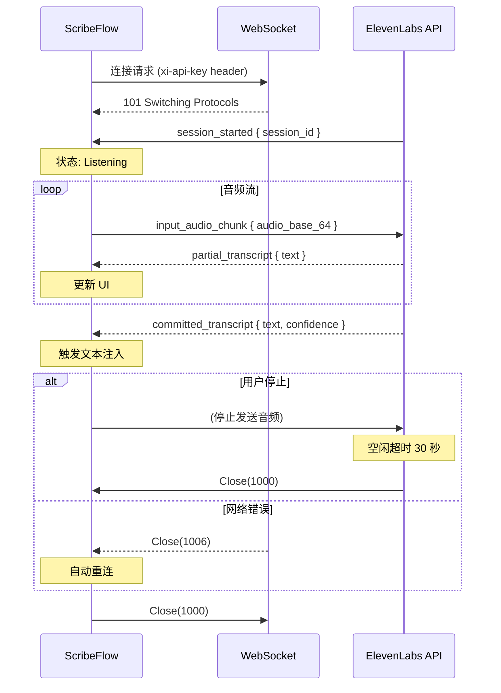

# ElevenLabs Scribe v2 Realtime WebSocket 协议规范

**版本**: 1.0.0
**日期**: 2026-01-24
**API 版本**: Scribe v2 Realtime (2026-01-06)

本文档定义了 ScribeFlow 与 ElevenLabs Scribe v2 Realtime API 的 WebSocket 通信协议规范。

---

## 目录

1. [连接建立](#连接建立)
2. [客户端消息](#客户端消息)
3. [服务端消息](#服务端消息)
4. [错误场景](#错误场景)
5. [连接生命周期](#连接生命周期)
6. [Rust 实现示例](#rust-实现示例)

---

## 连接建立

### 端点

```
wss://api.elevenlabs.io/v1/speech-to-text/realtime
```

### 鉴权方式

**推荐方式**: HTTP Header

```http
GET /v1/speech-to-text/realtime?model_id=scribe_v2_realtime&language_code=zh&encoding=pcm_16000 HTTP/1.1
Host: api.elevenlabs.io
Upgrade: websocket
Connection: Upgrade
xi-api-key: YOUR_API_KEY_HERE
```

**备用方式**: Query Parameter (仅用于浏览器环境)

```
wss://api.elevenlabs.io/v1/speech-to-text/realtime?token=YOUR_API_KEY
```

### 查询参数

| 参数 | 类型 | 必填 | 默认值 | 说明 |
|------|------|------|-------|------|
| `model_id` | string | ✅ | - | 固定为 `scribe_v2_realtime` |
| `language_code` | string | ❌ | `auto` | 语言代码: `en`, `zh`, `auto` |
| `encoding` | string | ✅ | - | 音频编码: `pcm_16000` (16kHz PCM) |

### 连接成功响应

```http
HTTP/1.1 101 Switching Protocols
Upgrade: websocket
Connection: Upgrade
```

随后立即收到 `session_started` 消息。

### 连接失败响应

| HTTP 状态码 | 原因 | 处理方式 |
|-----------|------|---------|
| `401 Unauthorized` | API 密钥无效或缺失 | 提示用户更新密钥 |
| `429 Too Many Requests` | 超出速率限制 | 等待 60 秒后重试 |
| `503 Service Unavailable` | 服务暂时不可用 | 指数退避重试 |

---

## 客户端消息

### 1. input_audio_chunk (音频数据块)

**描述**: 发送音频数据到服务端进行实时转写。

**消息格式**:

```json
{
  "message_type": "input_audio_chunk",
  "audio_base_64": "AAABAAACAAADAAA..."
}
```

**字段说明**:

| 字段 | 类型 | 必填 | 说明 |
|------|------|------|------|
| `message_type` | string | ✅ | 固定为 `"input_audio_chunk"` |
| `audio_base_64` | string | ✅ | Base64 编码的 PCM i16 音频数据 |

**音频数据要求**:

- **格式**: PCM signed 16-bit little-endian
- **采样率**: 16000 Hz
- **通道数**: 1 (单声道)
- **推荐块大小**: 1600 bytes (800 samples = 50ms)
- **编码方式**: Base64

**Rust 示例**:

```rust
use serde::Serialize;

#[derive(Serialize)]
struct InputAudioChunk {
    message_type: String,
    audio_base_64: String,
}

// 发送音频块
async fn send_audio_chunk(stream: &mut WebSocketStream, audio_data: &[i16]) -> Result<()> {
    // 将 i16 转换为字节数组
    let bytes: Vec<u8> = audio_data.iter()
        .flat_map(|&sample| sample.to_le_bytes())
        .collect();

    // Base64 编码
    let encoded = base64::encode(&bytes);

    // 构建消息
    let message = InputAudioChunk {
        message_type: "input_audio_chunk".to_string(),
        audio_base_64: encoded,
    };

    // 序列化为 JSON
    let json = serde_json::to_string(&message)?;

    // 发送
    stream.send(Message::Text(json)).await?;

    Ok(())
}
```

**发送频率建议**:

- **实时场景**: 每 50-100ms 发送一次 (800-1600 samples)
- **低延迟场景**: 每 25ms 发送一次 (400 samples)
- **最大块大小**: 不超过 5 秒音频数据

---

## 服务端消息

### 1. session_started (会话已启动)

**描述**: WebSocket 连接成功后,服务端返回的初始化消息。

**消息格式**:

```json
{
  "message_type": "session_started",
  "session_id": "550e8400-e29b-41d4-a716-446655440000",
  "config": {
    "model_id": "scribe_v2_realtime",
    "language_code": "zh",
    "encoding": "pcm_16000"
  }
}
```

**字段说明**:

| 字段 | 类型 | 说明 |
|------|------|------|
| `message_type` | string | 固定为 `"session_started"` |
| `session_id` | string | UUID v4 格式的会话 ID |
| `config` | object | 服务端确认的配置 |

**Rust 示例**:

```rust
use serde::Deserialize;

#[derive(Deserialize)]
struct SessionStarted {
    message_type: String,
    session_id: String,
    config: SessionConfig,
}

#[derive(Deserialize)]
struct SessionConfig {
    model_id: String,
    language_code: String,
    encoding: String,
}

// 处理 session_started
fn handle_session_started(msg: SessionStarted) {
    tracing::info!(
        event = "session_started",
        session_id = %msg.session_id,
        language = %msg.config.language_code
    );

    // 更新会话状态
    // session.set_session_id(msg.session_id);
    // session.transition_to(SessionState::Listening);
}
```

---

### 2. partial_transcript (部分转写结果)

**描述**: 实时返回的部分转写结果,会不断覆盖更新。

**消息格式**:

```json
{
  "message_type": "partial_transcript",
  "text": "你好世",
  "created_at_ms": 1706025600000
}
```

**字段说明**:

| 字段 | 类型 | 说明 |
|------|------|------|
| `message_type` | string | 固定为 `"partial_transcript"` |
| `text` | string | 部分转写文本 (UTF-8) |
| `created_at_ms` | number | 事件时间戳 (Unix milliseconds) |

**特性**:

- **覆盖性**: 每次收到新的 partial 会覆盖前一个
- **不触发注入**: 仅用于 UI 显示,不触发文本注入
- **可能为空**: 某些情况下 `text` 可能为空字符串

**Rust 示例**:

```rust
#[derive(Deserialize)]
struct PartialTranscript {
    message_type: String,
    text: String,
    created_at_ms: u64,
}

// 处理 partial_transcript
fn handle_partial_transcript(msg: PartialTranscript, overlay: &mut OverlayWindow) {
    tracing::debug!(
        event = "partial_transcript",
        text_length = msg.text.len(),
        timestamp = msg.created_at_ms
    );

    // 更新悬浮窗显示
    overlay.update_partial_text(msg.text);
}
```

**时序示例**:

```
用户说: "你好世界"

t=0ms:    (开始说话)
t=200ms:  partial_transcript { text: "你" }
t=400ms:  partial_transcript { text: "你好" }
t=600ms:  partial_transcript { text: "你好世" }
t=800ms:  committed_transcript { text: "你好世界", confidence: 0.98 }
```

---

### 3. committed_transcript (最终转写文本)

**描述**: 确定的最终转写结果,触发文本注入逻辑。

**消息格式**:

```json
{
  "message_type": "committed_transcript",
  "text": "你好世界",
  "confidence": 0.98,
  "created_at_ms": 1706025601500
}
```

**字段说明**:

| 字段 | 类型 | 说明 |
|------|------|------|
| `message_type` | string | 固定为 `"committed_transcript"` |
| `text` | string | 最终转写文本 (UTF-8) |
| `confidence` | number | 置信度 (0.0 ~ 1.0) |
| `created_at_ms` | number | 事件时间戳 (Unix milliseconds) |

**触发条件**:

- VAD (Voice Activity Detection) 检测到停顿 (通常 0.5-1 秒)
- 用户主动停止说话
- 语音片段达到最大长度限制

**Rust 示例**:

```rust
#[derive(Deserialize)]
struct CommittedTranscript {
    message_type: String,
    text: String,
    confidence: f32,
    created_at_ms: u64,
}

// 处理 committed_transcript
async fn handle_committed_transcript(
    msg: CommittedTranscript,
    injector: &mut TextInjector,
) -> Result<()> {
    tracing::info!(
        event = "committed_transcript",
        text_length = msg.text.len(),
        confidence = msg.confidence
    );

    // 检查置信度
    if msg.confidence < 0.5 {
        tracing::warn!("Low confidence transcript, skipping injection");
        return Ok(());
    }

    // 触发文本注入
    injector.inject_text(&msg.text).await?;

    // 更新悬浮窗
    // overlay.show_committed_text(&msg.text);

    Ok(())
}
```

---

### 4. input_error (输入错误)

**描述**: 客户端发送的音频数据格式错误。

**消息格式**:

```json
{
  "message_type": "input_error",
  "error_message": "Invalid audio format: expected pcm_16000, got pcm_48000"
}
```

**字段说明**:

| 字段 | 类型 | 说明 |
|------|------|------|
| `message_type` | string | 固定为 `"input_error"` |
| `error_message` | string | 错误描述 |

**常见错误**:

| 错误消息 | 原因 | 解决方案 |
|---------|------|---------|
| `"Invalid audio format"` | 音频编码格式不匹配 | 检查重采样器输出 |
| `"Base64 decode failed"` | Base64 编码错误 | 检查编码实现 |
| `"Audio data too large"` | 单次发送数据过大 | 减小音频块大小 |

**Rust 示例**:

```rust
#[derive(Deserialize)]
struct InputError {
    message_type: String,
    error_message: String,
}

// 处理 input_error
fn handle_input_error(msg: InputError) {
    tracing::error!(
        event = "input_error",
        message = %msg.error_message
    );

    // 停止音频采集
    // audio_stream.stop();

    // 显示错误通知
    // notify_user(&format!("音频格式错误: {}", msg.error_message));
}
```

---

## 错误场景

### 1. 网络连接错误

**场景**: 连接建立失败或连接中断。

**WebSocket 关闭代码**:

| 代码 | 名称 | 原因 | 客户端处理 |
|------|------|------|----------|
| `1000` | Normal Closure | 正常关闭 | 不重连 |
| `1001` | Going Away | 服务端关闭 | 重连 (1 次) |
| `1006` | Abnormal Closure | 网络异常 | 指数退避重连 (最多 3 次) |
| `1011` | Internal Error | 服务端内部错误 | 等待 60 秒后重连 |

**Rust 处理示例**:

```rust
use tokio_tungstenite::tungstenite::protocol::CloseFrame;

async fn handle_close(close_frame: Option<CloseFrame<'_>>) {
    if let Some(frame) = close_frame {
        match frame.code {
            1000 => {
                tracing::info!("WebSocket closed normally");
                // 不重连
            }
            1006 => {
                tracing::warn!("Abnormal closure, reconnecting...");
                // 触发重连逻辑
                // connection.reconnect().await;
            }
            1011 => {
                tracing::error!("Server internal error");
                // 等待后重连
                // tokio::time::sleep(Duration::from_secs(60)).await;
                // connection.reconnect().await;
            }
            _ => {
                tracing::error!("Unexpected close code: {}", frame.code);
            }
        }
    }
}
```

---

### 2. 鉴权错误

**场景**: API 密钥无效或过期。

**HTTP 响应**:

```http
HTTP/1.1 401 Unauthorized
Content-Type: application/json

{
  "error": {
    "message": "Invalid API key",
    "type": "authentication_error"
  }
}
```

**客户端处理**:

1. 停止连接尝试
2. 显示错误通知: "API 密钥无效,请在设置中更新"
3. 打开设置面板
4. 不自动重连

---

### 3. 速率限制

**场景**: 请求频率超出限制。

**HTTP 响应**:

```http
HTTP/1.1 429 Too Many Requests
Retry-After: 60

{
  "error": {
    "message": "Rate limit exceeded",
    "type": "rate_limit_error"
  }
}
```

**客户端处理**:

1. 读取 `Retry-After` header
2. 显示通知: "请求过于频繁,请 60 秒后重试"
3. 等待指定时间后重连
4. 如果持续 429,停止重连并提示用户升级配额

---

## 连接生命周期

### 完整流程图



---

### 状态转换规则

| 当前状态 | 触发事件 | 新状态 | 操作 |
|---------|---------|-------|------|
| Disconnected | `connect()` 调用 | Connecting | 建立 WebSocket 连接 |
| Connecting | 收到 `session_started` | Listening | 存储 session_id |
| Connecting | 401 错误 | AuthenticationFailed | 显示错误,停止重连 |
| Listening | 发送 `input_audio_chunk` | Recording | 开始计时 |
| Recording | 收到 `partial_transcript` | Processing | 更新 UI |
| Processing | 收到 `committed_transcript` | Committing | 触发文本注入 |
| Committing | 注入完成 | Listening | 等待下次语音 |
| * | 收到 `input_error` | Error | 停止采集,显示错误 |
| * | Close(1006) | NetworkError | 触发重连 |

---

## Rust 实现示例

### 完整客户端实现

```rust
use tokio_tungstenite::{connect_async, tungstenite::protocol::Message, WebSocketStream, MaybeTlsStream};
use tokio::net::TcpStream;
use futures_util::{StreamExt, SinkExt};
use serde::{Deserialize, Serialize};

pub struct ScribeClient {
    stream: WebSocketStream<MaybeTlsStream<TcpStream>>,
    session_id: Option<String>,
}

impl ScribeClient {
    /// 连接到 ElevenLabs API
    pub async fn connect(api_key: &str, language: &str) -> Result<Self, Box<dyn std::error::Error>> {
        let url = format!(
            "wss://api.elevenlabs.io/v1/speech-to-text/realtime?model_id=scribe_v2_realtime&language_code={}&encoding=pcm_16000",
            language
        );

        let request = tokio_tungstenite::tungstenite::http::Request::builder()
            .uri(&url)
            .header("xi-api-key", api_key)
            .body(())?;

        let (ws_stream, _) = connect_async(request).await?;

        tracing::info!("WebSocket connected");

        let mut client = Self {
            stream: ws_stream,
            session_id: None,
        };

        // 等待 session_started
        if let Some(msg) = client.receive().await? {
            if let ServerMessage::SessionStarted { session_id, .. } = msg {
                client.session_id = Some(session_id);
                tracing::info!("Session started: {}", client.session_id.as_ref().unwrap());
            }
        }

        Ok(client)
    }

    /// 发送音频数据
    pub async fn send_audio(&mut self, audio_samples: &[i16]) -> Result<(), Box<dyn std::error::Error>> {
        // 转换为字节
        let bytes: Vec<u8> = audio_samples.iter()
            .flat_map(|&s| s.to_le_bytes())
            .collect();

        // Base64 编码
        let encoded = base64::encode(&bytes);

        // 构建消息
        let message = serde_json::json!({
            "message_type": "input_audio_chunk",
            "audio_base_64": encoded
        });

        // 发送
        self.stream.send(Message::Text(message.to_string())).await?;

        Ok(())
    }

    /// 接收服务端消息
    pub async fn receive(&mut self) -> Result<Option<ServerMessage>, Box<dyn std::error::Error>> {
        if let Some(msg) = self.stream.next().await {
            match msg? {
                Message::Text(text) => {
                    let server_msg: ServerMessage = serde_json::from_str(&text)?;
                    Ok(Some(server_msg))
                }
                Message::Close(_) => {
                    tracing::info!("WebSocket closed by server");
                    Ok(None)
                }
                _ => Ok(None),
            }
        } else {
            Ok(None)
        }
    }

    /// 关闭连接
    pub async fn close(mut self) -> Result<(), Box<dyn std::error::Error>> {
        self.stream.send(Message::Close(None)).await?;
        Ok(())
    }
}

/// 服务端消息枚举
#[derive(Debug, Deserialize)]
#[serde(tag = "message_type", rename_all = "snake_case")]
pub enum ServerMessage {
    SessionStarted {
        session_id: String,
        config: serde_json::Value,
    },
    PartialTranscript {
        text: String,
        created_at_ms: u64,
    },
    CommittedTranscript {
        text: String,
        confidence: f32,
        created_at_ms: u64,
    },
    InputError {
        error_message: String,
    },
}

/// 使用示例
#[tokio::main]
async fn main() -> Result<(), Box<dyn std::error::Error>> {
    let api_key = "YOUR_API_KEY";
    let mut client = ScribeClient::connect(api_key, "zh").await?;

    // 发送音频数据
    let audio_data: Vec<i16> = vec![0; 800]; // 50ms @ 16kHz
    client.send_audio(&audio_data).await?;

    // 接收消息
    while let Some(msg) = client.receive().await? {
        match msg {
            ServerMessage::PartialTranscript { text, .. } => {
                println!("Partial: {}", text);
            }
            ServerMessage::CommittedTranscript { text, confidence, .. } => {
                println!("Committed: {} (confidence: {})", text, confidence);
                break;
            }
            ServerMessage::InputError { error_message } => {
                eprintln!("Error: {}", error_message);
                break;
            }
            _ => {}
        }
    }

    client.close().await?;

    Ok(())
}
```

---

## 测试场景

详见 [test-scenarios.md](./test-scenarios.md)

---

## 总结

### 关键要点

1. **连接**: 使用 WSS + `xi-api-key` header 鉴权
2. **音频格式**: PCM i16, 16kHz, 单声道, Base64 编码
3. **消息类型**: 客户端 1 种 (`input_audio_chunk`),服务端 4 种
4. **状态机**: 7 个状态,10+ 种状态转换
5. **错误处理**: 指数退避重连,最多 3 次

### 性能指标

- **WebSocket 建立延迟**: <500ms
- **首次 partial 延迟**: <200ms (语音开始后)
- **committed 延迟**: <1000ms (语音停止后)
- **消息发送频率**: 每 50-100ms

---

**协议版本**: 1.0.0
**最后更新**: 2026-01-24
**状态**: Complete
