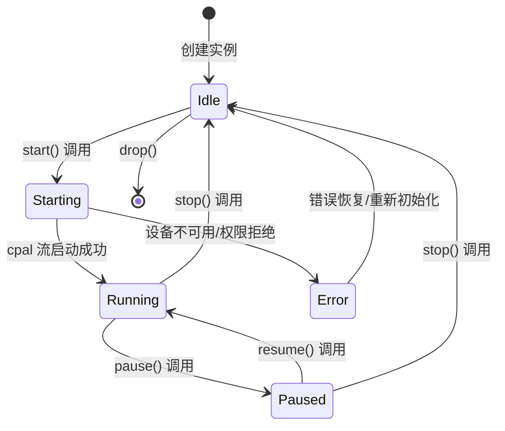
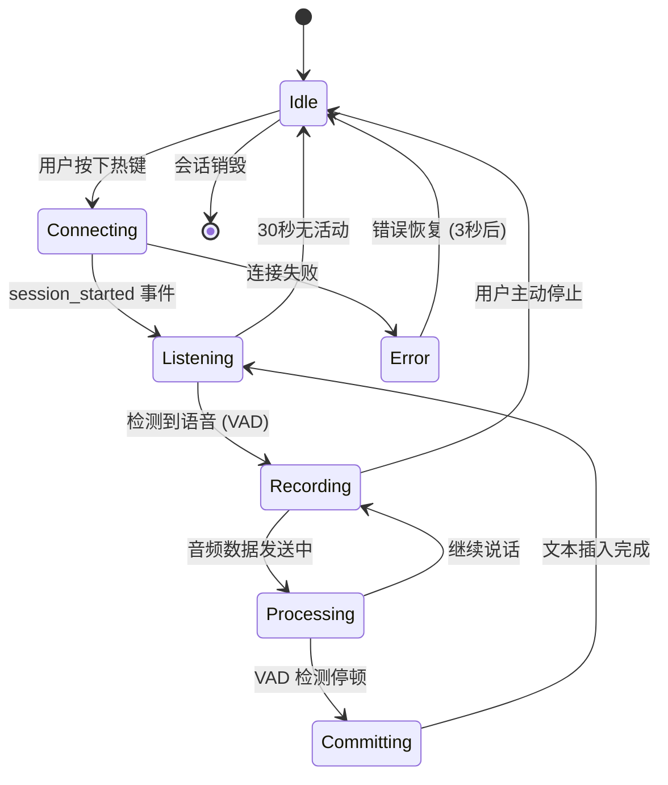
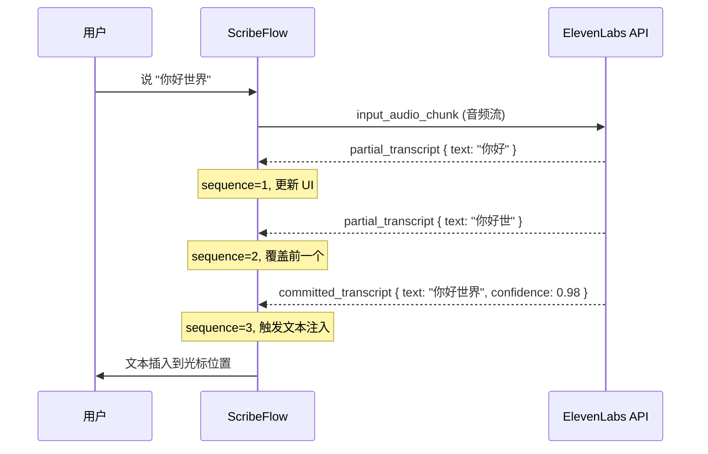
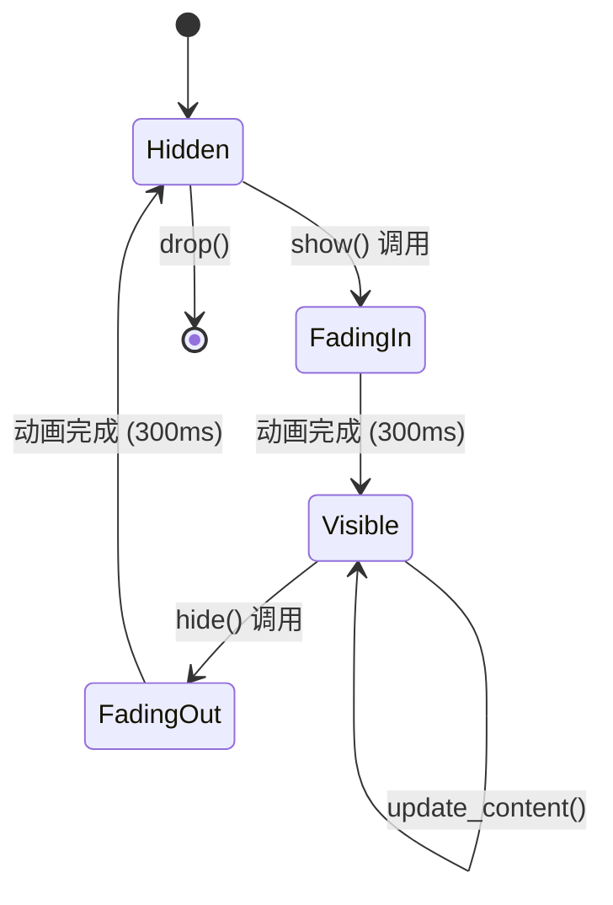
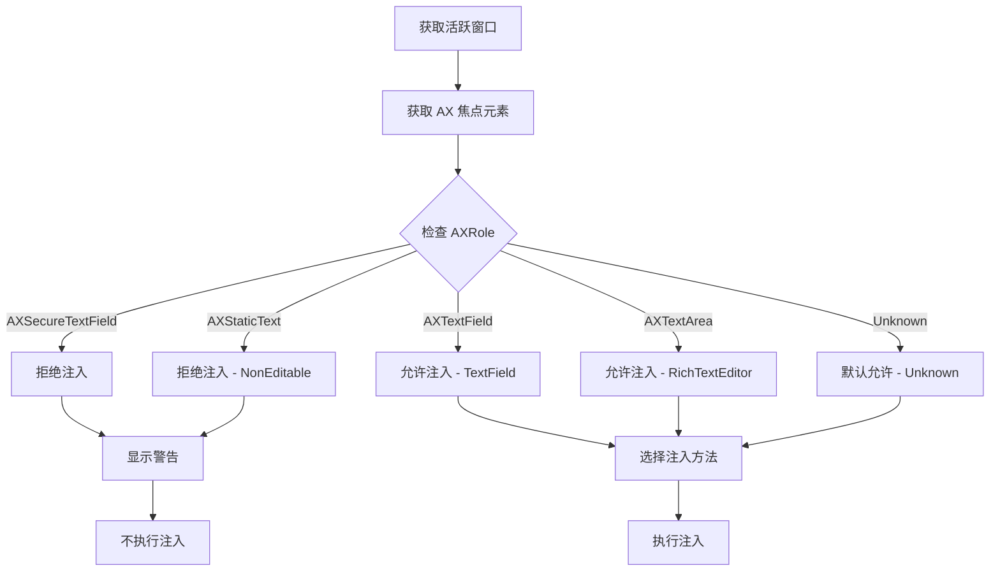
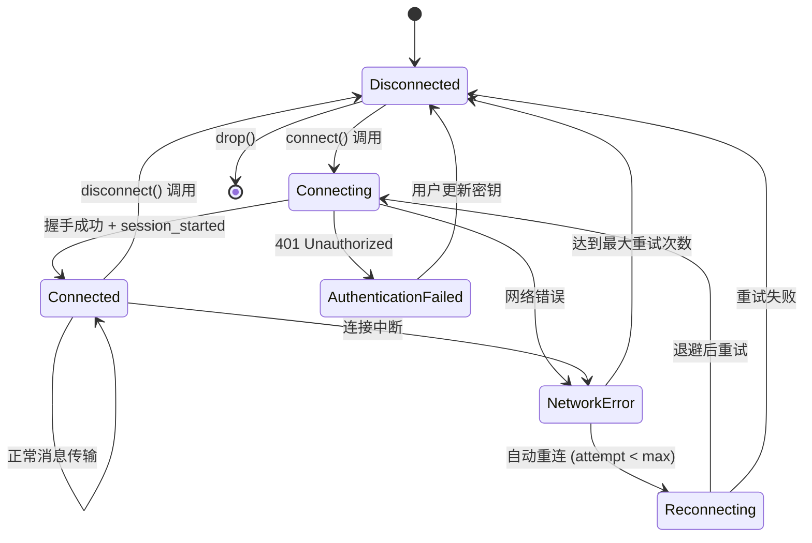
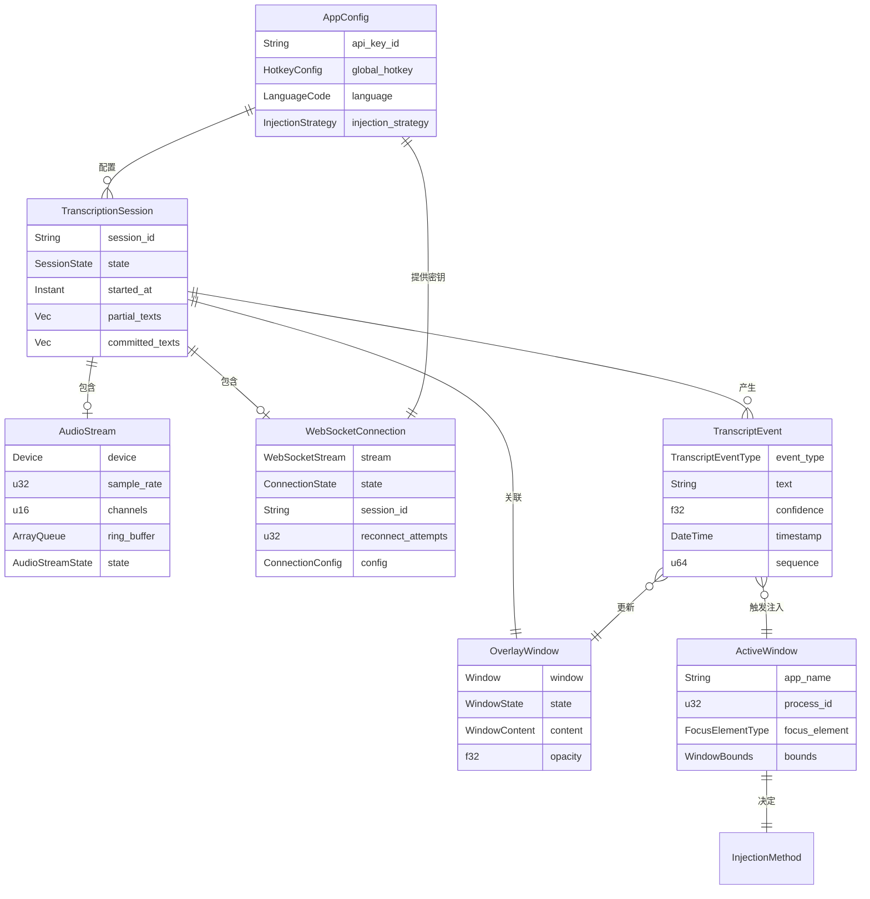

# 数据模型规范: ScribeFlow

**版本**: 1.0.0
**日期**: 2026-01-24
**状态**: Phase 1 Complete
**Project Root**: `~/Documents/VibeCoding/Week3`
**实现位置**: `~/Documents/VibeCoding/Week3/src-tauri/src/` (Rust 数据结构)

本文档定义了 ScribeFlow 实时语音听写系统的所有核心实体、状态机、验证规则和实体关系。

---

## 目录

1. [Entity: AudioStream (音频流)](#entity-audiostream-音频流)
2. [Entity: TranscriptionSession (转写会话)](#entity-transcriptionsession-转写会话)
3. [Entity: TranscriptEvent (转写事件)](#entity-transcriptevent-转写事件)
4. [Entity: OverlayWindow (悬浮窗)](#entity-overlaywindow-悬浮窗)
5. [Entity: AppConfig (应用配置)](#entity-appconfig-应用配置)
6. [Entity: ActiveWindow (活跃窗口)](#entity-activewindow-活跃窗口)
7. [Entity: WebSocketConnection (WebSocket 连接)](#entity-websocketconnection-websocket-连接)
8. [实体关系图](#实体关系图)

---

## Entity: AudioStream (音频流)

### 用途

表示从麦克风采集的实时音频数据流。负责管理音频设备、缓冲区和采样率配置。

### Rust 数据结构

```rust
use cpal::{Device, Stream, StreamConfig};
use std::sync::Arc;
use crossbeam::queue::ArrayQueue;

/// 音频流实体
pub struct AudioStream {
    /// cpal 音频输入设备
    pub device: Device,

    /// 流配置
    pub config: StreamConfig,

    /// 原生采样率 (Hz),通常为 48000
    pub sample_rate: u32,

    /// 通道数,固定为 1 (单声道)
    pub channels: u16,

    /// 缓冲区大小 (frames),目标 10ms = 480 frames @ 48kHz
    pub buffer_size: usize,

    /// cpal 音频流句柄 (运行时)
    pub stream: Option<Stream>,

    /// 环形缓冲区 (无锁并发队列)
    /// 容量: 100ms @ 48kHz = 4800 samples
    pub ring_buffer: Arc<ArrayQueue<f32>>,

    /// 流状态
    pub state: AudioStreamState,
}

/// 音频流状态
#[derive(Debug, Clone, Copy, PartialEq, Eq)]
pub enum AudioStreamState {
    /// 未初始化
    Idle,

    /// 正在启动
    Starting,

    /// 运行中 (采集数据)
    Running,

    /// 已暂停
    Paused,

    /// 错误状态
    Error,
}

impl AudioStream {
    /// 创建新的音频流
    pub fn new(device: Device, config: StreamConfig) -> Result<Self, AudioError> {
        let sample_rate = config.sample_rate.0;
        let channels = config.channels;

        // 验证配置
        if channels != 1 {
            return Err(AudioError::InvalidChannelCount(channels));
        }

        if !(16000..=48000).contains(&sample_rate) {
            return Err(AudioError::InvalidSampleRate(sample_rate));
        }

        // 计算缓冲区大小 (10ms)
        let buffer_size = (sample_rate / 100) as usize;

        // 创建环形缓冲区 (100ms 容量)
        let ring_buffer = Arc::new(ArrayQueue::new(sample_rate as usize / 10));

        Ok(Self {
            device,
            config,
            sample_rate,
            channels,
            buffer_size,
            stream: None,
            ring_buffer,
            state: AudioStreamState::Idle,
        })
    }

    /// 启动音频采集
    pub fn start(&mut self) -> Result<(), AudioError> {
        // 实现省略...
        Ok(())
    }

    /// 停止音频采集
    pub fn stop(&mut self) -> Result<(), AudioError> {
        self.stream.take();
        self.state = AudioStreamState::Idle;
        Ok(())
    }
}
```

### 生命周期



### 验证规则

| 字段 | 验证规则 | 错误类型 |
|------|---------|---------|
| `sample_rate` | 16000 ≤ rate ≤ 48000 | `InvalidSampleRate` |
| `channels` | 必须为 1 (单声道) | `InvalidChannelCount` |
| `buffer_size` | 必须是 2 的幂次方 | `InvalidBufferSize` |
| `ring_buffer` | 容量至少 100ms 数据 | `InsufficientBufferCapacity` |

### 关系

- **使用于** `TranscriptionSession`: 每个会话关联一个 AudioStream
- **产生** 原始音频数据 → 传递给 Resampler

---

## Entity: TranscriptionSession (转写会话)

### 用途

表示一次完整的语音输入过程,从用户按下热键到文本插入完成。管理会话生命周期和状态转换。

### Rust 数据结构

```rust
use std::time::Instant;
use uuid::Uuid;

/// 转写会话实体
#[derive(Debug, Clone)]
pub struct TranscriptionSession {
    /// 会话 ID (由 ElevenLabs 服务端生成)
    pub session_id: String,

    /// 会话状态
    pub state: SessionState,

    /// 会话开始时间
    pub started_at: Instant,

    /// 会话结束时间
    pub ended_at: Option<Instant>,

    /// 部分转写文本历史 (临时存储)
    pub partial_texts: Vec<String>,

    /// 已确认的转写文本
    pub committed_texts: Vec<String>,

    /// 关联的音频流
    pub audio_stream: Option<AudioStream>,

    /// 关联的 WebSocket 连接
    pub websocket_conn: Option<WebSocketConnection>,
}

/// 会话状态
#[derive(Debug, Clone, PartialEq, Eq)]
pub enum SessionState {
    /// 空闲 (未激活)
    Idle,

    /// 正在连接 WebSocket
    Connecting,

    /// 监听中 (已连接,等待用户说话)
    Listening { session_id: String },

    /// 录音中 (检测到语音)
    Recording { start_time: Instant },

    /// 处理中 (等待服务端响应)
    Processing,

    /// 提交中 (收到 committed_transcript)
    Committing,

    /// 错误状态
    Error { message: String },
}

impl TranscriptionSession {
    /// 创建新会话
    pub fn new() -> Self {
        Self {
            session_id: String::new(),
            state: SessionState::Idle,
            started_at: Instant::now(),
            ended_at: None,
            partial_texts: Vec::new(),
            committed_texts: Vec::new(),
            audio_stream: None,
            websocket_conn: None,
        }
    }

    /// 状态转换 (带验证)
    pub fn transition_to(&mut self, new_state: SessionState) -> Result<(), StateTransitionError> {
        // 验证状态转换合法性
        if !self.can_transition_to(&new_state) {
            return Err(StateTransitionError::InvalidTransition {
                from: self.state.clone(),
                to: new_state,
            });
        }

        tracing::info!(
            event = "session_state_transition",
            session_id = %self.session_id,
            from = ?self.state,
            to = ?new_state
        );

        self.state = new_state;
        Ok(())
    }

    /// 检查状态转换是否合法
    fn can_transition_to(&self, new_state: &SessionState) -> bool {
        use SessionState::*;

        matches!(
            (&self.state, new_state),
            (Idle, Connecting) |
            (Connecting, Listening { .. }) |
            (Connecting, Error { .. }) |
            (Listening { .. }, Recording { .. }) |
            (Recording { .. }, Processing) |
            (Recording { .. }, Idle) |
            (Processing, Recording { .. }) |
            (Processing, Committing) |
            (Committing, Listening { .. }) |
            (Listening { .. }, Idle) |
            (Error { .. }, Idle)
        )
    }

    /// 添加部分转写文本
    pub fn add_partial_text(&mut self, text: String) {
        self.partial_texts.push(text);
    }

    /// 添加已确认文本
    pub fn add_committed_text(&mut self, text: String) {
        self.committed_texts.push(text);
    }

    /// 获取会话持续时长
    pub fn duration(&self) -> std::time::Duration {
        self.ended_at.unwrap_or_else(Instant::now) - self.started_at
    }
}
```

### 状态机



### 验证规则

| 字段 | 验证规则 | 错误类型 |
|------|---------|---------|
| `session_id` | 进入 Listening 状态后必须非空 | `MissingSessionId` |
| `state` | 状态转换必须遵循状态机规则 | `InvalidTransition` |
| `committed_texts` | 一旦添加不可修改 (immutable) | - |
| `started_at` | 必须早于 `ended_at` | `InvalidTimeRange` |

### 关系

- **包含** 1 个 `AudioStream` (可选)
- **包含** 1 个 `WebSocketConnection` (可选)
- **产生** 多个 `TranscriptEvent`

---

## Entity: TranscriptEvent (转写事件)

### 用途

表示从 ElevenLabs 服务端推送的转写结果事件。区分部分结果 (partial) 和最终结果 (committed)。

### Rust 数据结构

```rust
use chrono::{DateTime, Utc};
use serde::{Deserialize, Serialize};

/// 转写事件实体
#[derive(Debug, Clone, Serialize, Deserialize)]
pub struct TranscriptEvent {
    /// 事件类型
    pub event_type: TranscriptEventType,

    /// 转写文本内容
    pub text: String,

    /// 置信度 (0.0 ~ 1.0),仅 committed 事件有值
    pub confidence: Option<f32>,

    /// 事件时间戳
    pub timestamp: DateTime<Utc>,

    /// 事件序列号 (单调递增)
    pub sequence: u64,
}

/// 转写事件类型
#[derive(Debug, Clone, PartialEq, Eq, Serialize, Deserialize)]
#[serde(rename_all = "snake_case")]
pub enum TranscriptEventType {
    /// 部分转写结果 (实时更新)
    PartialTranscript,

    /// 最终确定的转写文本
    CommittedTranscript,

    /// 输入错误 (音频格式问题)
    InputError,
}

impl TranscriptEvent {
    /// 创建部分转写事件
    pub fn partial(text: String, sequence: u64) -> Self {
        Self {
            event_type: TranscriptEventType::PartialTranscript,
            text,
            confidence: None,
            timestamp: Utc::now(),
            sequence,
        }
    }

    /// 创建已确认转写事件
    pub fn committed(text: String, confidence: f32, sequence: u64) -> Self {
        Self {
            event_type: TranscriptEventType::CommittedTranscript,
            text,
            confidence: Some(confidence),
            timestamp: Utc::now(),
            sequence,
        }
    }

    /// 是否是最终转写
    pub fn is_final(&self) -> bool {
        self.event_type == TranscriptEventType::CommittedTranscript
    }
}
```

### 事件时序图



### 验证规则

| 字段 | 验证规则 | 错误类型 |
|------|---------|---------|
| `text` | 不能为空 | `EmptyTranscriptText` |
| `confidence` | 0.0 ≤ confidence ≤ 1.0 | `InvalidConfidence` |
| `sequence` | 必须单调递增 | `InvalidSequence` |
| `event_type` | committed 事件必须有 confidence | `MissingConfidence` |

### 关系

- **属于** 1 个 `TranscriptionSession`
- **触发** UI 更新 (`OverlayWindow`)
- **触发** 文本注入 (当 `event_type = CommittedTranscript`)

---

## Entity: OverlayWindow (悬浮窗)

### 用途

表示显示实时转写反馈的透明悬浮窗口。固定显示在主显示器中央,展示音量波形和转写文本。

### Rust 数据结构

```rust
use tauri::{Window, Manager};
use serde::{Serialize, Deserialize};

/// 悬浮窗实体
pub struct OverlayWindow {
    /// Tauri 窗口句柄
    pub window: Window,

    /// 窗口状态
    pub state: WindowState,

    /// 显示内容
    pub content: WindowContent,

    /// 窗口位置 (固定在屏幕中央)
    pub position: WindowPosition,

    /// 透明度 (0.0 ~ 1.0)
    pub opacity: f32,
}

/// 窗口状态
#[derive(Debug, Clone, Copy, PartialEq, Eq)]
pub enum WindowState {
    /// 隐藏
    Hidden,

    /// 显示中
    Visible,

    /// 淡入动画
    FadingIn,

    /// 淡出动画
    FadingOut,
}

/// 窗口内容
#[derive(Debug, Clone, Serialize, Deserialize)]
pub struct WindowContent {
    /// 状态文本 (如 "正在听...", "正在识别...")
    pub status: String,

    /// 部分转写文本
    pub partial_text: Option<String>,

    /// 已确认文本
    pub committed_text: Option<String>,

    /// 当前音量级别 (0.0 ~ 1.0)
    pub audio_level: f32,
}

/// 窗口位置
#[derive(Debug, Clone, Copy)]
pub struct WindowPosition {
    /// X 坐标 (屏幕中心)
    pub x: i32,

    /// Y 坐标 (屏幕中心)
    pub y: i32,

    /// 窗口宽度
    pub width: u32,

    /// 窗口高度
    pub height: u32,
}

impl OverlayWindow {
    /// 创建悬浮窗
    pub fn new(app: &tauri::AppHandle) -> Result<Self, WindowError> {
        let window = app.get_window("overlay")
            .ok_or(WindowError::WindowNotFound)?;

        // 获取主显示器尺寸并计算中心位置
        let position = Self::calculate_center_position();

        Ok(Self {
            window,
            state: WindowState::Hidden,
            content: WindowContent::default(),
            position,
            opacity: 0.0,
        })
    }

    /// 显示窗口 (淡入动画)
    pub fn show(&mut self) -> Result<(), WindowError> {
        self.state = WindowState::FadingIn;
        self.window.show()?;
        self.fade_in();
        Ok(())
    }

    /// 隐藏窗口 (淡出动画)
    pub fn hide(&mut self) -> Result<(), WindowError> {
        self.state = WindowState::FadingOut;
        self.fade_out();
        self.window.hide()?;
        Ok(())
    }

    /// 更新内容
    pub fn update_content(&mut self, content: WindowContent) -> Result<(), WindowError> {
        self.content = content;
        self.window.emit("overlay_update", &self.content)?;
        Ok(())
    }

    /// 计算屏幕中心位置
    fn calculate_center_position() -> WindowPosition {
        // 实现省略...
        WindowPosition {
            x: 0,
            y: 0,
            width: 400,
            height: 120,
        }
    }

    fn fade_in(&mut self) {
        // 淡入动画实现
    }

    fn fade_out(&mut self) {
        // 淡出动画实现
    }
}

impl Default for WindowContent {
    fn default() -> Self {
        Self {
            status: String::new(),
            partial_text: None,
            committed_text: None,
            audio_level: 0.0,
        }
    }
}
```

### 状态机



### 验证规则

| 字段 | 验证规则 | 错误类型 |
|------|---------|---------|
| `opacity` | 0.0 ≤ opacity ≤ 1.0 | `InvalidOpacity` |
| `audio_level` | 0.0 ≤ level ≤ 1.0 | `InvalidAudioLevel` |
| `position` | 必须在屏幕边界内 | `InvalidPosition` |

### 关系

- **接收** `TranscriptEvent` → 更新显示内容
- **接收** 音量数据 → 更新波形动画
- **属于** 1 个 `TranscriptionSession`

---

## Entity: AppConfig (应用配置)

### 用途

存储用户的个性化设置,包括 API 密钥、快捷键、语言偏好等。API 密钥存储在系统钥匙串,其他配置持久化到本地文件。

### Rust 数据结构

```rust
use serde::{Deserialize, Serialize};
use tauri_plugin_store::Store;

/// 应用配置实体
#[derive(Debug, Clone, Serialize, Deserialize)]
pub struct AppConfig {
    /// API 密钥引用 (存储在 Keychain,此处仅标识)
    pub api_key_id: Option<String>,

    /// 全局快捷键
    pub global_hotkey: HotkeyConfig,

    /// 首选语言
    pub language: LanguageCode,

    /// 文本注入策略
    pub injection_strategy: InjectionStrategy,

    /// 是否启用音量可视化
    pub enable_waveform: bool,

    /// 悬浮窗透明度
    pub overlay_opacity: f32,

    /// 日志级别
    pub log_level: LogLevel,
}

/// 快捷键配置
#[derive(Debug, Clone, Serialize, Deserialize)]
pub struct HotkeyConfig {
    /// 修饰键 (Cmd, Shift, Alt, Ctrl)
    pub modifiers: Vec<String>,

    /// 主键 (如 "Backslash")
    pub key: String,
}

/// 语言代码
#[derive(Debug, Clone, Copy, PartialEq, Eq, Serialize, Deserialize)]
#[serde(rename_all = "lowercase")]
pub enum LanguageCode {
    /// 英语
    En,

    /// 中文
    Zh,

    /// 自动检测
    Auto,
}

/// 文本注入策略
#[derive(Debug, Clone, Serialize, Deserialize)]
pub struct InjectionStrategy {
    /// 短文本阈值 (字符数)
    /// 小于此值使用键盘模拟,大于等于使用剪贴板
    pub short_text_threshold: usize,

    /// 是否保存剪贴板
    pub preserve_clipboard: bool,
}

/// 日志级别
#[derive(Debug, Clone, Copy, Serialize, Deserialize)]
#[serde(rename_all = "lowercase")]
pub enum LogLevel {
    Error,
    Warn,
    Info,
    Debug,
}

impl Default for AppConfig {
    fn default() -> Self {
        Self {
            api_key_id: None,
            global_hotkey: HotkeyConfig {
                modifiers: vec!["Cmd".to_string(), "Shift".to_string()],
                key: "Backslash".to_string(),
            },
            language: LanguageCode::Auto,
            injection_strategy: InjectionStrategy {
                short_text_threshold: 10,
                preserve_clipboard: true,
            },
            enable_waveform: true,
            overlay_opacity: 0.85,
            log_level: LogLevel::Info,
        }
    }
}

impl AppConfig {
    /// 从持久化存储加载配置
    pub fn load(store: &Store) -> Result<Self, ConfigError> {
        store.get("config")
            .ok_or(ConfigError::NotFound)?
            .as_object()
            .ok_or(ConfigError::InvalidFormat)
            .and_then(|obj| serde_json::from_value(obj.clone().into())
                .map_err(|e| ConfigError::DeserializationError(e.to_string())))
    }

    /// 保存配置到持久化存储
    pub fn save(&self, store: &mut Store) -> Result<(), ConfigError> {
        let value = serde_json::to_value(self)
            .map_err(|e| ConfigError::SerializationError(e.to_string()))?;

        store.set("config", value);
        store.save().map_err(|e| ConfigError::SaveError(e.to_string()))?;

        Ok(())
    }

    /// 验证配置有效性
    pub fn validate(&self) -> Result<(), ConfigError> {
        // 验证透明度
        if !(0.0..=1.0).contains(&self.overlay_opacity) {
            return Err(ConfigError::InvalidOpacity(self.overlay_opacity));
        }

        // 验证注入策略
        if self.injection_strategy.short_text_threshold == 0 {
            return Err(ConfigError::InvalidThreshold);
        }

        Ok(())
    }
}
```

### 配置存储策略

| 配置项 | 存储位置 | 安全级别 | 加密 |
|-------|---------|---------|------|
| **API 密钥** | macOS Keychain | 高 | ✅ 系统级加密 |
| **快捷键** | tauri-plugin-store (JSON) | 低 | ❌ 明文 |
| **语言偏好** | tauri-plugin-store | 低 | ❌ 明文 |
| **注入策略** | tauri-plugin-store | 低 | ❌ 明文 |
| **日志级别** | tauri-plugin-store | 低 | ❌ 明文 |

### 验证规则

| 字段 | 验证规则 | 错误类型 |
|------|---------|---------|
| `overlay_opacity` | 0.0 ≤ opacity ≤ 1.0 | `InvalidOpacity` |
| `short_text_threshold` | 必须 > 0 | `InvalidThreshold` |
| `global_hotkey.key` | 必须是有效键名 | `InvalidHotkey` |

### 关系

- **使用于** 所有组件 (全局配置)
- **管理** API 密钥访问 (通过 Keychain)

---

## Entity: ActiveWindow (活跃窗口)

### 用途

表示当前用户正在操作的应用窗口。用于确定文本注入目标和焦点元素类型检测。

### Rust 数据结构

```rust
use active_win_pos_rs::ActiveWindow as SysActiveWindow;

/// 活跃窗口实体
#[derive(Debug, Clone)]
pub struct ActiveWindow {
    /// 应用名称 (如 "Visual Studio Code")
    pub app_name: String,

    /// 窗口标题 (需要 Screen Recording 权限)
    pub window_title: Option<String>,

    /// 进程 ID
    pub process_id: u32,

    /// 焦点元素类型
    pub focus_element: FocusElementType,

    /// 窗口位置和大小
    pub bounds: WindowBounds,
}

/// 焦点元素类型
#[derive(Debug, Clone, Copy, PartialEq, Eq)]
pub enum FocusElementType {
    /// 普通文本框 (可注入)
    TextField,

    /// 安全文本框 (密码框,拒绝注入)
    SecureTextField,

    /// 富文本编辑器
    RichTextEditor,

    /// 代码编辑器
    CodeEditor,

    /// 非编辑区域 (拒绝注入)
    NonEditable,

    /// 未知类型 (默认允许注入)
    Unknown,
}

/// 窗口边界
#[derive(Debug, Clone, Copy)]
pub struct WindowBounds {
    pub x: i32,
    pub y: i32,
    pub width: u32,
    pub height: u32,
}

impl ActiveWindow {
    /// 获取当前活跃窗口
    pub fn get_current() -> Result<Self, WindowError> {
        let sys_window = active_win_pos_rs::get_active_window()
            .map_err(|e| WindowError::DetectionError(e.to_string()))?;

        Ok(Self {
            app_name: sys_window.app_name,
            window_title: Some(sys_window.title),
            process_id: sys_window.process_id,
            focus_element: Self::detect_focus_element(&sys_window)?,
            bounds: WindowBounds {
                x: sys_window.position.x,
                y: sys_window.position.y,
                width: sys_window.position.width,
                height: sys_window.position.height,
            },
        })
    }

    /// 检测焦点元素类型 (使用 macOS Accessibility API)
    fn detect_focus_element(window: &SysActiveWindow) -> Result<FocusElementType, WindowError> {
        // 通过 Accessibility API 获取焦点元素的 AXRole
        // 如果是 AXSecureTextField,返回 SecureTextField
        // 实现省略...
        Ok(FocusElementType::Unknown)
    }

    /// 是否允许文本注入
    pub fn can_inject_text(&self) -> bool {
        !matches!(
            self.focus_element,
            FocusElementType::SecureTextField | FocusElementType::NonEditable
        )
    }

    /// 获取推荐的注入策略
    pub fn recommended_injection_method(&self, text_length: usize) -> InjectionMethod {
        match self.focus_element {
            FocusElementType::CodeEditor => InjectionMethod::Keyboard,
            FocusElementType::RichTextEditor if text_length > 50 => InjectionMethod::Clipboard,
            _ if text_length < 10 => InjectionMethod::Keyboard,
            _ => InjectionMethod::Clipboard,
        }
    }
}

/// 注入方法
#[derive(Debug, Clone, Copy, PartialEq, Eq)]
pub enum InjectionMethod {
    /// 键盘模拟
    Keyboard,

    /// 剪贴板粘贴
    Clipboard,
}
```

### 焦点检测流程



### 验证规则

| 字段 | 验证规则 | 错误类型 |
|------|---------|---------|
| `app_name` | 不能为空 | `EmptyAppName` |
| `process_id` | 必须 > 0 | `InvalidProcessId` |
| `bounds.width` | 必须 > 0 | `InvalidBounds` |
| `bounds.height` | 必须 > 0 | `InvalidBounds` |

### 关系

- **决定** 文本注入目标和方法
- **影响** 注入策略选择 (`InjectionMethod`)

---

## Entity: WebSocketConnection (WebSocket 连接)

### 用途

表示与 ElevenLabs Scribe v2 API 的 WebSocket 连接。管理连接生命周期、消息发送接收和重连逻辑。

### Rust 数据结构

```rust
use tokio_tungstenite::{WebSocketStream, MaybeTlsStream};
use tokio::net::TcpStream;
use std::time::{Duration, Instant};

/// WebSocket 连接实体
pub struct WebSocketConnection {
    /// WebSocket 流
    pub stream: Option<WebSocketStream<MaybeTlsStream<TcpStream>>>,

    /// 连接状态
    pub state: ConnectionState,

    /// 会话 ID (连接成功后由服务端提供)
    pub session_id: Option<String>,

    /// 上次心跳时间
    pub last_heartbeat: Instant,

    /// 重连次数
    pub reconnect_attempts: u32,

    /// 最大重连次数
    pub max_reconnect_attempts: u32,

    /// 连接配置
    pub config: ConnectionConfig,
}

/// 连接状态
#[derive(Debug, Clone, PartialEq, Eq)]
pub enum ConnectionState {
    /// 未连接
    Disconnected,

    /// 正在连接
    Connecting,

    /// 已连接 (握手完成)
    Connected { session_id: String },

    /// 认证失败
    AuthenticationFailed,

    /// 网络错误
    NetworkError { message: String },

    /// 正在重连
    Reconnecting { attempt: u32 },
}

/// 连接配置
#[derive(Debug, Clone)]
pub struct ConnectionConfig {
    /// API 端点
    pub endpoint: String,

    /// API 密钥
    pub api_key: String,

    /// 模型 ID
    pub model_id: String,

    /// 语言代码
    pub language_code: String,

    /// 音频编码格式
    pub encoding: String,

    /// 连接超时 (秒)
    pub timeout: Duration,
}

impl Default for ConnectionConfig {
    fn default() -> Self {
        Self {
            endpoint: "wss://api.elevenlabs.io/v1/speech-to-text/realtime".to_string(),
            api_key: String::new(),
            model_id: "scribe_v2_realtime".to_string(),
            language_code: "auto".to_string(),
            encoding: "pcm_16000".to_string(),
            timeout: Duration::from_secs(10),
        }
    }
}

impl WebSocketConnection {
    /// 创建新连接
    pub fn new(config: ConnectionConfig) -> Self {
        Self {
            stream: None,
            state: ConnectionState::Disconnected,
            session_id: None,
            last_heartbeat: Instant::now(),
            reconnect_attempts: 0,
            max_reconnect_attempts: 3,
            config,
        }
    }

    /// 建立连接
    pub async fn connect(&mut self) -> Result<(), ConnectionError> {
        self.state = ConnectionState::Connecting;

        // 构建 WebSocket URL
        let url = format!(
            "{}?model_id={}&language_code={}&encoding={}",
            self.config.endpoint,
            self.config.model_id,
            self.config.language_code,
            self.config.encoding
        );

        // 建立 WebSocket 连接 (带自定义 Header)
        let request = tokio_tungstenite::tungstenite::http::Request::builder()
            .uri(&url)
            .header("xi-api-key", &self.config.api_key)
            .body(())
            .map_err(|e| ConnectionError::RequestBuildError(e.to_string()))?;

        let (ws_stream, _) = tokio_tungstenite::connect_async(request).await
            .map_err(|e| ConnectionError::ConnectionFailed(e.to_string()))?;

        self.stream = Some(ws_stream);

        tracing::info!(
            event = "websocket_connected",
            endpoint = %self.config.endpoint
        );

        Ok(())
    }

    /// 发送音频数据块
    pub async fn send_audio_chunk(&mut self, audio_data: Vec<i16>) -> Result<(), ConnectionError> {
        // Base64 编码
        let encoded = base64::encode(&audio_data);

        // 构建 JSON 消息
        let message = serde_json::json!({
            "message_type": "input_audio_chunk",
            "audio_base_64": encoded
        });

        // 发送
        if let Some(stream) = &mut self.stream {
            use tokio_tungstenite::tungstenite::Message;
            stream.send(Message::Text(message.to_string())).await
                .map_err(|e| ConnectionError::SendError(e.to_string()))?;
        } else {
            return Err(ConnectionError::NotConnected);
        }

        Ok(())
    }

    /// 接收消息
    pub async fn receive_message(&mut self) -> Result<ServerMessage, ConnectionError> {
        if let Some(stream) = &mut self.stream {
            use tokio_tungstenite::tungstenite::Message;
            use futures_util::StreamExt;

            match stream.next().await {
                Some(Ok(Message::Text(text))) => {
                    let msg: ServerMessage = serde_json::from_str(&text)
                        .map_err(|e| ConnectionError::ParseError(e.to_string()))?;
                    Ok(msg)
                }
                Some(Ok(Message::Close(_))) => {
                    Err(ConnectionError::ConnectionClosed)
                }
                Some(Err(e)) => {
                    Err(ConnectionError::ReceiveError(e.to_string()))
                }
                None => {
                    Err(ConnectionError::StreamEnded)
                }
                _ => {
                    Err(ConnectionError::UnexpectedMessage)
                }
            }
        } else {
            Err(ConnectionError::NotConnected)
        }
    }

    /// 断开连接
    pub async fn disconnect(&mut self) -> Result<(), ConnectionError> {
        if let Some(mut stream) = self.stream.take() {
            use tokio_tungstenite::tungstenite::Message;
            let _ = stream.send(Message::Close(None)).await;
        }

        self.state = ConnectionState::Disconnected;
        self.session_id = None;

        Ok(())
    }

    /// 计算重连退避时间
    fn calculate_backoff(&self) -> Duration {
        let base = Duration::from_secs(1);
        let backoff = base * 2u32.pow(self.reconnect_attempts.saturating_sub(1));
        backoff.min(Duration::from_secs(8))
    }

    /// 尝试重连
    pub async fn reconnect(&mut self) -> Result<(), ConnectionError> {
        if self.reconnect_attempts >= self.max_reconnect_attempts {
            return Err(ConnectionError::MaxReconnectAttemptsReached);
        }

        self.reconnect_attempts += 1;
        self.state = ConnectionState::Reconnecting {
            attempt: self.reconnect_attempts,
        };

        let backoff = self.calculate_backoff();
        tracing::info!(
            event = "websocket_reconnecting",
            attempt = self.reconnect_attempts,
            backoff_ms = backoff.as_millis()
        );

        tokio::time::sleep(backoff).await;
        self.connect().await
    }
}

/// 服务端消息类型
#[derive(Debug, Clone, serde::Deserialize)]
#[serde(tag = "message_type", rename_all = "snake_case")]
pub enum ServerMessage {
    SessionStarted {
        session_id: String,
        config: serde_json::Value,
    },
    PartialTranscript {
        text: String,
        created_at_ms: u64,
    },
    CommittedTranscript {
        text: String,
        confidence: f32,
        created_at_ms: u64,
    },
    InputError {
        error_message: String,
    },
}
```

### 连接状态机



### 验证规则

| 字段 | 验证规则 | 错误类型 |
|------|---------|---------|
| `config.api_key` | 不能为空 | `MissingApiKey` |
| `config.endpoint` | 必须是有效的 WSS URL | `InvalidEndpoint` |
| `reconnect_attempts` | ≤ max_reconnect_attempts | `MaxReconnectAttemptsReached` |
| `session_id` | Connected 状态必须非空 | `MissingSessionId` |

### 关系

- **属于** 1 个 `TranscriptionSession`
- **接收** `ServerMessage` → 转换为 `TranscriptEvent`
- **发送** 音频数据 (来自 `AudioStream`)

---

## 实体关系图



---

## 数据流图

```mermaid
flowchart LR
    User[用户] -->|按下热键| Hotkey[全局热键]
    Hotkey --> Session[TranscriptionSession]

    Session --> AudioStream[AudioStream]
    AudioStream -->|原始音频| Resampler[重采样器]
    Resampler -->|16kHz PCM| WebSocket[WebSocketConnection]

    WebSocket -->|发送| API[ElevenLabs API]
    API -->|返回| ServerMsg[ServerMessage]

    ServerMsg -->|解析| TranscriptEvent[TranscriptEvent]
    TranscriptEvent -->|更新 UI| OverlayWindow[OverlayWindow]
    TranscriptEvent -->|触发注入| Injector[TextInjector]

    Injector -->|检测| ActiveWindow[ActiveWindow]
    ActiveWindow -->|决定方法| InjectionMethod[注入方法]

    InjectionMethod -->|键盘模拟| Keyboard[enigo]
    InjectionMethod -->|剪贴板| Clipboard[剪贴板管理器]

    Keyboard -->|插入文本| TargetApp[目标应用]
    Clipboard -->|插入文本| TargetApp

    AppConfig[AppConfig] -.->|配置| Session
    AppConfig -.->|配置| WebSocket
    AppConfig -.->|配置| Injector
```



---

## 总结

### 实体数量统计

| 实体 | Rust 结构体数 | 枚举数 | 状态机 |
|------|-------------|-------|-------|
| AudioStream | 1 | 1 | ✅ |
| TranscriptionSession | 1 | 1 | ✅ |
| TranscriptEvent | 1 | 1 | ❌ (事件流) |
| OverlayWindow | 3 | 1 | ✅ |
| AppConfig | 5 | 2 | ❌ (配置) |
| ActiveWindow | 3 | 2 | ❌ (查询) |
| WebSocketConnection | 3 | 1 | ✅ |
| **总计** | **17** | **9** | **4** |

### 关键验证规则数量

- **不可为空验证**: 8 个字段
- **范围验证**: 12 个字段
- **状态转换验证**: 4 个状态机
- **关系完整性验证**: 6 个关联

### 下一步

Phase 1 数据模型定义完成。接下来:
1. ✅ 生成 `contracts/*.md` (WebSocket 协议、Tauri Commands、测试场景)
2. ✅ 生成 `quickstart.md` (开发环境搭建指南)
3. ✅ 更新 agent 上下文文件

---

**文档版本**: 1.0.0
**最后更新**: 2026-01-24
**状态**: Complete
