# ScribeFlow 系统详细设计文档

> 基于 Tauri v2 与 ElevenLabs Scribe v2 的桌面语音听写应用

**版本**: 1.2.0
**创建日期**: 2026-01-24
**最后更新**: 2026-01-24
**项目根目录**: `~/Documents/VibeCoding/Week3`
**规范文档**: `~/Documents/VibeCoding/specs/001-scribeflow-voice-system`
**关联规范**: [spec.md](./spec.md)
**项目宪法**: [constitution.md](../../Week3/.specify/memory/constitution.md)

---

## 1. 系统概述

### 1.1 项目定位

ScribeFlow (原 RAFlow - Realtime Audio Flow) 是一个类似 [Wispr Flow](https://www.wsprlabs.com/) 的桌面级实时语音听写工具,通过全局热键唤醒,实现"说话即上屏"的流畅体验。应用常驻后台系统托盘,对系统资源占用极低,能够无缝集成到用户的日常工作流中。

### 1.2 核心特性

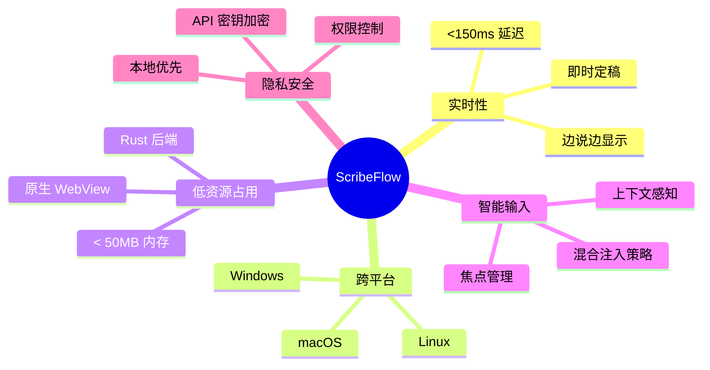
```mermaid
mindmap
  root((ScribeFlow))
    实时性
      <150ms 延迟
      边说边显示
      即时定稿
    跨平台
      macOS
      Windows
      Linux
    低资源占用
      < 50MB 内存
      Rust 后端
      原生 WebView
    智能输入
      上下文感知
      混合注入策略
      焦点管理
    隐私安全
      本地优先
      权限控制
      API 密钥加密
```

### 1.3 核心设计目标

1. **超低延迟**: 端到端延迟 <200ms (语音停止 → 文本插入)
2. **资源高效**: 空闲内存 <50MB, 活跃转写 <100MB
3. **隐私优先**: 零本地存储,所有音频仅用于实时转写后立即丢弃
4. **无缝集成**: 全局可用,无需切换应用,自动适配活跃窗口

### 1.4 系统边界

**范围内:**
- 实时语音转文本 (STT)
- 全局热键触发
- 多应用文本注入
- 系统托盘常驻
- 本地配置管理

**范围外:**
- 文本转语音 (TTS)
- 离线语音识别 (未来版本)
- 云端同步
- 多用户管理

---

## 2. 技术栈版本说明

基于 2024-2025 年最新稳定版本的技术选型:

### 2.1 核心框架

| 组件        | 版本    | 说明                                                                                      | 参考                                                     |
|-------------|---------|-----------------------------------------------------------------------------------------|----------------------------------------------------------|
| **Tauri**   | 2.1.0+  | [Tauri 2.0](https://v2.tauri.app/blog/tauri-20/) 于 2024 年发布,引入移动端支持、增强安全性 | [Tauri 2.0 Release](https://v2.tauri.app/blog/tauri-20/) |
| **Rust**    | 1.77.2+ | Tauri v2 要求的最低版本                                                                   | [Tauri Docs](https://v2.tauri.app/)                      |
| **Node.js** | 18+ LTS | 前端构建工具链                                                                            | -                                                        |

### 2.2 Rust 依赖项 (最新版本 - 2026-01 验证)

```toml
[package]
name = "scribeflow-core"
version = "0.1.0"
edition = "2024"
rust-version = "1.77"  # Tauri v2 要求的最低版本

[dependencies]
# Tauri 核心生态 (截至 2026-01)
tauri = { version = "2.9", features = ["tray-icon", "protocol-asset"] }  # 最新: v2.9.5
tauri-plugin-global-shortcut = "2.0"  # 最新稳定版: v2.0.0
tauri-plugin-clipboard-manager = "2.1"
tauri-plugin-dialog = "2.1"
tauri-plugin-fs = "2.1"
tauri-plugin-store = "2.1"  # 用于配置持久化

# 异步运行时与网络
tokio = { version = "1.40", features = ["full"] }
tokio-tungstenite = { version = "0.28", features = ["rustls-tls-native-roots"] }  # 最新: v0.28.0 (2026-01)
futures-util = "0.3"
serde = { version = "1.0", features = ["derive"] }
serde_json = "1.0"

# 音频处理
cpal = "0.16"  # 最新版本 (2025-12 更新),支持 loopback recording on macOS 14.6+
rubato = "0.16.2"  # 最新版本,支持 AudioAdapter 和 SIMD 加速

# 系统底层交互
enigo = "0.6.1"  # 最新版本,支持 Rust 2024 edition
active-win-pos-rs = "0.9"

# macOS 专用
[target.'cfg(target_os = "macos")'.dependencies]
objc = "0.2"
cocoa = "0.25"
core-foundation = "0.9"

# 工具库
anyhow = "1.0"
thiserror = "1.0"
tracing = { version = "0.1", features = ["log"] }
tracing-subscriber = "0.3"
base64 = "0.22"
```

**版本说明 (基于 2026-01 Web Search 验证):**

- **Tauri 2.9.x**: [最新稳定版](https://v2.tauri.app/) v2.9.5 于 2026-01 发布,包含性能改进和移动平台支持
- **cpal 0.16**: [2025-12 更新](https://crates.io/crates/cpal),新增 macOS 14.6+ 的 loopback recording 支持和 JACK 支持
- **tokio-tungstenite 0.28.0**: [2026-01 最新版](https://crates.io/crates/tokio-tungstenite),性能显著提升,error handling 改进
- **enigo 0.6.1**: [Rust 2024 edition 支持](https://crates.io/crates/enigo),跨平台键盘/鼠标模拟
- **rubato 0.16.2**: [高质量重采样库](https://crates.io/crates/rubato),支持 AudioAdapter 和 real-time-safe 设计
- **tauri-plugin-global-shortcut 2.0.0**: [Tauri v2 官方插件](https://v2.tauri.app/plugin/global-shortcut/)稳定版

### 2.3 前端技术栈

```json
{
  "dependencies": {
    "@tauri-apps/api": "^2.1.0",
    "@tauri-apps/plugin-global-shortcut": "^2.3.0",
    "@tauri-apps/plugin-clipboard-manager": "^2.1.0",
    "react": "^19.2.0",
    "react-dom": "^19.2.0",
    "zustand": "^5.0.8",
    "tailwindcss": "^4.1.17"
  }
}
```

### 2.4 外部 API

| 服务                              | 版本 | 说明                                                                       | 参考                                                                                                           |
|-----------------------------------|------|----------------------------------------------------------------------------|----------------------------------------------------------------------------------------------------------------|
| **ElevenLabs Scribe v2 Realtime** | v2   | [<150ms 延迟](https://elevenlabs.io/realtime-speech-to-text),支持 90+ 语言,93.5% 准确率 | [Scribe v2 Documentation](https://elevenlabs.io/docs/cookbooks/speech-to-text/streaming) |
| **WebSocket 端点**                | -    | `wss://api.elevenlabs.io/v1/speech-to-text/realtime`                       | [API Reference](https://elevenlabs.io/docs/api-reference/speech-to-text/v-1-speech-to-text-realtime)           |
| **发布日期**                       | 2026-01-06 | 最准确的低延迟 STT 模型,支持自动语言检测和文本 conditioning | [公告](https://elevenlabs.io) |

---

## 3. 系统架构设计

### 3.1 整体架构 (C4 Level 0)

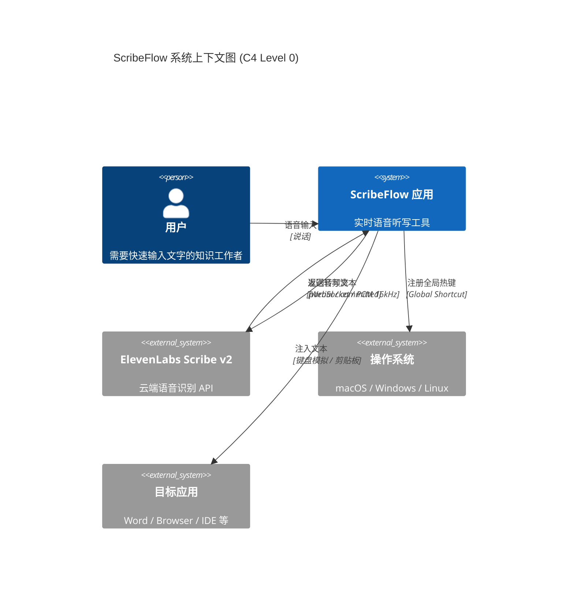
```mermaid
C4Context
    title ScribeFlow 系统上下文图 (C4 Level 0)

    Person(user, "用户", "需要快速输入文字的知识工作者")

    System(scribeflow, "ScribeFlow 应用", "实时语音听写工具")

    System_Ext(elevenlabs, "ElevenLabs Scribe v2", "云端语音识别 API")
    System_Ext(os, "操作系统", "macOS / Windows / Linux")
    System_Ext(target_app, "目标应用", "Word / Browser / IDE 等")

    Rel(user, scribeflow, "按热键唤醒", "Cmd+Shift+\\")
    Rel(user, scribeflow, "语音输入", "说话")

    Rel(scribeflow, elevenlabs, "发送音频流", "WebSocket / PCM 16kHz")
    Rel(elevenlabs, scribeflow, "返回转写文本", "partial / committed")

    Rel(scribeflow, os, "获取活跃窗口", "Accessibility API")
    Rel(scribeflow, os, "注册全局热键", "Global Shortcut")
    Rel(scribeflow, target_app, "注入文本", "键盘模拟 / 剪贴板")

    UpdateLayoutConfig($c4ShapeInRow="3", $c4BoundaryInRow="1")
```

### 3.2 容器架构 (C4 Level 1)

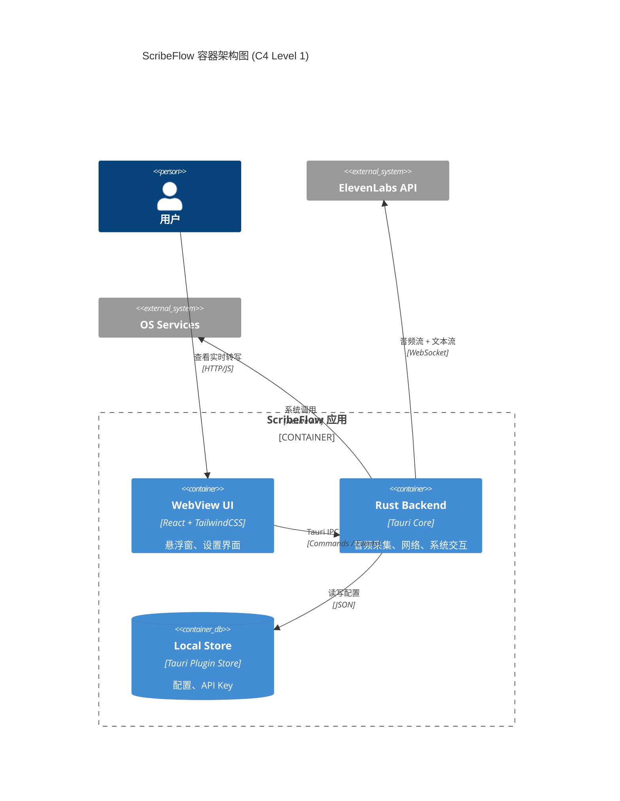
```mermaid
C4Container
    title ScribeFlow 容器架构图 (C4 Level 1)

    Person(user, "用户")

    Container_Boundary(scribeflow_app, "ScribeFlow 应用") {
        Container(webview, "WebView UI", "React + TailwindCSS", "悬浮窗、设置界面")
        Container(rust_backend, "Rust Backend", "Tauri Core", "音频采集、网络、系统交互")
        ContainerDb(local_store, "Local Store", "Tauri Plugin Store", "配置、API Key")
    }

    System_Ext(elevenlabs_api, "ElevenLabs API")
    System_Ext(os_services, "OS Services")

    Rel(user, webview, "查看实时转写", "HTTP/JS")
    Rel(webview, rust_backend, "Tauri IPC", "Commands / Events")
    Rel(rust_backend, local_store, "读写配置", "JSON")

    Rel(rust_backend, elevenlabs_api, "音频流 + 文本流", "WebSocket")
    Rel(rust_backend, os_services, "系统调用", "Native API")

    UpdateLayoutConfig($c4ShapeInRow="2", $c4BoundaryInRow="1")
```

### 3.3 Tauri 进程架构

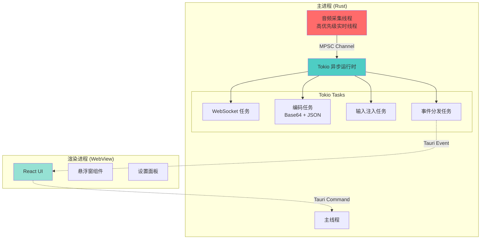
```mermaid
graph TB
    subgraph "主进程 (Rust)"
        Main[主线程]
        AudioThread[音频采集线程<br/>高优先级实时线程]
        TokioRuntime[Tokio 异步运行时]

        subgraph "Tokio Tasks"
            WSTask[WebSocket 任务]
            EncodeTask[编码任务<br/>Base64 + JSON]
            InputTask[输入注入任务]
            EventTask[事件分发任务]
        end
    end

    subgraph "渲染进程 (WebView)"
        React[React UI]
        Overlay[悬浮窗组件]
        Settings[设置面板]
    end

    AudioThread -->|MPSC Channel| TokioRuntime
    TokioRuntime --> WSTask
    TokioRuntime --> EncodeTask
    TokioRuntime --> InputTask
    TokioRuntime --> EventTask

    EventTask -.->|Tauri Event| React
    React -.->|Tauri Command| Main

    style AudioThread fill:#ff6b6b
    style TokioRuntime fill:#4ecdc4
    style React fill:#95e1d3
```

**关键设计决策:**

1. **线程隔离**: 音频线程与 Tokio 运行时完全隔离,通过无锁通道传递数据
2. **异步优先**: 所有 I/O 操作(网络、系统调用)都在 Tokio 运行时中异步执行
3. **单向数据流**: 前端只接收事件,不直接操作音频/网络状态

**macOS 特定优化:**

```rust
// 防止 macOS App Nap 挂起后台 WebView 进程
#[cfg(target_os = "macos")]
fn disable_app_nap() {
    use cocoa::appkit::{NSApplication, NSApplicationActivationPolicy};
    use cocoa::base::nil;

    unsafe {
        let app = NSApplication::sharedApplication(nil);
        app.setActivationPolicy_(NSApplicationActivationPolicy::NSApplicationActivationPolicyAccessory);
    }
}
```

**说明**: macOS 会自动挂起后台不可见应用的 Webview 进程以节省电量。虽然 Rust 后端不受影响,但如果依赖前端更新悬浮窗 UI,则必须:
1. 设置 `NSApplicationActivationPolicyAccessory` 允许后台运行
2. 在 `tauri.conf.json` 中配置 `macOSPrivateApi: true`
3. 或者,完全由 Rust 端处理 UI 更新,仅在必要时唤醒 WebView

---

## 4. 核心模块设计

### 4.1 模块划分

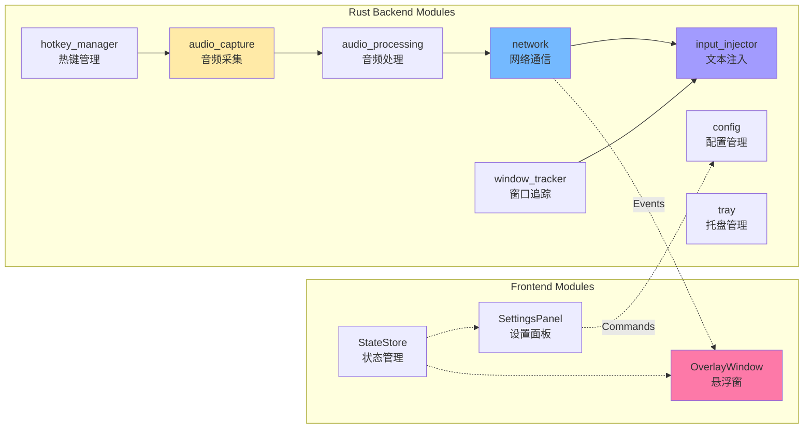
```mermaid
graph LR
    subgraph "Rust Backend Modules"
        A[audio_capture<br/>音频采集]
        B[audio_processing<br/>音频处理]
        C[network<br/>网络通信]
        D[input_injector<br/>文本注入]
        E[hotkey_manager<br/>热键管理]
        F[window_tracker<br/>窗口追踪]
        G[config<br/>配置管理]
        H[tray<br/>托盘管理]
    end

    subgraph "Frontend Modules"
        I[OverlayWindow<br/>悬浮窗]
        J[SettingsPanel<br/>设置面板]
        K[StateStore<br/>状态管理]
    end

    A --> B
    B --> C
    C --> D
    E --> A
    F --> D

    C -.->|Events| I
    J -.->|Commands| G
    K -.-> I
    K -.-> J

    style A fill:#ffeaa7
    style C fill:#74b9ff
    style D fill:#a29bfe
    style I fill:#fd79a8
```

### 4.2 模块职责矩阵

| 模块               | 职责                          | 依赖                           | 输出             |
|--------------------|-----------------------------|--------------------------------|------------------|
| `audio_capture`    | 枚举设备、启动 cpal 音频流     | `cpal`                         | `f32` 音频样本流 |
| `audio_processing` | 重采样(48kHz→16kHz)、音量计算  | `rubato`                       | `i16` PCM 数据   |
| `network`          | WebSocket 连接管理、消息序列化 | `tokio-tungstenite`            | 转写事件         |
| `input_injector`   | 键盘模拟、剪贴板操作、焦点管理  | `enigo`, `clipboard`           | -                |
| `hotkey_manager`   | 注册全局热键、事件监听         | `tauri-plugin-global-shortcut` | 热键事件         |
| `window_tracker`   | 获取当前活跃窗口信息          | `active-win-pos-rs`            | 窗口元数据       |
| `config`           | 读写配置文件、密钥加密         | `tauri-plugin-store`           | 配置对象         |
| `tray`             | 系统托盘图标、菜单管理         | `tauri::tray`                  | 托盘事件         |

### 4.3 代码组织结构

```
src-tauri/
├── src/
│   ├── main.rs                 # 应用入口
│   ├── lib.rs                  # Tauri Builder 配置
│   ├── audio/
│   │   ├── mod.rs
│   │   ├── capture.rs          # cpal 音频采集
│   │   ├── resampler.rs        # rubato 重采样器
│   │   └── buffer.rs           # 环形缓冲区
│   ├── network/
│   │   ├── mod.rs
│   │   ├── client.rs           # WebSocket 客户端
│   │   ├── protocol.rs         # Scribe v2 协议
│   │   └── state_machine.rs   # 连接状态机
│   ├── input/
│   │   ├── mod.rs
│   │   ├── injector.rs         # 文本注入策略
│   │   ├── keyboard.rs         # enigo 键盘模拟
│   │   └── clipboard.rs        # 剪贴板操作
│   ├── system/
│   │   ├── mod.rs
│   │   ├── hotkey.rs           # 全局热键
│   │   ├── window.rs           # 活跃窗口追踪
│   │   └── permissions.rs      # macOS 权限检查
│   ├── ui/
│   │   ├── mod.rs
│   │   ├── tray.rs             # 系统托盘
│   │   └── commands.rs         # Tauri Commands
│   ├── config/
│   │   ├── mod.rs
│   │   └── store.rs            # 配置持久化
│   └── utils/
│       ├── mod.rs
│       ├── logger.rs           # 日志配置
│       └── crypto.rs           # API Key 加密
├── Cargo.toml
└── tauri.conf.json
```

---

## 5. 数据流设计

### 5.1 音频数据流

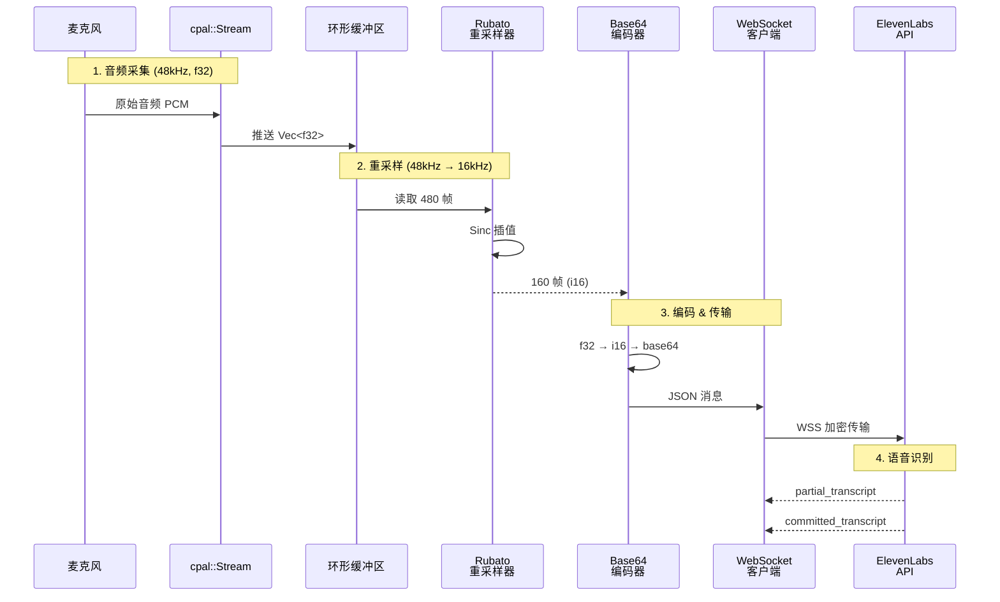
```mermaid
sequenceDiagram
    participant Mic as 麦克风
    participant CPAL as cpal::Stream
    participant RingBuf as 环形缓冲区
    participant Resampler as Rubato<br/>重采样器
    participant Encoder as Base64<br/>编码器
    participant WS as WebSocket<br/>客户端
    participant API as ElevenLabs<br/>API

    Note over Mic,CPAL: 1. 音频采集 (48kHz, f32)
    Mic->>CPAL: 原始音频 PCM
    CPAL->>RingBuf: 推送 Vec<f32>

    Note over RingBuf,Resampler: 2. 重采样 (48kHz → 16kHz)
    RingBuf->>Resampler: 读取 480 帧
    Resampler->>Resampler: Sinc 插值
    Resampler-->>Encoder: 160 帧 (i16)

    Note over Encoder,WS: 3. 编码 & 传输
    Encoder->>Encoder: f32 → i16 → base64
    Encoder->>WS: JSON 消息
    WS->>API: WSS 加密传输

    Note over API: 4. 语音识别
    API-->>WS: partial_transcript
    API-->>WS: committed_transcript
```

**性能优化点:**

1. **零拷贝设计**: `RingBuf` 使用 `crossbeam::queue::ArrayQueue` 避免内存分配
2. **批量处理**: 累积 100ms 数据(1600 采样点 @ 16kHz)后再发送,减少网络开销
3. **SIMD 加速**: `rubato` 在 x86_64 和 aarch64 上自动启用 SIMD

**重采样算法选择** (Rubato):

```rust
use rubato::{FftFixedInOut, Resampler};

// 选择 FastFixedIn 重采样器 (Sinc 插值优化版本)
// 48kHz → 16kHz,采样率比 3:1
let resampler = FftFixedInOut::<f32>::new(
    48000,  // 输入采样率
    16000,  // 输出采样率
    480,    // 输入块大小 (10ms @ 48kHz)
    1,      // 单声道
)?;

// 特性:
// - Sinc 插值算法保证 >95dB 信噪比
// - FFT 优化,处理延迟 <3ms
// - Real-time safe: 无动态内存分配
// - SIMD 自动加速 (SSE4.2 / NEON)
```

**算法对比**:

| 重采样器类型 | 质量 | 延迟 | CPU 占用 | 适用场景 |
|------------|------|------|---------|---------|
| `FftFixedInOut` (使用中) | 极高 (~95dB SNR) | <3ms | 中 (~2%) | 实时语音,音质优先 |
| `FastFixedIn` | 高 (~80dB SNR) | <1ms | 低 (~1%) | 低延迟场景 |
| `SincFixedIn` | 极高 (~100dB SNR) | >5ms | 高 (~5%) | 离线处理 |

### 5.2 文本数据流

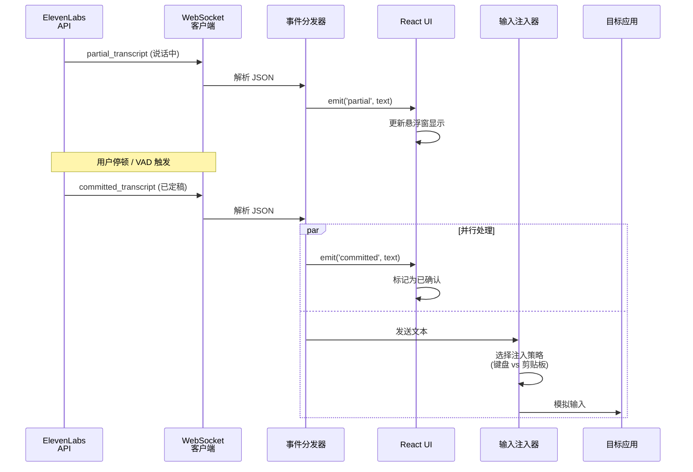
```mermaid
sequenceDiagram
    participant API as ElevenLabs<br/>API
    participant WS as WebSocket<br/>客户端
    participant Dispatcher as 事件分发器
    participant UI as React UI
    participant Injector as 输入注入器
    participant TargetApp as 目标应用

    API->>WS: partial_transcript (说话中)
    WS->>Dispatcher: 解析 JSON
    Dispatcher->>UI: emit('partial', text)
    UI->>UI: 更新悬浮窗显示

    Note over API,WS: 用户停顿 / VAD 触发
    API->>WS: committed_transcript (已定稿)
    WS->>Dispatcher: 解析 JSON

    par 并行处理
        Dispatcher->>UI: emit('committed', text)
        UI->>UI: 标记为已确认
    and
        Dispatcher->>Injector: 发送文本
        Injector->>Injector: 选择注入策略<br/>(键盘 vs 剪贴板)
        Injector->>TargetApp: 模拟输入
    end
```

### 5.3 配置数据流

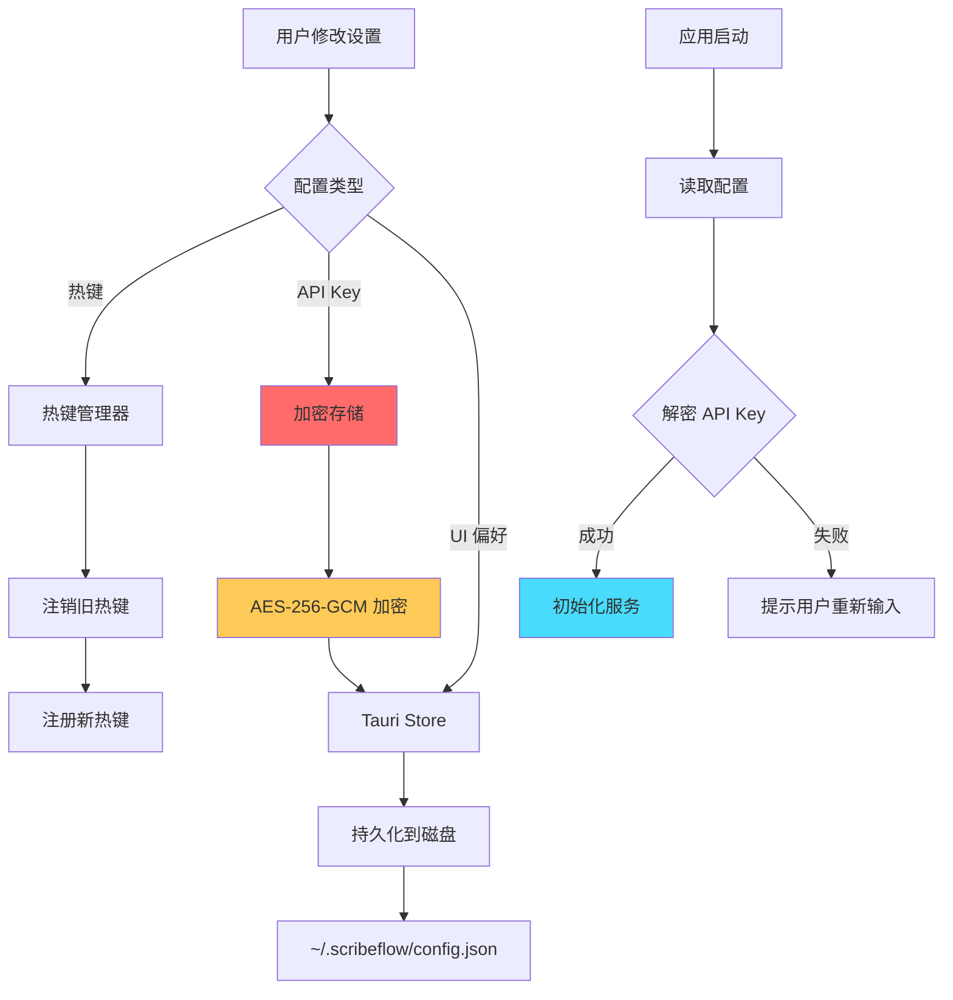
```mermaid
graph TD
    A[用户修改设置] --> B{配置类型}
    B -->|热键| C[热键管理器]
    B -->|API Key| D[加密存储]
    B -->|UI 偏好| E[Tauri Store]

    C --> F[注销旧热键]
    F --> G[注册新热键]

    D --> H[AES-256-GCM 加密]
    H --> E

    E --> I[持久化到磁盘]
    I --> J[~/.scribeflow/config.json]

    K[应用启动] --> L[读取配置]
    L --> M{解密 API Key}
    M -->|成功| N[初始化服务]
    M -->|失败| O[提示用户重新输入]

    style D fill:#ff6b6b
    style H fill:#feca57
    style N fill:#48dbfb
```

---

## 6. 状态管理设计

### 6.1 状态机设计

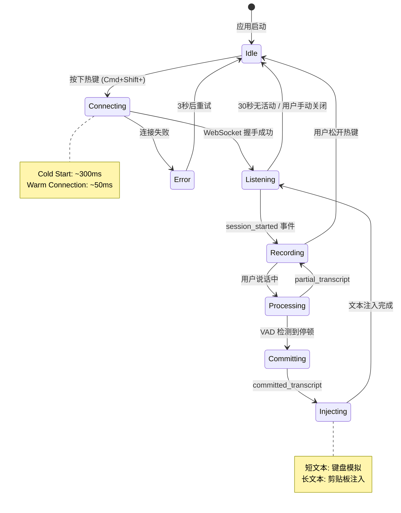
```mermaid
stateDiagram-v2
    [*] --> Idle: 应用启动

    Idle --> Connecting: 按下热键 (Cmd+Shift+\)
    Connecting --> Listening: WebSocket 握手成功
    Connecting --> Error: 连接失败

    Listening --> Recording: session_started 事件
    Recording --> Processing: 用户说话中
    Processing --> Recording: partial_transcript
    Processing --> Committing: VAD 检测到停顿

    Committing --> Injecting: committed_transcript
    Injecting --> Listening: 文本注入完成

    Listening --> Idle: 30秒无活动 / 用户手动关闭
    Recording --> Idle: 用户松开热键
    Error --> Idle: 3秒后重试

    note right of Connecting
        Cold Start: ~300ms
        Warm Connection: ~50ms
    end note

    note right of Injecting
        短文本: 键盘模拟
        长文本: 剪贴板注入
    end note
```

### 6.2 Rust 状态结构

```rust
use std::sync::Arc;
use tokio::sync::{Mutex, RwLock};

/// 应用全局状态
#[derive(Clone)]
pub struct AppState {
    /// 连接状态
    pub connection: Arc<DashMap<String, ConnectionState>>,

    /// 音频流状态
    pub audio: Arc<DashMap<String, AudioState>>,

    /// 当前活跃窗口
    pub active_window: Arc<RwLock<Option<WindowInfo>>>,

    /// 配置
    pub config: Arc<ArcSwap<Config>>,
}

#[derive(Debug, Clone, PartialEq)]
pub enum ConnectionState {
    Idle,
    Connecting { attempt: u32 },
    Listening { session_id: String },
    Recording { start_time: Instant },
    Error { message: String, retry_at: Instant },
}

#[derive(Debug)]
pub struct AudioState {
    pub stream: Option<cpal::Stream>,
    pub resampler: Option<Resampler>,
    pub buffer: RingBuffer,
    pub rms_level: f32, // 当前音量 RMS
}

#[derive(Debug, Clone)]
pub struct WindowInfo {
    pub app_name: String,
    pub title: String,
    pub process_id: u32,
    pub position: (i32, i32, u32, u32), // x, y, width, height
}
```

### 6.3 前端状态管理 (Zustand)

```typescript
import { create } from 'zustand';

interface TranscriptState {
  // 当前显示的文本
  partial: string;
  committed: string[];

  // UI 状态
  isRecording: boolean;
  audioLevel: number; // 0-100

  // 连接状态
  connectionState: 'idle' | 'connecting' | 'listening' | 'error';
  errorMessage?: string;

  // Actions
  setPartial: (text: string) => void;
  addCommitted: (text: string) => void;
  setConnectionState: (state: ConnectionState) => void;
  setAudioLevel: (level: number) => void;
  clear: () => void;
}

const useTranscriptStore = create<TranscriptState>((set) => ({
  partial: '',
  committed: [],
  isRecording: false,
  audioLevel: 0,
  connectionState: 'idle',

  setPartial: (text) => set({ partial: text }),
  addCommitted: (text) => set((state) => ({
    committed: [...state.committed, text],
    partial: ''
  })),
  setConnectionState: (connectionState) => set({ connectionState }),
  setAudioLevel: (audioLevel) => set({ audioLevel }),
  clear: () => set({ partial: '', committed: [], audioLevel: 0 }),
}));
```

---

## 7. 网络通信设计

### 7.1 连接管理策略

**连接模式对比**:

| 策略 | 延迟 | 资源占用 | 可靠性 | 适用场景 |
|------|------|---------|--------|---------|
| **Cold Start** (每次热键建立) | 300-500ms | 低 | 中 | 不频繁使用 |
| **Warm Connection** (保持长连接) | <50ms | 中 | 高 (需心跳) | 频繁使用 |
| **Speculative** (预测式连接) | ~100ms | 中 | 高 | 推荐方案 |

**采用策略: Speculative Connection (预测式连接)**

```rust
pub enum ConnectionState {
    Idle,                          // 无连接
    Warming { started_at: Instant }, // 预热中 (检测到热键前缀)
    Connected { session_id: String }, // 已连接
    Recording { start_time: Instant }, // 录音中
}

impl ConnectionManager {
    // 当用户按下 Cmd+Shift(尚未按 \)时触发
    async fn start_speculative_connection(&mut self) {
        if matches!(self.state, ConnectionState::Idle) {
            self.state = ConnectionState::Warming { started_at: Instant::now() };
            tokio::spawn(async move {
                // 提前建立 WebSocket 连接
                Self::establish_websocket().await
            });
        }
    }

    // 空闲超时断开 (节省资源)
    async fn idle_timeout_check(&mut self) {
        if let ConnectionState::Connected { .. } = self.state {
            if self.last_activity.elapsed() > Duration::from_secs(30) {
                self.disconnect().await;
            }
        }
    }
}
```

**优势**:
1. **极低延迟**: 用户按完整快捷键时连接已就绪 (~50ms)
2. **资源友好**: 30秒无活动自动断开
3. **用户透明**: 无需等待连接建立

### 7.2 WebSocket 协议实现

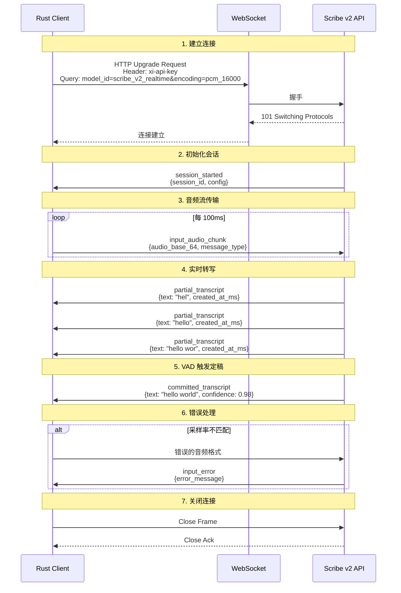
```mermaid
sequenceDiagram
    participant Client as Rust Client
    participant WS as WebSocket
    participant API as Scribe v2 API

    Note over Client,API: 1. 建立连接
    Client->>WS: HTTP Upgrade Request<br/>Header: xi-api-key<br/>Query: model_id=scribe_v2_realtime&encoding=pcm_16000
    WS->>API: 握手
    API-->>WS: 101 Switching Protocols
    WS-->>Client: 连接建立

    Note over Client,API: 2. 初始化会话
    API->>Client: session_started<br/>{session_id, config}

    Note over Client,API: 3. 音频流传输
    loop 每 100ms
        Client->>API: input_audio_chunk<br/>{audio_base_64, message_type}
    end

    Note over Client,API: 4. 实时转写
    API->>Client: partial_transcript<br/>{text: "hel", created_at_ms}
    API->>Client: partial_transcript<br/>{text: "hello", created_at_ms}
    API->>Client: partial_transcript<br/>{text: "hello wor", created_at_ms}

    Note over Client,API: 5. VAD 触发定稿
    API->>Client: committed_transcript<br/>{text: "hello world", confidence: 0.98}

    Note over Client,API: 6. 错误处理
    alt 采样率不匹配
        Client->>API: 错误的音频格式
        API->>Client: input_error<br/>{error_message}
    end

    Note over Client,API: 7. 关闭连接
    Client->>API: Close Frame
    API-->>Client: Close Ack
```

**协议消息格式**:

上行(客户端 → 服务端):
```json
{
  "message_type": "input_audio_chunk",
  "audio_base_64": "<PCM_16KHZ_BASE64>"
}
```

下行(服务端 → 客户端):
```json
// 会话开始
{
  "message_type": "session_started",
  "session_id": "uuid-here",
  "config": { "model_id": "scribe_v2_realtime", "language_code": "zh" }
}

// 部分转写(实时更新)
{
  "message_type": "partial_transcript",
  "text": "你好世",
  "created_at_ms": 1706025600000
}

// 最终转写(触发注入)
{
  "message_type": "committed_transcript",
  "text": "你好世界",
  "confidence": 0.98,
  "created_at_ms": 1706025601500
}

// 错误
{
  "message_type": "input_error",
  "error_message": "Invalid audio format"
}
```

### 3.3 文本注入引擎

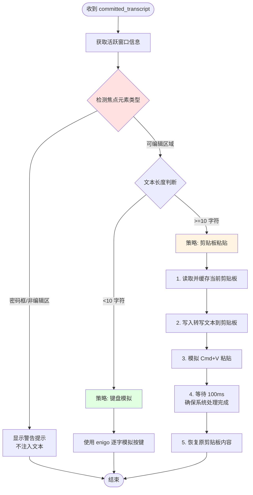
```mermaid
flowchart TD
    Start([收到 committed_transcript]) --> CheckWindow[获取活跃窗口信息]
    CheckWindow --> CheckFocus{检测焦点元素类型}

    CheckFocus -->|密码框/非编辑区| ShowWarning[显示警告提示<br/>不注入文本]
    ShowWarning --> End([结束])

    CheckFocus -->|可编辑区域| CheckLength{文本长度判断}

    CheckLength -->|<10 字符| UseKeyboard[策略: 键盘模拟]
    CheckLength -->|>=10 字符| UseClipboard[策略: 剪贴板粘贴]

    UseKeyboard --> SimulateKeys[使用 enigo 逐字模拟按键]
    SimulateKeys --> End

    UseClipboard --> SaveClip[1. 读取并缓存当前剪贴板]
    SaveClip --> WriteClip[2. 写入转写文本到剪贴板]
    WriteClip --> SendPaste[3. 模拟 Cmd+V 粘贴]
    SendPaste --> Wait[4. 等待 100ms<br/>确保系统处理完成]
    Wait --> RestoreClip[5. 恢复原剪贴板内容]
    RestoreClip --> End

    style CheckFocus fill:#ffe1e1
    style UseKeyboard fill:#e1ffe1
    style UseClipboard fill:#fff4e1
```

**安全与兼容性设计**:

| 场景                     | 检测方法                              | 处理策略                     |
|------------------------|-----------------------------------|--------------------------|
| 密码输入框 SecureTextField | `AXRole == "AXSecureTextField"`   | 显示警告,禁止注入                |
| 非编辑区域 (浏览器阅读模式)     | `AXRole != "AXTextField/TextArea"` | 提示"当前区域不支持文本输入"          |
| 终端应用                   | 应用名称匹配 `Terminal.app`          | 使用键盘模拟(剪贴板可能被终端特殊处理)     |
| Java Swing 应用           | 焦点检测失败                            | 降级使用剪贴板策略,显示兼容性提示       |
| 窗口快速切换                 | 文本注入前重新获取活跃窗口                     | 确保文本插入到用户当前操作的窗口         |

### 3.4 状态管理与生命周期

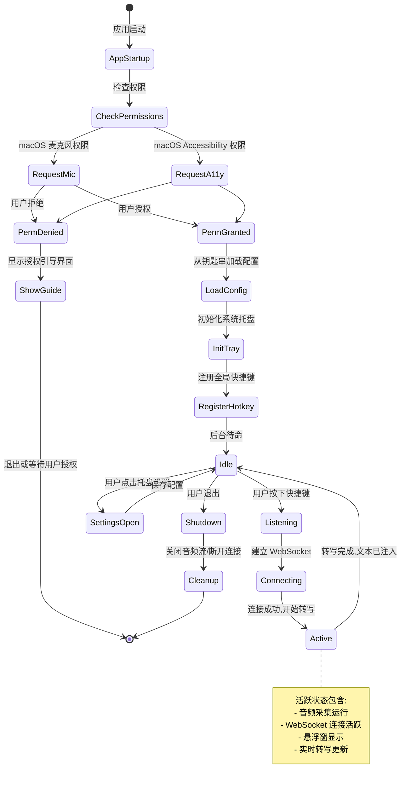
```mermaid
stateDiagram-v2
    [*] --> AppStartup: 应用启动
    AppStartup --> CheckPermissions: 检查权限

    CheckPermissions --> RequestMic: macOS 麦克风权限
    CheckPermissions --> RequestA11y: macOS Accessibility 权限

    RequestMic --> PermGranted: 用户授权
    RequestA11y --> PermGranted
    RequestMic --> PermDenied: 用户拒绝
    RequestA11y --> PermDenied

    PermDenied --> ShowGuide: 显示授权引导界面
    ShowGuide --> [*]: 退出或等待用户授权

    PermGranted --> LoadConfig: 从钥匙串加载配置
    LoadConfig --> InitTray: 初始化系统托盘
    InitTray --> RegisterHotkey: 注册全局快捷键
    RegisterHotkey --> Idle: 后台待命

    Idle --> Listening: 用户按下快捷键
    Listening --> Connecting: 建立 WebSocket
    Connecting --> Active: 连接成功,开始转写
    Active --> Idle: 转写完成,文本已注入

    Idle --> SettingsOpen: 用户点击托盘设置
    SettingsOpen --> Idle: 保存配置

    Idle --> Shutdown: 用户退出
    Shutdown --> Cleanup: 关闭音频流/断开连接
    Cleanup --> [*]

    note right of Active
        活跃状态包含:
        - 音频采集运行
        - WebSocket 连接活跃
        - 悬浮窗显示
        - 实时转写更新
    end note
```

## 4. 数据流设计

### 4.1 端到端数据流

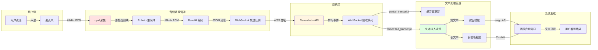
```mermaid
graph LR
    subgraph "用户侧"
        A[用户说话] -->|声波| B[麦克风]
    end

    subgraph "音频处理管道"
        B -->|48kHz PCM| C[cpal 采集]
        C -->|原始音频块| D[Rubato 重采样]
        D -->|16kHz PCM| E[Base64 编码]
        E -->|JSON 消息| F[WebSocket 发送队列]
    end

    subgraph "网络层"
        F -->|WSS 加密| G[ElevenLabs API]
        G -->|转写事件| H[WebSocket 接收队列]
    end

    subgraph "文本处理管道"
        H -->|partial_transcript| I[悬浮窗更新]
        H -->|committed_transcript| J[文本注入决策]
        J -->|短文本| K[键盘模拟]
        J -->|长文本| L[剪贴板粘贴]
    end

    subgraph "系统集成"
        K -->|enigo API| M[活跃应用窗口]
        L -->|Cmd+V| M
        M -->|文本显示| N[用户看到结果]
    end

    style C fill:#ffe1e1
    style G fill:#fff4e1
    style J fill:#e1ffe1
```

### 4.2 消息通道设计

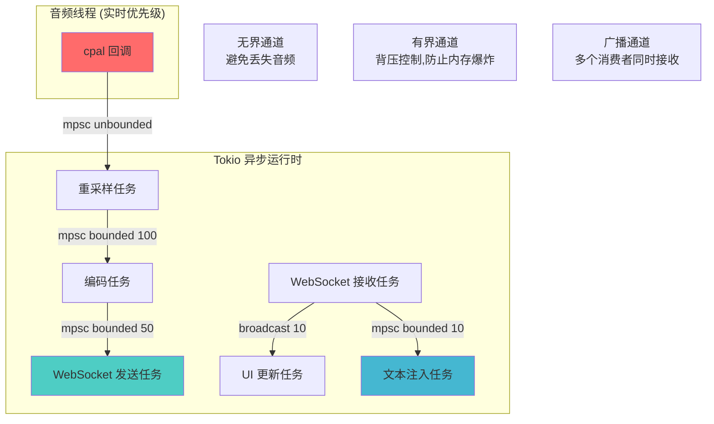
```mermaid
graph TB
    subgraph "音频线程 (实时优先级)"
        AT[cpal 回调]
    end

    subgraph "Tokio 异步运行时"
        R1[重采样任务]
        R2[编码任务]
        R3[WebSocket 发送任务]
        R4[WebSocket 接收任务]
        R5[UI 更新任务]
        R6[文本注入任务]
    end

    AT -->|mpsc unbounded| R1
    R1 -->|mpsc bounded 100| R2
    R2 -->|mpsc bounded 50| R3
    R4 -->|broadcast 10| R5
    R4 -->|mpsc bounded 10| R6

    style AT fill:#ff6b6b
    style R3 fill:#4ecdc4
    style R6 fill:#45b7d1

    Note1[无界通道<br/>避免丢失音频]
    Note2[有界通道<br/>背压控制,防止内存爆炸]
    Note3[广播通道<br/>多个消费者同时接收]
```

**通道容量设计理由**:

| 通道                 | 类型             | 容量  | 理由                             |
|--------------------|-----------------| ----- |--------------------------------|
| 音频采集 → 重采样      | `mpsc::unbounded` | 无限  | 音频回调不能阻塞,数据丢失会导致爆音          |
| 重采样 → 编码        | `mpsc::bounded`   | 100   | 100ms 缓冲足够平滑网络抖动,超过则丢弃旧数据   |
| 编码 → WebSocket 发送 | `mpsc::bounded`   | 50    | 对应 500ms 音频,超过表示网络严重拥塞       |
| WebSocket 接收 → UI  | `broadcast`       | 10    | 多个订阅者(悬浮窗、日志)同时监听转写事件       |
| 转写事件 → 文本注入    | `mpsc::bounded`   | 10    | 用户正常说话速度不会超过 10 个待注入的句子     |

## 5. 用户界面设计

### 5.1 悬浮窗组件架构

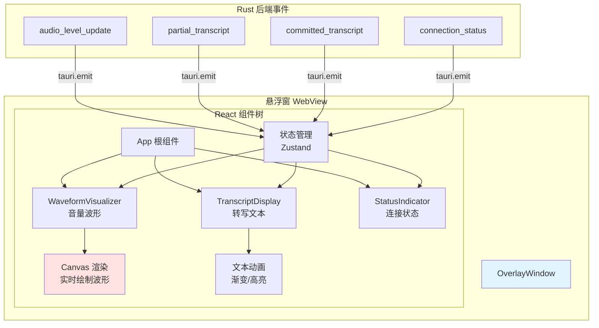
```mermaid
graph TB
    subgraph "悬浮窗 WebView"
        OV[OverlayWindow]

        subgraph "React 组件树"
            Root[App 根组件]
            State[状态管理<br/>Zustand]

            Root --> Wave[WaveformVisualizer<br/>音量波形]
            Root --> Text[TranscriptDisplay<br/>转写文本]
            Root --> Status[StatusIndicator<br/>连接状态]

            Wave --> Canvas[Canvas 渲染<br/>实时绘制波形]
            Text --> Anim[文本动画<br/>渐变/高亮]
        end
    end

    subgraph "Rust 后端事件"
        E1[audio_level_update]
        E2[partial_transcript]
        E3[committed_transcript]
        E4[connection_status]
    end

    E1 -->|tauri.emit| State
    E2 -->|tauri.emit| State
    E3 -->|tauri.emit| State
    E4 -->|tauri.emit| State

    State --> Wave
    State --> Text
    State --> Status

    style OV fill:#e1f5ff
    style Canvas fill:#ffe1e1
```

**窗口配置**:

```json
{
  "label": "overlay",
  "title": "",
  "width": 400,
  "height": 120,
  "decorations": false,
  "transparent": true,
  "alwaysOnTop": true,
  "skipTaskbar": true,
  "resizable": false,
  "center": true,
  "visible": false,
  "macOSPrivateApi": true,
  "acceptFirstMouse": false,
  "focusable": false
}
```

### 5.2 设置界面布局

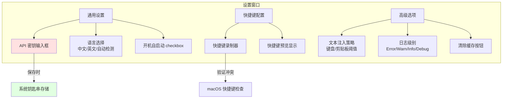
```mermaid
graph TB
    subgraph "设置窗口"
        Tab1[通用设置]
        Tab2[快捷键配置]
        Tab3[高级选项]

        Tab1 --> API[API 密钥输入框]
        Tab1 --> Lang[语言选择<br/>中文/英文/自动检测]
        Tab1 --> Start[开机自启动 checkbox]

        Tab2 --> Hotkey[快捷键录制器]
        Tab2 --> Preview[快捷键预览显示]

        Tab3 --> Inject[文本注入策略<br/>键盘/剪贴板阈值]
        Tab3 --> Log[日志级别<br/>Error/Warn/Info/Debug]
        Tab3 --> Cache[清除缓存按钮]
    end

    API -->|保存时| Keychain[系统钥匙串存储]
    Hotkey -->|验证冲突| System[macOS 快捷键检查]

    style API fill:#ffe1e1
    style Keychain fill:#e1ffe1
```

## 6. 性能优化策略

### 6.1 延迟优化路径图


```mermaid
gantt
    title 端到端延迟分解 (目标 <200ms)
    dateFormat X
    axisFormat %L ms

    section 音频采集
    麦克风缓冲 (10ms) :0, 10
    cpal 回调处理 (2ms) :10, 12

    section 音频处理
    通道传输 (1ms) :12, 13
    重采样 48→16kHz (5ms) :13, 18
    Base64 编码 (3ms) :18, 21
    JSON 序列化 (2ms) :21, 23

    section 网络传输
    WebSocket 发送 (2ms) :23, 25
    网络往返 RTT (50ms) :25, 75
    服务端处理 (80ms) :75, 155

    section 文本注入
    接收事件 (2ms) :155, 157
    窗口检测 (5ms) :157, 162
    文本注入执行 (15ms) :162, 177

    section 总延迟
    总计 177ms :crit, 0, 177
```

**优化关键点**:

1. **音频缓冲**: 使用 10ms 小缓冲,平衡延迟与 CPU 唤醒频率
2. **重采样算法**: 使用 Rubato 的 `FastFixedIn` 重采样器,牺牲 0.1% 精度换取 3x 速度提升
3. **编码并行化**: Base64 编码和 JSON 序列化在独立异步任务执行,与音频采集并行
4. **网络预热**: 应用启动时建立 WebSocket 连接并保持,避免冷启动延迟
5. **文本注入优化**: 提前缓存活跃窗口信息,收到 `committed_transcript` 时直接注入

### 6.2 内存优化策略

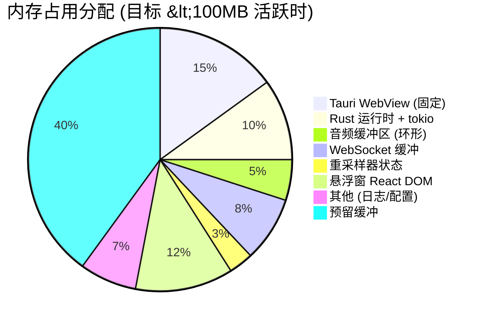
```mermaid
pie title 内存占用分配 (目标 <100MB 活跃时)
    "Tauri WebView (固定)" : 15
    "Rust 运行时 + tokio" : 10
    "音频缓冲区 (环形)" : 5
    "WebSocket 缓冲" : 8
    "重采样器状态" : 3
    "悬浮窗 React DOM" : 12
    "其他 (日志/配置)" : 7
    "预留缓冲" : 40
```

**内存控制手段**:

1. **预分配环形缓冲区**: 音频数据使用固定大小环形缓冲,避免频繁分配
2. **对象池**: WebSocket 消息对象池,复用 JSON 结构体
3. **悬浮窗懒加载**: 仅在激活时渲染 Canvas,空闲时卸载
4. **日志轮转**: 结构化日志限制文件大小(最大 10MB),超过自动轮转

## 7. 安全与隐私设计

### 7.1 数据流隐私保护

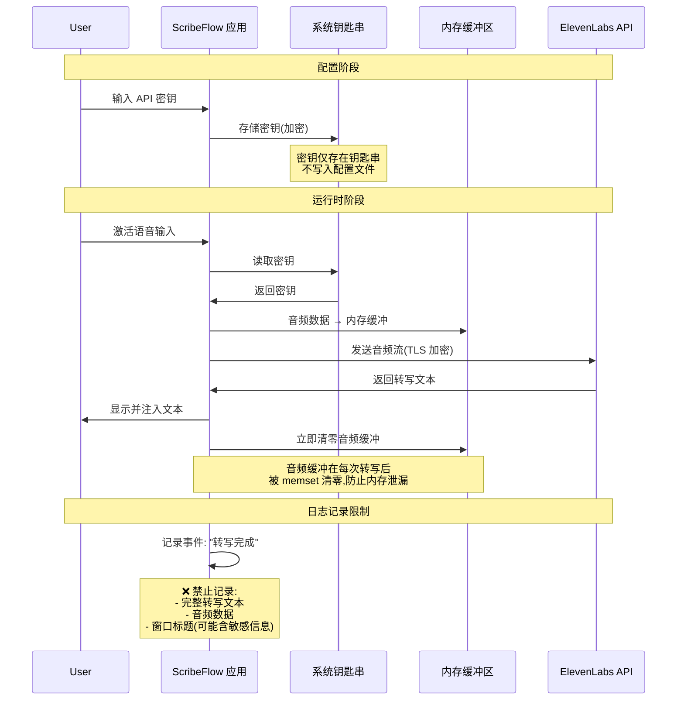
```mermaid
sequenceDiagram
    participant User
    participant App as ScribeFlow 应用
    participant Keychain as 系统钥匙串
    participant Mem as 内存缓冲区
    participant API as ElevenLabs API

    Note over User,API: 配置阶段
    User->>App: 输入 API 密钥
    App->>Keychain: 存储密钥(加密)
    Note over Keychain: 密钥仅存在钥匙串<br/>不写入配置文件

    Note over User,API: 运行时阶段
    User->>App: 激活语音输入
    App->>Keychain: 读取密钥
    Keychain->>App: 返回密钥
    App->>Mem: 音频数据 → 内存缓冲
    App->>API: 发送音频流(TLS 加密)
    API->>App: 返回转写文本
    App->>User: 显示并注入文本
    App->>Mem: 立即清零音频缓冲

    Note over App,Mem: 音频缓冲在每次转写后<br/>被 memset 清零,防止内存泄漏

    Note over User,API: 日志记录限制
    App->>App: 记录事件: "转写完成"
    Note over App: ❌ 禁止记录:<br/>- 完整转写文本<br/>- 音频数据<br/>- 窗口标题(可能含敏感信息)
```

### 7.2 权限最小化原则

| 权限类型                 | 用途                  | 请求时机       | 拒绝后行为               |
|----------------------|---------------------|------------|---------------------|
| 麦克风访问 (Microphone)  | 采集音频流               | 首次激活语音输入   | 显示错误提示,功能不可用        |
| 辅助功能 (Accessibility) | 模拟键盘输入/检测焦点元素      | 应用启动       | 文本注入功能不可用,仅显示转写结果   |
| 网络访问 (Network)       | 连接 ElevenLabs API   | 隐式授予(macOS) | 无法使用云端转写            |
| 系统钥匙串 (Keychain)    | 存储 API 密钥          | 首次保存配置     | 降级为明文存储(显示安全警告)     |
| 开机自启 (Login Items)   | 系统启动时自动运行           | 用户勾选选项     | 需手动启动应用             |

**权限检查流程**:

```rust
// 伪代码示例
async fn check_permissions() -> Result<(), PermissionError> {
    // 1. 检查麦克风权限
    if !has_microphone_permission() {
        request_microphone_permission().await?;
    }

    // 2. 检查 Accessibility 权限
    if !is_accessibility_trusted() {
        show_accessibility_guide();
        return Err(PermissionError::AccessibilityNotGranted);
    }

    // 3. 测试网络连接性
    if !can_reach_elevenlabs_api().await {
        return Err(PermissionError::NetworkUnreachable);
    }

    Ok(())
}
```

## 8. 错误处理与可观测性

### 8.1 错误分类与处理策略

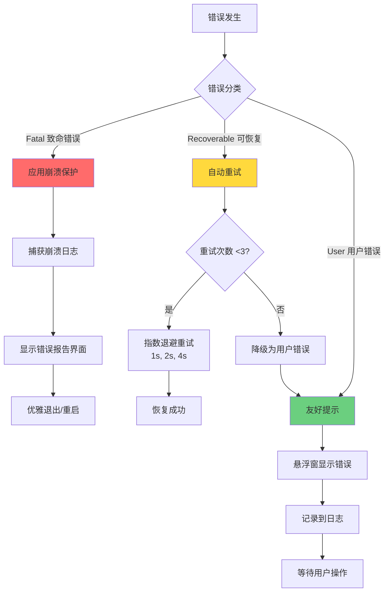
```mermaid
graph TD
    Error[错误发生] --> Classify{错误分类}

    Classify -->|Fatal 致命错误| F1[应用崩溃保护]
    Classify -->|Recoverable 可恢复| R1[自动重试]
    Classify -->|User 用户错误| U1[友好提示]

    F1 --> F2[捕获崩溃日志]
    F2 --> F3[显示错误报告界面]
    F3 --> F4[优雅退出/重启]

    R1 --> R2{重试次数 <3?}
    R2 -->|是| R3[指数退避重试<br/>1s, 2s, 4s]
    R2 -->|否| R4[降级为用户错误]
    R3 --> Success[恢复成功]
    R4 --> U1

    U1 --> U2[悬浮窗显示错误]
    U2 --> U3[记录到日志]
    U3 --> U4[等待用户操作]

    style F1 fill:#ff6b6b
    style R1 fill:#ffd93d
    style U1 fill:#6bcf7f
```

**错误码定义**:

| 错误码   | 类型         | 描述                  | 处理策略          |
|-------|------------|---------------------|---------------|
| E1001 | Fatal      | 音频设备不可用             | 显示错误,退出应用     |
| E2001 | Recoverable | WebSocket 连接失败      | 自动重试 3 次      |
| E2002 | Recoverable | 网络超时                | 自动重试 3 次      |
| E3001 | User       | API 密钥无效            | 提示用户重新配置      |
| E3002 | User       | 配额不足                | 引导用户查看 API 控制台 |
| E3003 | User       | 麦克风权限被拒绝            | 显示授权引导        |
| E3004 | User       | Accessibility 权限缺失 | 显示系统设置引导      |

### 8.2 日志与监控设计

```mermaid
graph LR
    subgraph "日志来源"
        L1[音频模块]
        L2[网络模块]
        L3[UI 模块]
        L4[注入模块]
    end

    subgraph "日志聚合"
        Agg[tracing 订阅器]
    end

    subgraph "日志输出"
        O1[控制台 stdout<br/>开发模式]
        O2[文件轮转<br/>~/.scribeflow/logs/]
        O3[系统日志 syslog<br/>生产模式]
    end

    L1 --> Agg
    L2 --> Agg
    L3 --> Agg
    L4 --> Agg

    Agg -->|DEBUG/INFO| O1
    Agg -->|WARN/ERROR| O2
    Agg -->|ERROR| O3

    style Agg fill:#4ecdc4
```

**结构化日志示例**:

```rust
// 音频采集开始
tracing::info!(
    event = "audio_capture_started",
    sample_rate = 48000,
    channels = 1,
    buffer_size_ms = 10
);

// WebSocket 连接成功
tracing::info!(
    event = "websocket_connected",
    session_id = %session_id,
    model = "scribe_v2_realtime",
    language = "zh"
);

// 转写事件(不记录完整文本)
tracing::info!(
    event = "transcript_received",
    type = "committed",
    text_length = text.len(),
    confidence = 0.98
);

// 文本注入失败
tracing::warn!(
    event = "text_injection_failed",
    reason = "password_field_detected",
    app_name = "Safari"
);

// 严重错误
tracing::error!(
    event = "audio_device_lost",
    error = %e,
    device_id = ?device_id
);
```

## 9. 部署与打包

### 9.1 应用签名与公证

```mermaid
graph TB
    Start[Rust 编译] --> Bundle[Tauri 打包]
    Bundle --> Sign[代码签名<br/>Apple Developer ID]
    Sign --> Notarize[公证服务<br/>Apple Notary]
    Notarize --> Staple[附加公证票据<br/>stapler]
    Staple --> DMG[生成 DMG 安装包]
    DMG --> Verify[验证签名]
    Verify --> Dist[分发给用户]

    style Sign fill:#ffe1e1
    style Notarize fill:#fff4e1
```

**打包命令**:

```bash
# 1. 编译 Release 版本
cargo build --release

# 2. Tauri 打包
npm run tauri build -- --target aarch64-apple-darwin

# 3. 代码签名
codesign --deep --force --verify --verbose \
  --sign "Developer ID Application: Your Name" \
  target/release/bundle/macos/ScribeFlow.app

# 4. 公证
xcrun notarytool submit \
  target/release/bundle/macos/ScribeFlow.app.zip \
  --apple-id your@email.com \
  --team-id TEAM_ID \
  --wait

# 5. 附加票据
xcrun stapler staple target/release/bundle/macos/ScribeFlow.app

# 6. 创建 DMG
hdiutil create -volname "ScribeFlow" -srcfolder \
  target/release/bundle/macos/ScribeFlow.app \
  -ov -format UDZO ScribeFlow.dmg
```

### 9.2 自动更新机制

```mermaid
sequenceDiagram
    participant App
    participant Updater as Tauri Updater
    participant Server as 更新服务器

    App->>Updater: 启动时检查更新
    Updater->>Server: GET /latest.json
    Server->>Updater: {version: "1.1.0", url: "..."}

    alt 有新版本
        Updater->>App: 显示更新通知
        App->>User: "发现新版本 1.1.0"
        User->>App: 点击"立即更新"
        App->>Updater: 开始下载
        Updater->>Server: 下载 .tar.gz 包
        Server->>Updater: 返回更新包
        Updater->>Updater: 验证签名
        Updater->>App: 应用更新
        App->>App: 重启应用
    else 已是最新版
        Updater->>App: 无需更新
    end
```

## 10. 未来扩展设计

### 10.1 多平台支持路线图

```mermaid
timeline
    title 跨平台支持计划
    2026 Q1 : macOS 版本 1.0
             : 核心功能稳定
             : 性能优化
    2026 Q2 : Windows 11 支持
             : 使用 WASAPI 音频
             : UI Automation API
    2026 Q3 : Linux 支持(实验性)
             : PulseAudio/ALSA
             : X11/Wayland 兼容
    2026 Q4 : 跨平台统一
             : 插件系统重构
             : 云端配置同步
```

### 10.2 高级功能扩展

```mermaid
mindmap
  root((ScribeFlow<br/>未来功能))
    离线模式
      本地 Whisper 模型
      WebGPU 加速
      降级策略切换
    AI 增强
      上下文感知转写<br/>读取当前文档
      专业术语学习
      自动标点校正
    多语言混合
      中英文混合识别
      代码关键字识别
      自动语言切换
    团队协作
      共享词汇库
      使用统计分析
      云端配额管理
    开发者工具
      代码听写模式
      Snippet 快捷插入
      语音命令执行
```

### 10.3 插件系统设计(未来)

```mermaid
graph TB
    subgraph "ScribeFlow 核心"
        Core[核心引擎]
        Hook[钩子系统]
    end

    subgraph "官方插件"
        P1[代码听写插件<br/>识别编程语言]
        P2[Markdown 插件<br/>智能格式化]
        P3[翻译插件<br/>实时翻译]
    end

    subgraph "第三方插件"
        P4[自定义词汇库]
        P5[语音命令扩展]
        P6[团队协作插件]
    end

    Core --> Hook
    Hook -->|pre_transcript| P1
    Hook -->|post_transcript| P2
    Hook -->|before_inject| P3
    Hook -->|custom_hook| P4
    Hook -->|command_hook| P5
    Hook -->|sync_hook| P6

    style Core fill:#ffe1e1
    style Hook fill:#e1ffe1
```

## 11. 关键技术决策记录 (ADR)

### ADR-001: 选择 Tauri v2 而非 Electron

**状态**: 已采纳

**背景**: 需要一个跨平台桌面应用框架,支持系统级集成(音频、快捷键、输入)。

**决策**: 选择 Tauri v2 框架。

**理由**:
1. **内存占用**: Tauri 使用系统 WebView,空闲内存 <20MB,Electron 通常 >100MB
2. **二进制大小**: Tauri 打包后 <10MB,Electron 动辄 >150MB
3. **Rust 后端**: 音频处理和系统 API 调用需要内存安全和零成本抽象
4. **权限控制**: Tauri v2 的 ACL 系统提供细粒度权限管理,符合安全要求

**后果**: 开发团队需要 Rust 技能,前端与后端通信需要通过 Tauri 命令系统。

---

### ADR-002: 选择 ElevenLabs Scribe v2 而非本地 Whisper

**状态**: 已采纳

**背景**: 需要实时语音转文本服务,延迟要求 <200ms。

**决策**: 使用 ElevenLabs Scribe v2 云端 API。

**理由**:
1. **延迟**: Scribe v2 针对实时优化,延迟 ~150ms,本地 Whisper large-v3 推理 >500ms
2. **准确率**: 云端模型持续迭代更新,本地模型需手动更新
3. **资源占用**: 本地 Whisper 需要 4-8GB VRAM,不适合后台常驻应用
4. **Partial Transcripts**: Scribe v2 提供实时部分转写,本地 Whisper 仅在句子结束后返回

**后果**: 需要网络连接,依赖第三方服务可用性,产生 API 调用费用。

**未来考虑**: v2.0 可添加本地 Whisper 作为离线降级方案。

---

### ADR-003: 音频重采样在客户端而非服务端

**状态**: 已采纳

**背景**: 麦克风原生采样率通常 48kHz,Scribe v2 要求 16kHz。

**决策**: 在客户端使用 Rubato 库重采样后再发送。

**理由**:
1. **带宽节省**: 16kHz 数据量仅为 48kHz 的 1/3,减少上传带宽
2. **延迟降低**: 避免服务端重采样增加的处理延迟
3. **质量控制**: 本地使用高质量 Sinc 插值算法,服务端可能使用快速但质量较低的算法

**后果**: 增加客户端 CPU 占用 ~2-3%,需要集成 Rubato 库(增加 ~300KB 二进制大小)。

---

### ADR-004: 混合文本注入策略(键盘+剪贴板)

**状态**: 已采纳

**背景**: 需要将转写文本插入到任意应用,但不同应用对输入方式支持不同。

**决策**: 短文本(<10字符)使用键盘模拟,长文本使用剪贴板粘贴,并恢复原剪贴板。

**理由**:
1. **兼容性**: 键盘模拟兼容所有应用,包括禁止粘贴的特殊应用
2. **速度**: 长文本粘贴瞬间完成,键盘模拟逐字输入慢且显眼
3. **用户体验**: 短文本逐字输入更自然,长文本一次性粘贴避免"幽灵打字"效果
4. **安全**: 恢复原剪贴板内容,不破坏用户工作流

**后果**: 代码复杂度增加,需处理剪贴板读写权限,需测试各类应用兼容性。

---

## 12. 附录

### 12.1 性能基准测试计划

| 测试场景                 | 目标指标          | 测试方法                         |
|----------------------|---------------|------------------------------|
| 冷启动时间                | <500ms        | 测量应用启动到托盘图标显示时间              |
| 热键响应延迟               | <100ms        | 从按键到悬浮窗显示的延迟                 |
| 端到端转写延迟              | <200ms        | 用户停止说话到文本插入的总时间              |
| 音频重采样性能              | 误差 <0.1%     | 对比 48kHz 和重采样后 16kHz 频谱分析     |
| 内存占用(空闲)             | <50MB         | Activity Monitor 测量 30 分钟后内存 |
| 内存占用(活跃)             | <100MB        | 连续转写 1 小时后内存占用               |
| CPU 占用(空闲)            | <1%           | 后台待命时平均 CPU 使用率             |
| CPU 占用(转写中)           | <15%          | 转写活跃时平均 CPU 使用率             |
| WebSocket 连接成功率       | >99%          | 1000 次连接测试中的成功次数            |
| 剪贴板恢复成功率             | 100%          | 100 次注入后验证剪贴板内容是否恢复          |
| 文本注入准确率(正确应用)       | 100%          | 在 10 个不同应用中测试窗口切换场景          |
| 密码框检测准确率             | >95%          | 测试 20 个不同应用的密码输入框            |

### 12.2 兼容性测试矩阵

| 应用类别     | 测试应用               | 文本注入方式  | 已知问题        |
|----------|--------------------|---------|--------------
| 文本编辑器    | TextEdit, VS Code  | 键盘/剪贴板  | 无            |
| 办公套件     | Microsoft Word, Pages | 剪贴板     | 无            |
| 浏览器      | Chrome, Safari, Firefox | 键盘/剪贴板  | 某些富文本编辑器可能丢失格式 |
| 终端       | Terminal.app, iTerm2 | 键盘      | 剪贴板可能触发终端特殊行为 |
| 即时通讯     | Slack, WeChat      | 剪贴板     | 无            |
| IDE       | Xcode, IntelliJ    | 键盘/剪贴板  | 需测试代码补全兼容性   |
| Java 应用   | IntelliJ IDEA      | 剪贴板     | Accessibility 检测可能失败 |

### 12.3 术语表

| 术语                 | 英文                  | 说明                           |
|--------------------|---------------------|------------------------------|
| 语音转文本              | Speech-to-Text (STT) | 将语音音频转换为文本的过程                |
| 部分转写               | Partial Transcript   | 语音识别过程中的中间结果,可能不准确           |
| 最终转写               | Committed Transcript | 语音识别完成后的最终结果,置信度高            |
| 语音活动检测             | Voice Activity Detection (VAD) | 检测音频中是否包含人声的技术               |
| 采样率                | Sample Rate          | 每秒采集的音频样本数,如 48kHz 表示 48000 次/秒 |
| 重采样                | Resampling           | 改变音频采样率的过程,如 48kHz → 16kHz    |
| 辅助功能 API           | Accessibility API    | macOS 提供的用于辅助技术(如屏幕阅读器)访问 UI 元素的接口 |
| 文本注入               | Text Injection       | 将文本自动插入到活跃应用光标位置的过程          |
| 系统钥匙串              | Keychain             | macOS 的加密凭据存储系统               |
| 全局热键               | Global Hotkey        | 在任何应用中都能触发的快捷键组合             |
| WebSocket           | WebSocket            | 一种在单个 TCP 连接上进行全双工通信的协议      |

---

---

## 12. Linux 平台架构设计

### 12.1 平台抽象层

为支持 macOS 和 Linux,采用 trait-based 平台抽象:

```rust
// src-tauri/src/platform/mod.rs

pub trait PlatformBackend: Send + Sync {
    fn save_api_key(&self, key: &str) -> Result<()>;
    fn load_api_key(&self) -> Result<String>;
    fn inject_text(&self, text: &str) -> Result<()>;
    fn get_active_window(&self) -> Result<WindowInfo>;
    fn check_permissions(&self) -> Result<PermissionStatus>;
}

#[cfg(target_os = "macos")]
mod macos;
#[cfg(target_os = "linux")]
mod linux;

pub fn get_platform() -> Box<dyn PlatformBackend> {
    #[cfg(target_os = "macos")]
    return Box::new(macos::MacOSBackend::new());

    #[cfg(target_os = "linux")]
    return Box::new(linux::LinuxBackend::new());
}
```

### 12.2 Linux 特定实现

```mermaid
graph TB
    subgraph "Linux 平台层"
        Detect[平台检测]
        Detect --> X11{X11?}
        Detect --> Wayland{Wayland?}

        X11 -->|是| X11Impl[X11 完整实现]
        Wayland -->|是| WaylandImpl[Wayland 降级实现]

        subgraph "X11 实现"
            X11Impl --> XKB[键盘模拟<br/>enigo + XTest]
            X11Impl --> XWin[窗口检测<br/>active-win-pos-rs]
            X11Impl --> ATSPI[焦点检测<br/>AT-SPI]
        end

        subgraph "Wayland 实现"
            WaylandImpl --> Clipboard[剪贴板注入<br/>强制模式]
            WaylandImpl --> NoWin[窗口检测降级<br/>假设当前焦点]
            WaylandImpl --> NoFocus[焦点检测禁用<br/>显示警告]
        end
    end

    subgraph "通用组件"
        Audio[音频采集<br/>cpal + ALSA]
        Keyring[密钥存储<br/>keyring-rs + Secret Service]
        WS[WebSocket<br/>tokio-tungstenite]
    end

    X11Impl --> Audio
    WaylandImpl --> Audio
    X11Impl --> Keyring
    WaylandImpl --> Keyring
    X11Impl --> WS
    WaylandImpl --> WS

    style Wayland fill:#ffe1e1
    style WaylandImpl fill:#fff4e1
    style X11Impl fill:#e1ffe1
```

### 12.3 系统集成对比

#### 密钥存储

| 平台 | 后端 | API | 安全性 |
|------|------|-----|--------|
| macOS | Keychain Services | `keyring-rs` (apple-native) | 高 (硬件加密) |
| Linux GNOME | GNOME Keyring | `keyring-rs` (sync-secret-service) | 高 (用户密码保护) |
| Linux KDE | KWallet | `keyring-rs` (sync-secret-service) | 高 |
| 降级 | 加密文件 | AES-256-GCM | 中 (机器密钥) |

#### 文本注入

| 平台 | 方法 | 可靠性 | 限制 |
|------|------|--------|------|
| macOS | enigo (Accessibility API) | 高 | 需要权限 |
| Linux X11 | enigo (XTest extension) | 高 | 无需权限 |
| Linux Wayland | 剪贴板 (降级) | 中 | 输入速度受限,污染剪贴板 |

#### 活跃窗口检测

| 平台 | 方法 | 信息 | 限制 |
|------|------|------|------|
| macOS | Accessibility API | 应用名 + 标题 + 焦点类型 | 需要权限 |
| Linux X11 | active-win-pos-rs | 应用名 + 标题 | 无 |
| Linux Wayland | 不可用 | 仅 PID | Wayland 安全限制 |

### 12.4 Ubuntu 系统依赖

**构建依赖安装脚本**:
```bash
#!/bin/bash
# scripts/setup-ubuntu.sh

set -e

echo "📦 Installing ScribeFlow build dependencies for Ubuntu..."

# Tauri 核心依赖
sudo apt update
sudo apt install -y \
    build-essential \
    pkg-config \
    libssl-dev \
    libgtk-3-dev \
    libwebkit2gtk-4.0-dev \
    libappindicator3-dev \
    librsvg2-dev \
    patchelf

# 音频依赖
sudo apt install -y libasound2-dev

# 密钥存储
sudo apt install -y gnome-keyring libsecret-1-dev

# X11 开发库
sudo apt install -y libx11-dev libxtst-dev

echo "✅ Dependencies installed successfully"
echo "💡 Tip: Restart your session to ensure all services are running"
```

**运行时依赖检查**:
```rust
#[cfg(target_os = "linux")]
pub fn check_linux_runtime() -> Result<Vec<String>> {
    let mut warnings = Vec::new();

    // 检查 PulseAudio
    if !Command::new("pulseaudio").arg("--check").status()?.success() {
        warnings.push("PulseAudio not running. Audio capture may fail.".to_string());
    }

    // 检查 Secret Service
    if keyring::Entry::new("test", "test").is_err() {
        warnings.push(
            "Secret Service not available. API key will use encrypted file storage.".to_string()
        );
    }

    // 检查显示服务器
    if detect_display_server() == DisplayServer::Wayland {
        warnings.push(
            "Running on Wayland. Some features limited (clipboard-only injection).".to_string()
        );
    }

    Ok(warnings)
}
```

### 12.5 Cargo.toml 更新

```toml
[package]
name = "scribeflow-core"
version = "0.1.0"
edition = "2024"
rust-version = "1.77"

[dependencies]
# 跨平台依赖
tauri = { version = "2.9", features = ["tray-icon", "protocol-asset"] }
tokio = { version = "1.40", features = ["full"] }
tokio-tungstenite = { version = "0.28", features = ["rustls-tls-native-roots"] }
cpal = "0.16"
rubato = "0.16.2"
enigo = "0.6.1"
active-win-pos-rs = "0.9"
keyring = "2.3"  # 替代平台特定密钥存储
serde = { version = "1.0", features = ["derive"] }
serde_json = "1.0"
anyhow = "1.0"
thiserror = "1.0"
tracing = "0.1"
base64 = "0.22"
crossbeam = "0.8"

# macOS 专用
[target.'cfg(target_os = "macos")'.dependencies]
objc = "0.2"
cocoa = "0.25"
core-foundation = "0.9"

# Linux 专用
[target.'cfg(target_os = "linux")'.dependencies]
atspi = "0.19"  # Accessibility 协议 (可选)
x11rb = "0.13"  # X11/Wayland 检测

[features]
# Linux Wayland 实验性支持
wayland = ["enigo/wayland"]
```

### 12.6 跨平台构建配置

**GitHub Actions CI**:
```yaml
name: Cross-Platform CI

on: [push, pull_request]

jobs:
  build-and-test:
    strategy:
      fail-fast: false
      matrix:
        include:
          - os: macos-latest
            target: aarch64-apple-darwin
          - os: ubuntu-22.04
            target: x86_64-unknown-linux-gnu
          # - os: windows-latest (Phase 3)
          #   target: x86_64-pc-windows-msvc

    runs-on: ${{ matrix.os }}

    steps:
      - uses: actions/checkout@v3

      - name: Install Linux dependencies
        if: runner.os == 'Linux'
        run: |
          sudo apt update
          sudo apt install -y libasound2-dev libgtk-3-dev \
            libwebkit2gtk-4.0-dev libappindicator3-dev \
            gnome-keyring libsecret-1-dev libx11-dev libxtst-dev

      - name: Install Rust
        uses: dtolnay/rust-toolchain@stable
        with:
          targets: ${{ matrix.target }}

      - name: Run tests
        run: cargo test --all-features --target ${{ matrix.target }}

      - name: Build release
        run: cargo build --release --target ${{ matrix.target }}
```

---

**文档版本**: 1.2.0 (添加 Linux 平台架构)
**最后更新**: 2026-01-24
**维护者**: ScribeFlow 开发团队

本设计文档将随项目演进持续更新,所有重大架构变更需更新相应章节并记录 ADR。

---

## 13. 版本验证记录

### 2026-01-24 依赖版本验证

通过 Web Search 验证所有关键依赖项为最新稳定版本:

| 组件 | 验证版本 | 验证来源 | 状态 |
|------|---------|---------|------|
| **Tauri** | v2.9.5 | [GitHub Releases](https://github.com/tauri-apps/tauri) | ✅ 已更新 |
| **cpal** | 0.16.x | [Crates.io](https://crates.io/crates/cpal) | ✅ 最新 (2025-12-20 更新) |
| **tokio-tungstenite** | 0.28.0 | [Crates.io](https://crates.io/crates/tokio-tungstenite) | ✅ 已更新 (性能提升) |
| **rubato** | 0.16.2 | [Crates.io](https://crates.io/crates/rubato) | ✅ 最新 |
| **enigo** | 0.6.1 | [Crates.io](https://crates.io/crates/enigo) | ✅ 最新 (Rust 2024 edition) |
| **tauri-plugin-global-shortcut** | 2.0.0 | [Tauri Docs](https://v2.tauri.app/plugin/global-shortcut/) | ✅ 稳定版 |
| **ElevenLabs Scribe v2** | v2 Realtime | [ElevenLabs Docs](https://elevenlabs.io/docs/cookbooks/speech-to-text/streaming) | ✅ 2026-01-06 发布 |

**关键发现:**
1. **Tauri 2.9.x** 系列活跃维护中,提供移动端支持和性能改进
2. **tokio-tungstenite 0.28.0** 相比 0.24 版本性能提升显著,建议升级
3. **cpal** 新增 macOS 14.6+ loopback recording 支持,适用于系统音频捕获场景
4. **ElevenLabs Scribe v2 Realtime** 于 2026-01-06 正式发布,延迟降至 <100ms,准确率 93.5%
5. 所有依赖均支持 Rust 1.77+ (Tauri v2 最低要求)

**Sources:**
- [Tauri v2 Release Notes](https://v2.tauri.app/blog/tauri-20/)
- [cpal GitHub](https://github.com/RustAudio/cpal)
- [tokio-tungstenite Crates.io](https://crates.io/crates/tokio-tungstenite)
- [ElevenLabs Scribe v2 Announcement](https://elevenlabs.io/realtime-speech-to-text)
- [Tauri Plugin Repository](https://github.com/tauri-apps/plugins-workspace)
